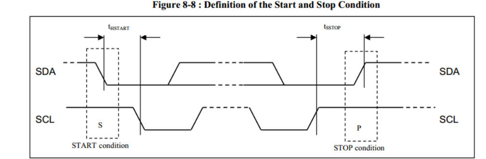
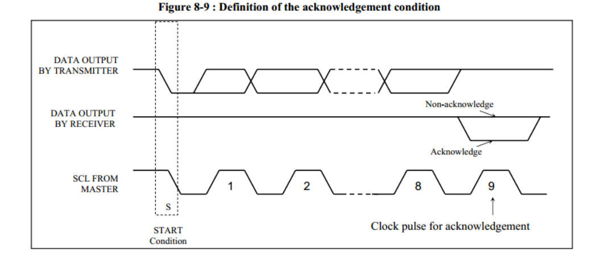
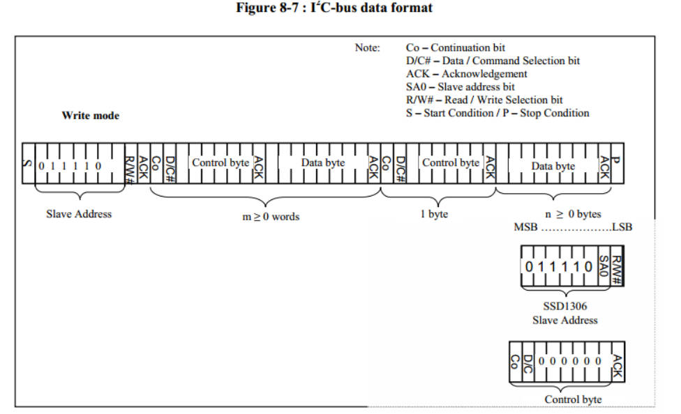
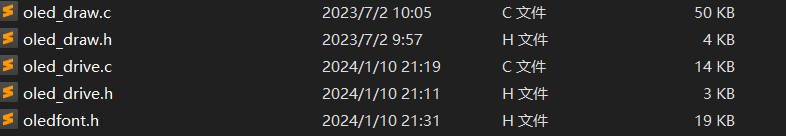
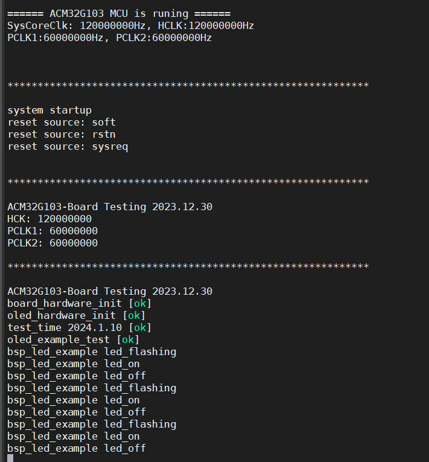
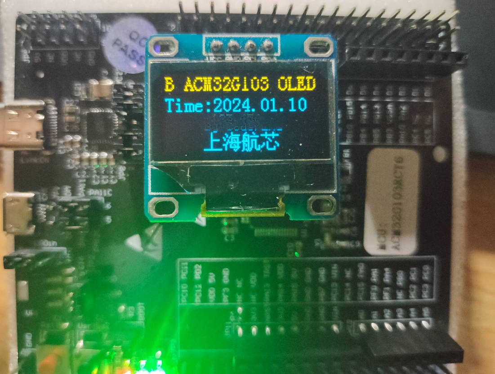

## 05-航芯ACM32G103开发板评测 0.96寸 IIC接口 OLED模块显示

### 软硬件平台

1. 航芯ACM32G103开发板
2. 0.96寸 IIC接口 OLED模块
3. 开发环境MDK-KEIL


### IIC总线
处理器和芯片间的通信可以形象的比喻成两个人讲话：1、你说的别人得能听懂：双方约定信号的协议。2、你的语速别人得能接受：双方满足时序要求。

  一、IIC总线的信号类型  

  1、开始信号：处理器让SCL时钟保持高电平，然后让SDA数据信号由高变低就表示一个开始信号。同时IIC总线上的设备检测到这个开始信号它就知道处理器要发送数据了。

2、停止信号：处理器让SCL时钟保持高电平，然后让SDA数据信号由低变高就表示一个停止信号。同时IIC总线上的设备检测到这个停止信号它就知道处理器已经结束了数据传输，我们就可以各忙各个的了，如休眠等。



二、IIC数据传输过程

1、在数据传输时，SDA的数据在SCL为高电平时，必须保持稳定，SCL高电平器件完成数据的传输。在SCL低电平器件，可以任意改变SDA的数据。数据写入过程是从最好为开始，高位在前，低位在后，即MSB。

2、响应信号（ACK）：接收器在接收到8位数据后，在第9个时钟周期，拉低SDA电平。即接收数据的IC在接收到8bit数据后，向发送数据的IC发出特定的低电平脉冲，表示已收到数据。CPU向受控单元发出一个信号后，等待受控单元发出一个应答信号，CPU接收到应答信号后，根据实际情况作出是否继续传递信号的判断。若未收到应答信号，由判断为受控单元出现故障。 



 3、数据写入的过程

首先发送一个开始信号，接着发送从机地址，OLED的从机地址前7位为地址，最后一位表示读(1)或者写(0)。应答ACK信号表示有这个从设备存在。在接收到应答信号后，发送控制位，来区分之后所发送的数据是控制命令还是显示相关的数据。在发送控制位后，等待应答信号。然后发送相应的控制命令或者数据。最后发送停止信号，表示数据传输完成。



### OLED 显示函数支持
 1.  OLED 显示字符、字符串 汉字
```c
void OLED_ShowChar_06x08(uint8_t X, uint8_t Y, uint8_t Char);//显示字符函数
void OLED_ShowString_06x08(uint8_t X, uint8_t Y, uint8_t *String);//显示字符串函数
void OLED_ShowCHinese(uint8_t X,uint8_t Y,uint8_t Chinese);//显示汉字函数
void OLED_ShowChar_08x16(uint8_t X, uint8_t Y, uint8_t Char);//显示字符函数
void OLED_ShowString_16x16(uint8_t X, uint8_t Y, uint8_t *String);//显示字符串函数
```
 2.  OLED 显示整型数字/浮点型数字/二进制数字/十六进制数字

```c
void OLED_ShowNumber_SignedInteger_06x08(uint8_t X, uint8_t Y, int16_t IntegerNumber, uint8_t Count);//显示有符号整型数字函数
void OLED_ShowNumber_UnsignedInteger_06x08(uint8_t X, uint8_t Y, uint16_t IntegerNumber, uint8_t Count);//显显示无符号整型数字函数
void OLED_ShowNumber_Float_06x08(uint8_t X, uint8_t Y, float FloatNumber, uint8_t Count1, uint8_t Count2);//显示浮点数函数
void OLED_ShowNumber_Binary_06x08(uint8_t X, uint8_t Y, unsigned long BinaryNumber, uint8_t Count);//显示数组函数
void OLED_ShowNumber_Hex_06x08(uint8_t X, uint8_t Y, unsigned long BinaryNumber, uint8_t Count);//显示十六进制数字函数

```

 3.  OLED 基本绘图函数


```c
//  OLED 绘制直线
void OLED_DrawLine(uint8_t X, uint8_t Y, uint8_t PointData);
//  OLED 绘制图像
void OLED_RollDisplay(void);//设置水平左右移
void Draw_BMP(uint8_t x0,uint8_t y0,uint8_t x1,uint8_t y1,uint8_t BMP[]);
//画点函数
void OLED_DrawDot(uint8_t X,uint8_t Y,uint8_t T);
//画直线函数
void LCD_DrawLine(uint32_t X1, uint32_t Y1, uint32_t X2,uint32_t Y2);
//dot ==1 表示亮显示出来
void OLED_Fill_Draw_circle(uint8_t X0,uint8_t Y0,uint8_t r,uint8_t dot);
//ucFilled ==1 表示填充 //画直圆函数
void OLED_DrawCircle( uint16_t usX_Center, uint16_t usY_Center, uint16_t usRadius, uint8_t ucFilled );
//画矩形函数
void LCD_DrawRectangle(uint16_t X1, uint16_t Y1, uint16_t X2, uint16_t Y2);
```
#### 模拟IIC移植 OLED屏幕驱动

1. 建立工程模板，添加相关驱动文件

   在之前的工程模板上进行添加文件，同时oled部分代码参考梁山派GD32F4开发板资料进行。

   olde_drive.c olde_drive.h // oled底层驱动文件，包括软件spi实现，oled引脚配置，oled初始化.

   olde_draw.c olde_draw.h // oled应用层文件，主要是绘图api实现（可以移植到其他开发板，不需要改，仅配置好驱动文件即可

   

2. 配置引脚

   选择引脚，进入工程开始编写屏幕引脚初始化代码。

   为了方便后续移植，我在**oled_drive.h**处宏定义了每一个引脚，后续根据需要进行修改即可。

   ```c
   #define OLED_GPIO_PORT  GPIOA
   
   #define SCL_GPIO_PORT            GPIOA
   #define SCL_GPIO_PIN             GPIO_PIN_5
   #define SCL_GPIO_CLK_ENABLE()    __RCC_GPIOA_CLK_ENABLE()
   
   #define SDA_GPIO_PORT            GPIOA
   #define SDA_GPIO_PIN             GPIO_PIN_6
   #define SDA_GPIO_CLK_ENABLE()    __RCC_GPIOA_CLK_ENABLE()
   
   ```

3. 屏幕GPIO端口初始化配置

   ```c
   void OLED_GPIO_Configuare(void)
   {
   
    	GPIO_InitTypeDef  GPIO_InitStruct;
       /* Enable the GPIO Clock */
       SDA_GPIO_CLK_ENABLE();
       SCL_GPIO_CLK_ENABLE();
   
       GPIO_InitStruct.Pin       = SDA_GPIO_PIN |SCL_GPIO_PIN;
       GPIO_InitStruct.Mode      = GPIO_MODE_OUTPUT_PP;
       GPIO_InitStruct.Pull      = GPIO_PULLUP;
       GPIO_InitStruct.Drive     = GPIO_DRIVE_LEVEL3;
       GPIO_InitStruct.Alternate = GPIO_FUNCTION_0;
        
       GPIO_Init(OLED_GPIO_PORT, &GPIO_InitStruct);
   }
   
   ```

4. IIC接口宏定义设置

   ```C
   #define OLED_SCLK_Clr() GPIO_ResetBits(SCL_GPIO_PORT,SCL_GPIO_PIN)//SCL IIC接口的时钟信号
   #define OLED_SCLK_Set() GPIO_SetBits(SCL_GPIO_PORT,SCL_GPIO_PIN)
   
   #define OLED_SDIN_Clr() GPIO_ResetBits(SDA_GPIO_PORT,SDA_GPIO_PIN)//SDA IIC接口的数据信号
   #define OLED_SDIN_Set() GPIO_SetBits(SDA_GPIO_PORT,SDA_GPIO_PIN)
   		     
   #define OLED_CMD  0	//写命令
   #define OLED_DATA 1	//写数据   
   //--------------------------------
   ```

5. 软件IIC代码实现

   ```c
   //==================================================================================================
   //  函数功能: IIC外设驱动函数部分
   //  函数标记: IIC_Start
   //  函数说明: 无
   //-------------------------------------------------------------------------------------------------
   //  |   -   |   -   |   0   |   1   |   2   |   3   |   4   |   5   |   6   |   7   |   8   |   9   
   //==================================================================================================
   void IIC_Start()
   {
   	OLED_SCLK_Set() ;
   	OLED_SDIN_Set();
   	OLED_SDIN_Clr();
   	OLED_SCLK_Clr();
   }
   //==================================================================================================
   //  函数功能: IIC外设驱动函数部分
   //  函数标记: IIC_Stop
   //  函数说明: 无
   //-------------------------------------------------------------------------------------------------
   //  |   -   |   -   |   0   |   1   |   2   |   3   |   4   |   5   |   6   |   7   |   8   |   9   
   //==================================================================================================
   void IIC_Stop()
   {
       OLED_SCLK_Set() ;
   	OLED_SDIN_Clr();
   	OLED_SDIN_Set();	
   }
   //==================================================================================================
   //  函数功能: IIC外设驱动函数部分
   //  函数标记: IIC_Stop
   //  函数说明: 无
   //-------------------------------------------------------------------------------------------------
   //  |   -   |   -   |   0   |   1   |   2   |   3   |   4   |   5   |   6   |   7   |   8   |   9   
   //==================================================================================================
   void IIC_Wait_Ack()
   {
   	OLED_SCLK_Set() ;
   	OLED_SCLK_Clr();
   }
   //==================================================================================================
   //  函数功能: IIC外设驱动函数部分
   //  函数标记: Write_IIC_Byte
   //  函数说明: 无
   //-------------------------------------------------------------------------------------------------
   //  |   -   |   -   |   0   |   1   |   2   |   3   |   4   |   5   |   6   |   7   |   8   |   9   
   //==================================================================================================
   void Write_IIC_Byte(uint8_t IIC_Byte)
   {
   	uint8_t i;
   	uint8_t m,da;
   	da=IIC_Byte;
   	OLED_SCLK_Clr();
   	for(i=0;i<8;i++)		
   	{
   		m=da;
   		//	OLED_SCLK_Clr();
   		m=m&0x80;
   		if(m==0x80)
   		{
   			OLED_SDIN_Set();
   		}
   		else 
   			OLED_SDIN_Clr();
   		
   		da=da<<1;
   		OLED_SCLK_Set();
   		OLED_SCLK_Clr();
   }
   
   }
   //==================================================================================================
   //  函数功能: IIC外设驱动函数部分
   //  函数标记: Write_IIC_Command
   //  函数说明: 无
   //-------------------------------------------------------------------------------------------------
   //  |   -   |   -   |   0   |   1   |   2   |   3   |   4   |   5   |   6   |   7   |   8   |   9   
   //==================================================================================================
   void Write_IIC_Command(uint8_t IIC_Command)
   {
      IIC_Start();
      Write_IIC_Byte(0x78);            //Slave address,SA0=0
      IIC_Wait_Ack();	
      Write_IIC_Byte(0x00);			//write command
      IIC_Wait_Ack();	
      Write_IIC_Byte(IIC_Command); 
      IIC_Wait_Ack();	
      IIC_Stop();
   }
   //==================================================================================================
   //  函数功能: IIC外设驱动函数部分
   //  函数标记: Write_IIC_Data
   //  函数说明: 无
   //-------------------------------------------------------------------------------------------------
   //  |   -   |   -   |   0   |   1   |   2   |   3   |   4   |   5   |   6   |   7   |   8   |   9   
   //==================================================================================================
   void Write_IIC_Data(uint8_t IIC_Data)
   {
       IIC_Start();
       Write_IIC_Byte(0x78);			//D/C#=0; R/W#=0
   	IIC_Wait_Ack();	
       Write_IIC_Byte(0x40);			//write data
   	IIC_Wait_Ack();	
       Write_IIC_Byte(IIC_Data);
   	IIC_Wait_Ack();	
       IIC_Stop();
   }
   ```

6. OLED初始化函数

   ```c
   //==================================================================================================
   //  函数功能: OLED 外设驱动函数部分
   //  函数标记: OLED_Init
   //  函数说明: 初始化函数配置
   //-------------------------------------------------------------------------------------------------
   //  |   -   |   -   |   0   |   1   |   2   |   3   |   4   |   5   |   6   |   7   |   8   |   9   
   //==================================================================================================
   void OLED_Init(void)
   { 	
       OLED_GPIO_Configuare();
       OLED_WR_Byte(0xAE,OLED_CMD);//--display off
   	OLED_WR_Byte(0x00,OLED_CMD);//---set low column address
   	OLED_WR_Byte(0x10,OLED_CMD);//---set high column address
   	OLED_WR_Byte(0x40,OLED_CMD);//--set start line address  
   	OLED_WR_Byte(0xB0,OLED_CMD);//--set page address
   	OLED_WR_Byte(0x81,OLED_CMD); // contract control
   	OLED_WR_Byte(0xFF,OLED_CMD);//--128   
   	OLED_WR_Byte(0xA1,OLED_CMD);//set segment remap 
   	OLED_WR_Byte(0xA6,OLED_CMD);//--normal / reverse
   	OLED_WR_Byte(0xA8,OLED_CMD);//--set multiplex ratio(1 to 64)
   	OLED_WR_Byte(0x3F,OLED_CMD);//--1/32 duty
   	OLED_WR_Byte(0xC8,OLED_CMD);//Com scan direction
   	OLED_WR_Byte(0xD3,OLED_CMD);//-set display offset
   	OLED_WR_Byte(0x00,OLED_CMD);//
       
   	OLED_WR_Byte(0xD5,OLED_CMD);//set osc division
   	OLED_WR_Byte(0x80,OLED_CMD);//
   	
   	OLED_WR_Byte(0xD8,OLED_CMD);//set area color mode off
   	OLED_WR_Byte(0x05,OLED_CMD);//
   	
   	OLED_WR_Byte(0xD9,OLED_CMD);//Set Pre-Charge Period
   	OLED_WR_Byte(0xF1,OLED_CMD);//
   	
   	OLED_WR_Byte(0xDA,OLED_CMD);//set com pin configuartion
   	OLED_WR_Byte(0x12,OLED_CMD);//
   	
   	OLED_WR_Byte(0xDB,OLED_CMD);//set Vcomh
   	OLED_WR_Byte(0x30,OLED_CMD);//
   	
   	OLED_WR_Byte(0x8D,OLED_CMD);//set charge pump enable
   	OLED_WR_Byte(0x14,OLED_CMD);//
   	
   	OLED_WR_Byte(0xAF,OLED_CMD);//--turn on oled panel
   	
   
   	OLED_Clear();
   	OLED_Set_Pos(0,0);
   }  
   ```

   综上所述，软件iic oled驱动文件完成，接下来就是应用层文件,具体参考仓库代码。

   


### 测试效果

1. 主函数

   ```c
   #include "main.h" 
   #include "app.h"   
   void board_hardware_init(void)
   {
        RCC_ClocksTypeDef RCC_Clocks;
       
   	#if (INS_ACCELERATE_ENABLE == 1)
   		System_EnableIAccelerate();
   	#endif
   
   	#if (DATA_ACCELERATE_ENABLE == 1)
   		System_EnableDAccelerate();
   	#endif     
       
   	/* Set Interrupt Group Priority */
   	NVIC_SetPriorityGrouping(NVIC_PRIORITYGROUP_4);
       
       SystemClock_Config();    
       
       SystemCoreClockUpdate();
       
       RCC_GetClocksFreq(&RCC_Clocks);
       
       SysTick_Config(RCC_Clocks.HCLK_Frequency / 1000);
       
       BSP_UART_Init();  
   	
   	printfS("\r\n\r\n");
   	printfS("************************************************************\r\n\r\n");
   	printfS("system startup\r\n");
   	
   	get_reset_source();
       BSP_MCO_Init();
       printfS("\r\n\r\n");
   	printfS("************************************************************\r\n\r\n");
   	printfS("ACM32G103-Board Testing 2023.12.30\r\n");
   	printfS("HCK: %u\r\n", RCC_GetHCLKFreq());
   	printfS("PCLK1: %u\r\n", RCC_GetPCLK1Freq());
   	printfS("PCLK2: %u\r\n", RCC_GetPCLK2Freq());
       printfS("\r\n");
   	printfS("************************************************************\r\n\r\n");
       printfS("ACM32G103-Board Testing 2023.12.30\r\n");
       
       
       BSP_LED_Init();
       
       OLED_Init();
   }
   
   
   void oled_example(void)
   {
         OLED_ShowChar_08x16(0,0,'B');
         OLED_ShowString_08x16(16,0,"ACM32G103-OLED");
   //      OLED_ShowNumber_SignedInteger_06x08(16,2,1234,5);
   //      OLED_ShowNumber_UnsignedInteger_06x08(64,2,1234,4);
         OLED_ShowString_08x16(0,2,"Time:2024.01.10");
         OLED_ShowNumber_Float_06x08(32,4,123.456,3,3);
         OLED_ShowString_06x08(32,5,"By:CoderEnd");
       
   //OLEDÏÔʾºº×Ö ÉϺ£º½Ð¾
         OLED_ShowCHinese(32,6,9);
         OLED_ShowCHinese(48,6,10);
         OLED_ShowCHinese(64,6,11);
         OLED_ShowCHinese(80,6,12);
         //OLED_Clear();
   }      
   
   /******************************************************************************
   *@brief : main program
   *@param : none
   *@return: none
   ******************************************************************************/
   int main(void)
   {
      
       board_hardware_init();
       printfS("board_hardware_init [ok] \r\n");
       printfS("oled_hardware_init [ok] \r\n");
       printfS("test_time 2024.1.10 [ok] \r\n");
       OLED_Clear();
       printfS("oled_example_test [ok] \r\n");
       oled_example();
   
       while(1)
       {
           bsp_led_example();
           
       }
       
   }
   ```

2. 测试效果




