## 07 雅特力车规级MCU-AT32A403A开发板评测  GC9A01 SPI-LCD  圆形屏幕LVGL移植

### 硬件平台

1. AT32A403A Board开发板

2. 1.28寸圆形彩色TFT显示屏高清IPS 模块240X240 SPI接口GC9A01

2. LVGL V8.3源码

   

###  2.LVGL

LVGL（Light and Versatile Graphics Library）是一个免费的开源图形库，提供创建具有易 于使用的图形元素、漂亮的视觉效果和低内存占用的嵌入式 GUI。

LVGL 是一款具有丰富的部件，具备高级图形特性，支持多种输入设备， 多国语言和独立于硬件之外等免费的开源图形库。接下来我们来看一下 LVGL 图形用户库的主要特点：

1. 强大的构建块：按钮、图表、列表、滑块、图像等部件。
2. 具有高级图形属性：具有动画、抗锯齿、不透明度、平滑滚动的高级图形。
3. 支持各种输入设备：如触摸、鼠标、键盘、编码器。
4. 支持多语言：UTF-8 编码。
5. 支持多显示器：它可以同时使用多个 TFT 或者单色显示器。
6. 支持多种样式属性：它具有类 CSS 样式的完全可定制的图形元素。
7. 独立于硬件之外：它与任何微控制器或显示器一起使用。
8. 可扩展性：它能够以小内存运行(最低 64 kB 闪存，16 kB RAM 的 MCU)。
9. 支持操作系统、外部存储器和 GPU(不是必需的)。
10. 具有高级图形效果：可进行单帧缓冲区操作。
11. 纯 C 编写： C 语言编写以获得最大的兼容性。

### 3.快速移植

参考stm32-lvgl网络移植教程，大体流程，下载代码，能够支持LCD显示的工程模板上面，添加显示接口，添加各种文件添加各种文件路径（这个文件路径设置迷得很，之前在使用stm32,或者acm32的时候，设置的路径添加很少，但是同样的路径在我这个at32的工程下面报了很多错误，虽然只要一步步加好路径，绝大多数肯定是能解决的，但是lvgl添加的东西太多了，你如果进行了修改，可能会导致许多莫名其妙的问题 ，这个就很烦人），源代码文件设置的具体细节不说了。每个人的工程习惯不同，搞的东西都不一样。

1. 下载源代码 https://github.com/lvgl/lvgl/tree/release/v8.3

   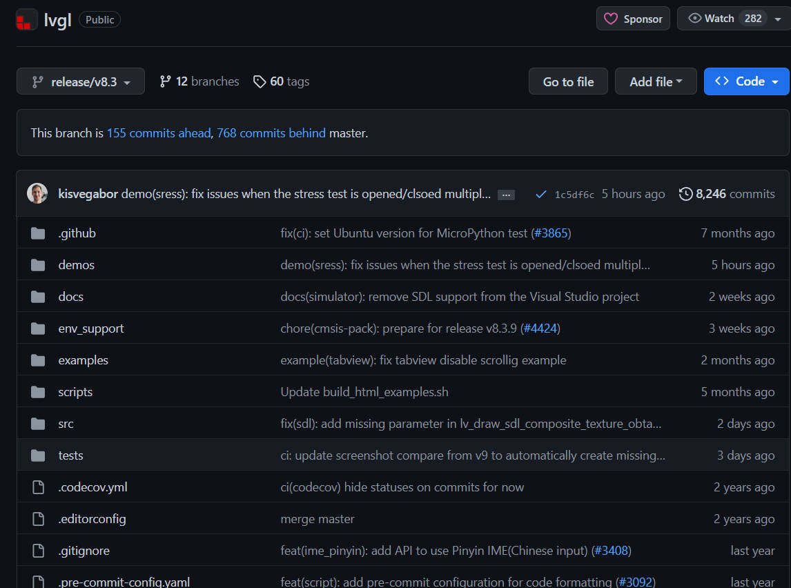

2. 把文件中的 lv_conf_template.h 文件名修改成 lv_conf.h 文件名

   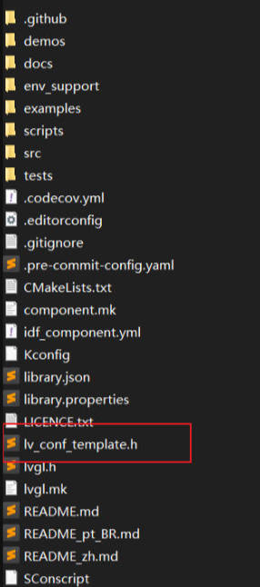

3. .打开 lv_conf.h 文件，修改条件编译指令，如下源码所示。
   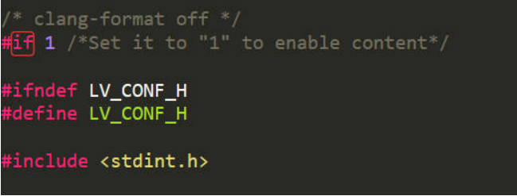

4. 打开 examples 文件夹，除了 porting 文件夹外，用户可以删除其他文件和文件夹

   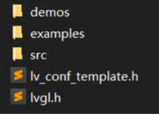

   把porting文件夹重新命名为lvgl_driver，并修改文件名称。

   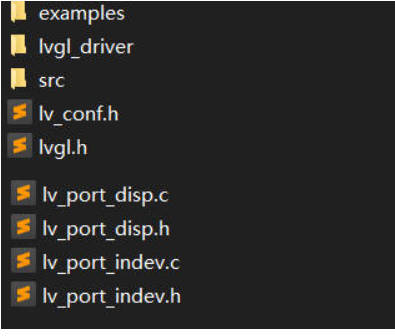

   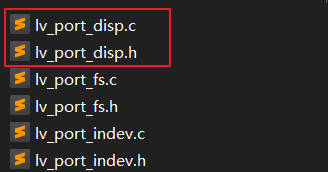

5. 准备一个裸机工程，其中包括lcd,touch驱动，能正常使用，建立LVGL,GUIAPP文件夹。其中LVGL文件夹十分重要（移植主体，源代码）

   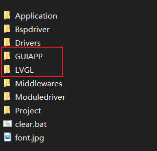

6. 创建lvgl/src,lvgl/config/,lvgl/port,lvgl/app，把源代码文件全部添加进去，添加文件路径（这个如果出现错误，尽量把所有的文件都，添加路径，）

   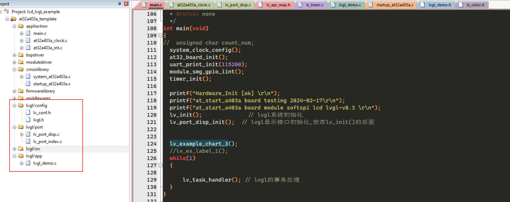

7. lvgl 的 1ms 心跳 通过调用定时器

   ```c
   crm_clocks_freq_type crm_clocks_freq_struct = {0};
   
   void TMR1_OVF_TMR10_IRQHandler(void)
   {
     if(tmr_flag_get(TMR1, TMR_OVF_FLAG) != RESET)
     {
       /* add user code... */
        lv_tick_inc(1);//lvgl的1ms中断
       tmr_flag_clear(TMR1, TMR_OVF_FLAG);
     }
   }
   
   void timer_init(void)
   {
     crm_clocks_freq_get(&crm_clocks_freq_struct);  
        /* enable tmr1 clock */
     crm_periph_clock_enable(CRM_TMR1_PERIPH_CLOCK, TRUE);
   
     /* tmr1 configuration */
     /* time base configuration */
     /* systemclock/20000/10000 = 1hz */
     tmr_base_init(TMR1, 9, (crm_clocks_freq_struct.ahb_freq / 10000) - 1);  //1ms
     tmr_cnt_dir_set(TMR1, TMR_COUNT_UP);
   
     /* overflow interrupt enable */
     tmr_interrupt_enable(TMR1, TMR_OVF_INT, TRUE);
   
     /* tmr1 overflow interrupt nvic init */
     nvic_priority_group_config(NVIC_PRIORITY_GROUP_4);
     nvic_irq_enable(TMR1_OVF_TMR10_IRQn, 0, 0);
   
     /* enable tmr1 */
     tmr_counter_enable(TMR1, TRUE);
     
   }
   ```

   

8. 修改disp代码，显示驱动接口代码（理论上有3个接口文件需要修改，但是目前只有显示接口文件，屏幕不支持触摸，也没有其他的外部设备，因此只需要改显示接口代码）

   主要是添加lcd的显示驱动代码，完成初始化，画点函数的配置

   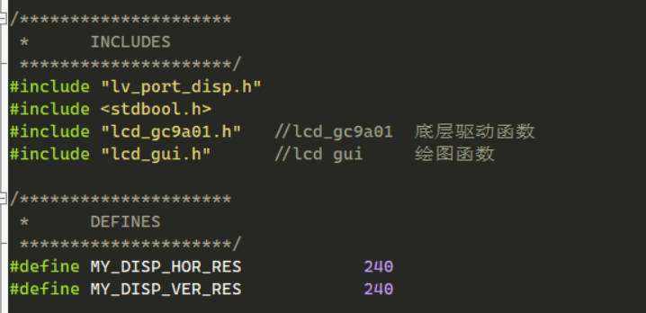

   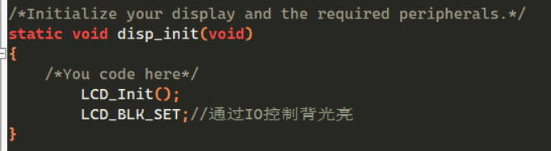

   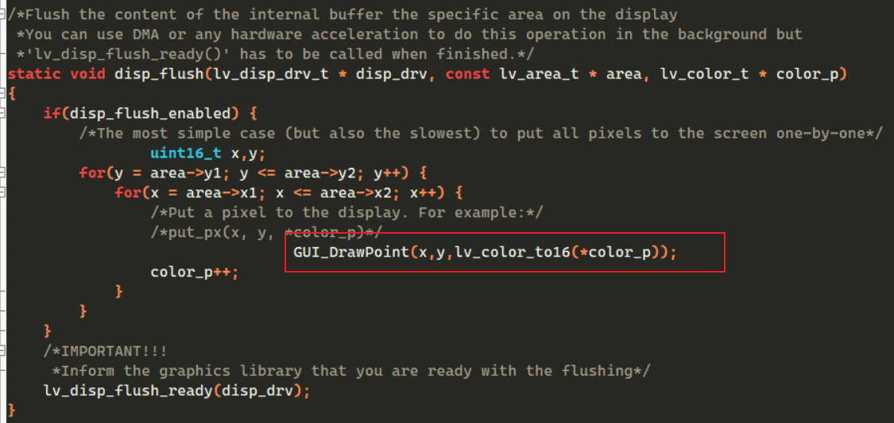

   ```c
   void GUI_DrawPoint(uint16_t x,uint16_t y,uint16_t color)
   {
   	LCD_SetCursor(x,y);//设置光标位置 
   	Lcd_WriteData_16Bit(color); 
   }
   ```

9. 注意：移植 LVGL 必须开启 C99 模式（要不然很多的报错）

   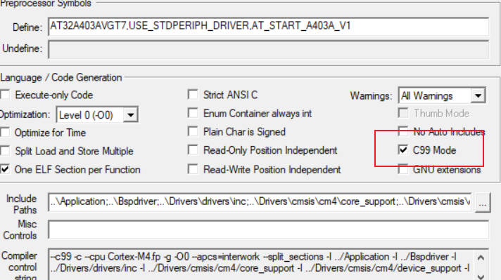

   上面只是简单的移植过程，许多东西可以参考正点原子或者韦东山LVGL教程，有错误通过网络搜索解决.

   ### 4.移植测试效果

   1. 主函数

      ```c
      #include "main.h"
      
      
      /** @addtogroup AT32A403A_periph_examples
        * @{
        */
      
      /** @addtogroup 403A_USART_printf USART_printf
        * @{
        */
      
      //__IO uint32_t time_cnt = 0;
      
      static void lv_ex_label_1(void)
      {
      	/* Create a screen */
          lv_obj_t * scr = lv_obj_create(NULL);
          lv_scr_load(scr);
          lv_obj_set_style_bg_color(scr,lv_palette_main(LV_PALETTE_PURPLE),0);
          lv_obj_align(scr,LV_ALIGN_CENTER,0,0);
          
          /* Create a button */
          lv_obj_t * btn = lv_btn_create(scr);
          lv_obj_align(btn, NULL, LV_ALIGN_CENTER, 40);
          /* Create a label for the button */
          lv_obj_t * label = lv_label_create(btn);
          lv_label_set_text(label, "Hello EEWORLD !");	
      		
      		/* Create a button */
          lv_obj_t * btn1 = lv_btn_create(scr);
          lv_obj_align(btn1, NULL, LV_ALIGN_CENTER, 90);
          /* Create a label for the button */
          lv_obj_t * label1 = lv_label_create(btn1);
          lv_label_set_text(label1, "By End 2024.02.17!");	
      		
      		/* Create a button */
          lv_obj_t * btn2 = lv_btn_create(scr);
          lv_obj_align(btn2, NULL, LV_ALIGN_CENTER, 140);
          /* Create a label for the button */
          lv_obj_t * label2 = lv_label_create(btn2);
          lv_label_set_text(label2, "AT32A403A-Board LVGL-Demo");	
      }
      crm_clocks_freq_type crm_clocks_freq_struct = {0};
      
      void TMR1_OVF_TMR10_IRQHandler(void)
      {
        if(tmr_flag_get(TMR1, TMR_OVF_FLAG) != RESET)
        {
          /* add user code... */
           lv_tick_inc(1);//lvgl的1ms中断
          tmr_flag_clear(TMR1, TMR_OVF_FLAG);
        }
      }
      
      void timer_init(void)
      {
        crm_clocks_freq_get(&crm_clocks_freq_struct);  
           /* enable tmr1 clock */
        crm_periph_clock_enable(CRM_TMR1_PERIPH_CLOCK, TRUE);
      
        /* tmr1 configuration */
        /* time base configuration */
        /* systemclock/20000/10000 = 1hz */
        tmr_base_init(TMR1, 9, (crm_clocks_freq_struct.ahb_freq / 10000) - 1);  //1ms
        tmr_cnt_dir_set(TMR1, TMR_COUNT_UP);
      
        /* overflow interrupt enable */
        tmr_interrupt_enable(TMR1, TMR_OVF_INT, TRUE);
      
        /* tmr1 overflow interrupt nvic init */
        nvic_priority_group_config(NVIC_PRIORITY_GROUP_4);
        nvic_irq_enable(TMR1_OVF_TMR10_IRQn, 0, 0);
      
        /* enable tmr1 */
        tmr_counter_enable(TMR1, TRUE);
        
      }
      
      /**
        * @brief  main function.
        * @param  none
        * @retval none
        */
      int main(void)
      {
      //  unsigned char count_num; 
        system_clock_config();
        at32_board_init();
        uart_print_init(115200);
        module_smg_gpio_iint();
        timer_init();
        
        printf("Hardware_Init [ok] \r\n");
        printf("at_start_a403a board testing 2024-02-17\r\n");
        printf("at_start_a403a board module softspi lcd lvgl-v8.3 \r\n");
        lv_init();			  // lvgl系统初始化
        lv_port_disp_init();  // lvgl显示接口初始化,放在lv_init()的后面
      
        lv_ex_label_1();
        //lv_example_chart_3();
       
        while(1)
        {
             
            lv_task_handler(); // lvgl的事务处理
        }
      }
      
      ```

   2. 测试效果

      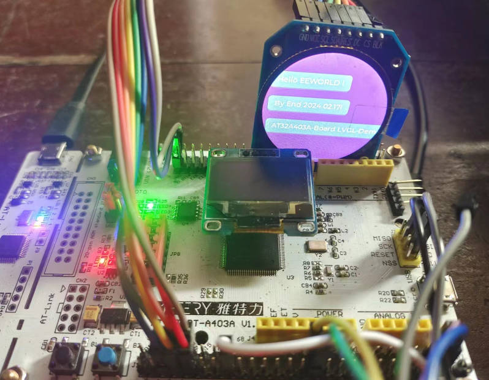

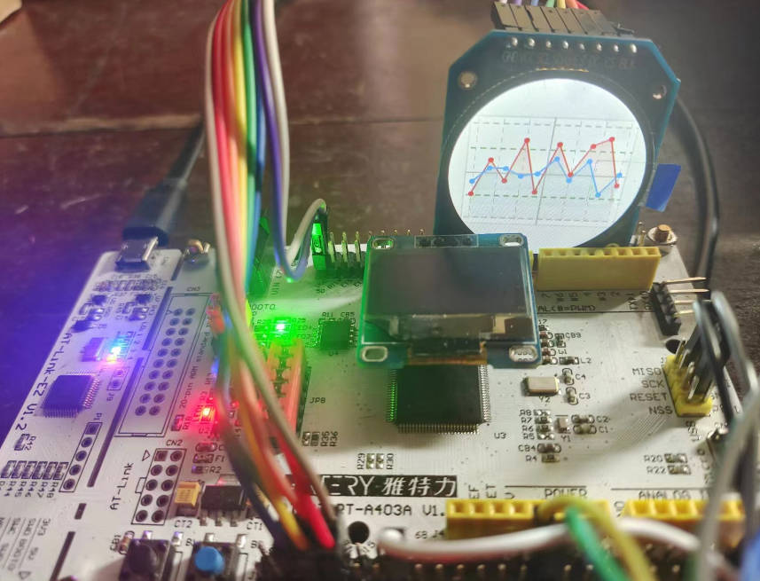

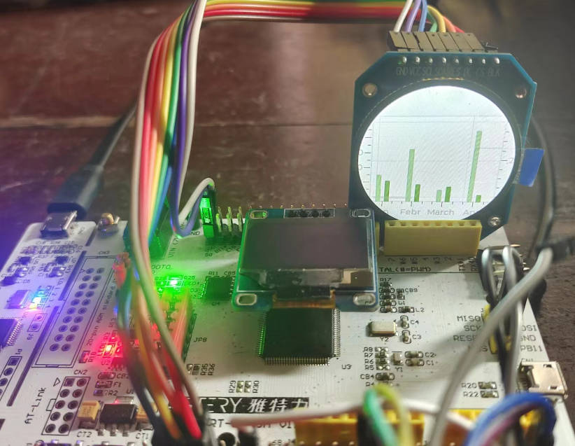