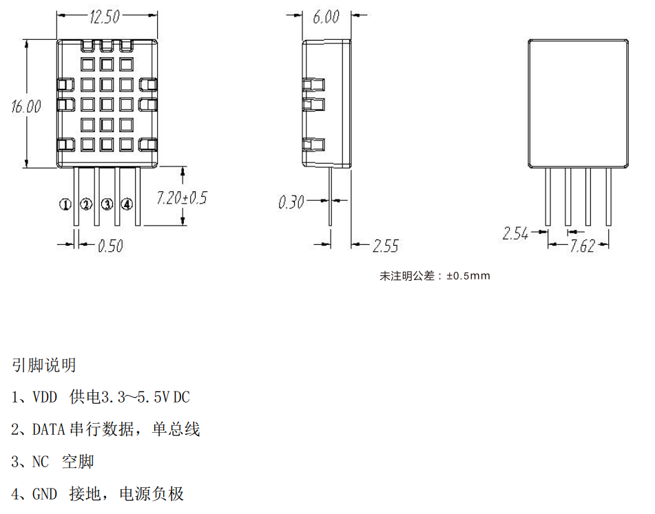
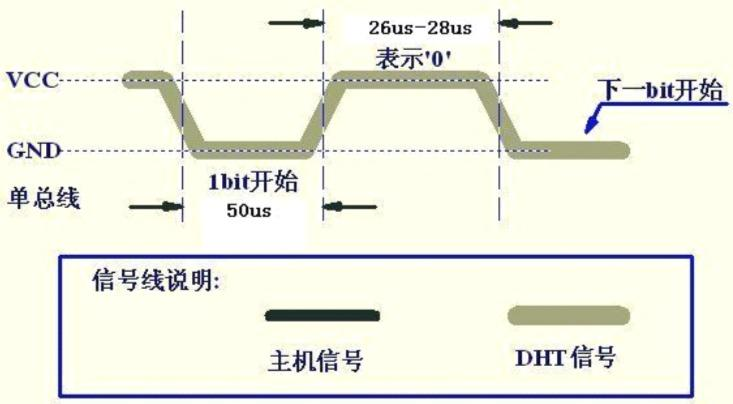
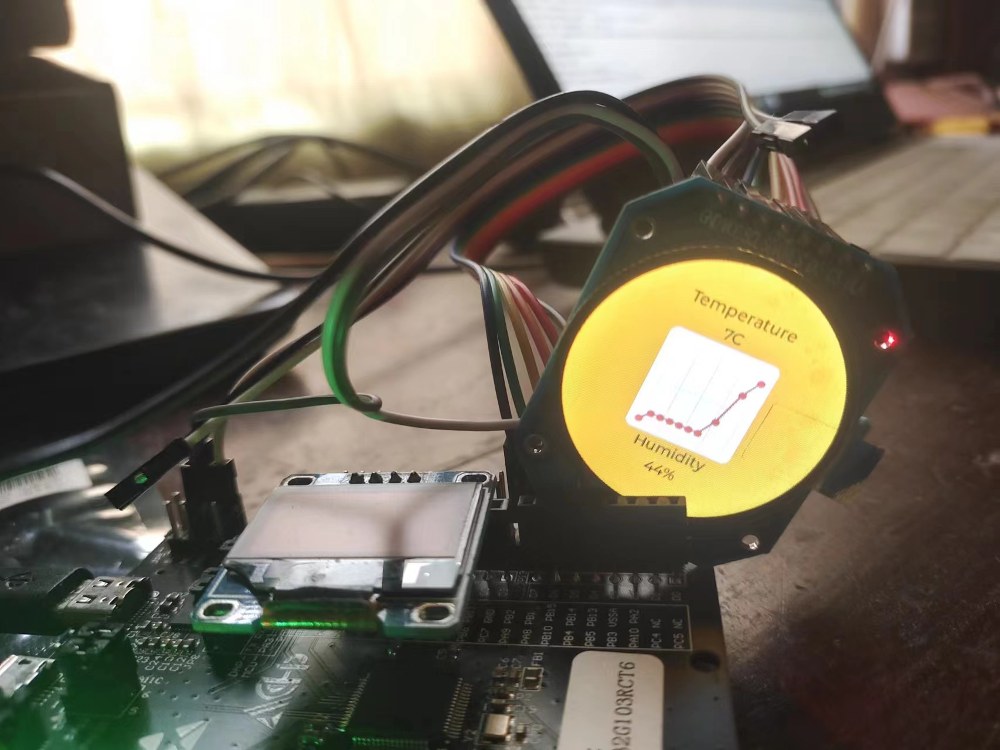

## 07-航芯ACM32G103开发板评测 LVGL 温湿度环境数据显示

### 参考移植教程

http://bbs.eeworld.com.cn/thread-1270136-1-1.html
http://bbs.eeworld.com.cn/thread-1270761-1-1.html

### 软硬件平台

1. 航芯ACM32G103开发板
2. 1.28寸圆形彩色TFT显示屏高清IPS 模块240X240 SPI接口 GC9A01驱动芯片
3. DHT11 温湿度传感器
4. LVGL V8.3.1源码

### DHT11 温湿度传感器

DHT11是一款有已校准数字信号输出的温湿度传感器。 精度湿度+-5%RH， 温度+-2℃，量程湿度20-90%RH， 温度0~50℃。

更多DHT11信息请参考：https://baike.sogou.com/v73984313.htm?fromTitle=DHT11

下图为DHT11的引脚说明图，DATA引脚为信号输入输出。
DS18B20引脚说明



### DHT11单总线传感器驱动

DHT11 整体工作时序为：主机发送开始信号、DHT11 响应输出、主机接收 40bit 数据（湿度数据+温度数据+校验值），结束信号（可选）。具体过程如下：

1. 总线空闲状态为高电平，主机拉低总线等待 DHT11 响应, 主机把总线拉低必须大于 18ms，保证 DHT11 能检测到起始信号；

2. 主机发送开始信号结束后，拉高总线电平并延时等待 20-40us 后，读取 DHT11 的响应信号；

3. DHT11 接收到主机的开始信号后，等待微处理器开始信号结束，发送 80us 低电平响应信号；

4. DHT11 发送 80us 高电平准备发送数据；

5. DHT11 发送 40bit 数据（湿度数据+温度数据+校验值）。

   

#### 起始及响应信号

主机拉低总线至少 18ms，然后再拉高总线，延时 20~40us，此时起始信号（有时也叫复位信号）发送完毕。
DHT11 检测到复位信号后，触发一次采样，并拉低总线 80us 表示响应信号，告诉主机数据已经准备好了。DHT11 之后拉高总线 80us，然后开始传输数据。如果检测到响应信号为高电平，则 DHT11 初始化失败，请检查线路是否连接正常。


#### 读时序

DHT11 开始传输数据。每 1bit 数据都以 50us 低电平开始，告诉主机开始传输一位数据了。DHT11 以高电平的长短定义数据位是 0 还是 1：当 50us 低电平过后拉高总线，高电平持续 26~28us 表示 0，高电平持续 70us 表示数据 1。
当最后 1bit 数据传送完毕后，DHT11 拉低总线 50us，表示数据传输完毕，随后总线由上拉电阻拉高进入空闲状态。

位数据0表示方式：
以 50us 低电平开始，高电平持续 26~28us 表示 0。



位数据1表示方式：
以 50us 低电平开始，高电平持续 70us 表示 1。


#### 驱动代码

端口初始化

```c
/*
 * 函数名：DHT11_GPIO_Config
 * 描述：配置DHT11用到的I/O口
 * 输入：无
 * 输出：无
 */
 static void DHT11_GPIO_Config ( void )
 {


 GPIO_InitTypeDefGPIO_InitStruct;
  /* Enable the GPIO Clock */
  DHT11_GPIO_CLK_ENABLE();

  GPIO_InitStruct.Pin   = DHT11_Dout_GPIO_PIN;
  GPIO_InitStruct.Mode  = GPIO_MODE_OUTPUT_PP;
  GPIO_InitStruct.Pull  = GPIO_PULLUP;
  GPIO_InitStruct.Drive = GPIO_DRIVE_LEVEL3;
  GPIO_InitStruct.Alternate = GPIO_FUNCTION_0;

  HAL_GPIO_Init(DHT11_Dout_GPIO_PORT, &GPIO_InitStruct);

 }


 /**
 * <a href="http://bbs.eeworld.com.cn/home.php?mod=space&uid=159083" target="_blank">@brief</a>DHT11 初始化函数
 * @param无
 * @retval 无
 */
 void DHT11_Init ( void )
 {
 DHT11_GPIO_Config ();

 DHT11_Dout_1;     // 拉高DHT11数据引脚
 }


 /*
 * 函数名：DHT11_Mode_IPU
 * 描述：使DHT11-DATA引脚变为上拉输入模式
 * 输入：无
 * 输出：无
 */
static void DHT11_Mode_IPU(void)
{

  GPIO_InitTypeDefGPIO_InitStruct;
  DHT11_GPIO_CLK_ENABLE();

  GPIO_InitStruct.Pin   = DHT11_Dout_GPIO_PIN;
  GPIO_InitStruct.Mode  = GPIO_MODE_INPUT;
  GPIO_InitStruct.Pull  = GPIO_PULLUP;
  GPIO_InitStruct.Drive = GPIO_DRIVE_LEVEL3;
  GPIO_InitStruct.Alternate = GPIO_FUNCTION_0;
  HAL_GPIO_Init(DHT11_Dout_GPIO_PORT, &GPIO_InitStruct);

}


/*
 * 函数名：DHT11_Mode_Out_PP
 * 描述：使DHT11-DATA引脚变为推挽输出模式
 * 输入：无
 * 输出：无
 */
static void DHT11_Mode_Out_PP(void)
{

  GPIO_InitTypeDefGPIO_InitStruct;
  DHT11_GPIO_CLK_ENABLE();

  GPIO_InitStruct.Pin   = DHT11_Dout_GPIO_PIN;
  GPIO_InitStruct.Mode  = GPIO_MODE_OUTPUT_PP;
  GPIO_InitStruct.Pull  = GPIO_PULLUP;
  GPIO_InitStruct.Drive = GPIO_DRIVE_LEVEL3;
  GPIO_InitStruct.Alternate = GPIO_FUNCTION_0;
  HAL_GPIO_Init(DHT11_Dout_GPIO_PORT, &GPIO_InitStruct);

}


```

从DHT11读取一个字节

```c
static uint8_t DHT11_ReadByte ( void )
{
  uint8_t i, temp=0;

  for(i=0;i<8;i++)
  {
  /*每bit以50us低电平标置开始，轮询直到从机发出 的50us 低电平 结束*/
  while(DHT11_Dout_IN()==Bit_RESET);

  /*DHT11 以26~28us的高电平表示“0”，以70us高电平表示“1”，
  *通过检测 x us后的电平即可区别这两个状 ，x 即下面的延时
  */
  HAL_DelayUs(40); //延时x us 这个延时需要大于数据0持续的时间即可

  if(DHT11_Dout_IN()==Bit_SET)/* x us后仍为高电平表示数据“1” */
  {
    /* 等待数据1的高电平结束 */
    while(DHT11_Dout_IN()==Bit_SET);

    temp|=(uint8_t)(0x01<<(7-i));//把第7-i位置1，MSB先行
  }
  else   // x us后为低电平表示数据“0”
  {
    temp&=(uint8_t)~(0x01<<(7-i)); //把第7-i位置0，MSB先行
  }
  }

  return temp;

}


```

温湿度数据获取函数

```c
/*
* 一次完整的数据传输为40bit，高位先出
* 8bit 湿度整数 + 8bit 湿度小数 + 8bit 温度整数 + 8bit 温度小数 + 8bit 校验和
*/
uint8_t DHT11_Read_TempAndHumidity(DHT11_Data_TypeDef *DHT11_Data)
{
  /*输出模式*/
  DHT11_Mode_Out_PP();
  /*主机拉低*/
  DHT11_Dout_0;
  /*延时18ms*/
  HAL_DelayMs(18);

  /*总线拉高 主机延时30us*/
  DHT11_Dout_1;

  HAL_DelayUs(30); //延时30us

  /*主机设为输入 判断从机响应信号*/
  DHT11_Mode_IPU();

  /*判断从机是否有低电平响应信号 如不响应则跳出，响应则向下运行*/
  if(DHT11_Dout_IN()==Bit_RESET)
  {
  /*轮询直到从机发出 的80us 低电平 响应信号结束*/
  while(DHT11_Dout_IN()==Bit_RESET);

  /*轮询直到从机发出的 80us 高电平 标置信号结束*/
  while(DHT11_Dout_IN()==Bit_SET);

  /*开始接收数据*/
  DHT11_Data->humi_int= DHT11_ReadByte();

  DHT11_Data->humi_deci= DHT11_ReadByte();

  DHT11_Data->temp_int= DHT11_ReadByte();

  DHT11_Data->temp_deci= DHT11_ReadByte();

  DHT11_Data->check_sum= DHT11_ReadByte();


  /*读取结束，引脚改为输出模式*/
  DHT11_Mode_Out_PP();
  /*主机拉高*/
  DHT11_Dout_1;

  /*检查读取的数据是否正确*/
  if(DHT11_Data->check_sum == DHT11_Data->humi_int + DHT11_Data->humi_deci + DHT11_Data->temp_int+ DHT11_Data->temp_deci)
    return SUCCESS;
  else
    return ERROR;
  }

  else
  return ERROR;

}

```

bsp_dht11.h

```c
#ifndef __BSP_DHT11_H
#define __BSP_DHT11_H 
#include "main.h"

typedef struct
{
  uint8_thumi_int;  //湿度的整数部分
  uint8_thumi_deci; //湿度的小数部分
  uint8_ttemp_int;  //温度的整数部分
  uint8_ttemp_deci; //温度的小数部分
  uint8_tcheck_sum; //校验和
}DHT11_Data_TypeDef;

#define Bit_RESET 0
#define Bit_SET 1

#define DHT11_Dout_GPIO_PORT   GPIOC
#define DHT11_Dout_GPIO_PIN  GPIO_PIN_5
#define DHT11_GPIO_CLK_ENABLE()  __HAL_RCC_GPIOC_CLK_ENABLE()


#define DHT11_Dout_0    HAL_GPIO_WritePin(DHT11_Dout_GPIO_PORT,DHT11_Dout_GPIO_PIN,GPIO_PIN_RESET)
#define DHT11_Dout_1    HAL_GPIO_WritePin(DHT11_Dout_GPIO_PORT,DHT11_Dout_GPIO_PIN,GPIO_PIN_SET)
#define DHT11_Dout_IN()   HAL_GPIO_ReadPin( DHT11_Dout_GPIO_PORT, DHT11_Dout_GPIO_PIN )

static void DHT11_GPIO_Config ( void );
void DHT11_Init ( void );
uint8_t DHT11_Read_TempAndHumidity ( DHT11_Data_TypeDef * DHT11_Data );

#endif


```

### 案例测试

主函数

```c

#include "main.h"  

#include "lvgl_timer.h"
LoopFunction loopFunction[MAX_INIT_FUNCTIONS];
int loopFunctionCount = 0;

void callInitFunctions(void){
    uint8_t i ;
    for(i = 0 ; i<loopFunctionCount;i++){
        loopFunction<i>();
    }
}

/******************************************************************************
*@brief : main program
*@param : none
*@return: none
******************************************************************************/

#include "lvgl.h"
#include "lv_port_disp.h"
#include "lv_port_indev.h"
#include "lv_demo_widgets.h"
#include "lv_examples.h"


lv_obj_t *labe_temp;
lv_obj_t *labe_humi;
static void lv_ex_label_1(void)
{
    /* Create a screen */
  lv_obj_t * scr = lv_obj_create(NULL);
  lv_scr_load(scr);
  lv_obj_set_style_bg_color(scr,lv_palette_main(LV_PALETTE_ORANGE),0);
  lv_obj_align(scr,LV_ALIGN_CENTER,0,0);

  /* Create a button */
  lv_obj_t * btn = lv_btn_create(scr);
  lv_obj_align(btn, NULL, LV_ALIGN_CENTER, 40);
  /* Create a label for the button */
  lv_obj_t * label = lv_label_create(btn);
  lv_label_set_text(label, "Hello EEWORLD !");    

        /* Create a button */
  lv_obj_t * btn1 = lv_btn_create(scr);
  lv_obj_align(btn1, NULL, LV_ALIGN_CENTER, 90);
  /* Create a label for the button */
  lv_obj_t * label1 = lv_label_create(btn1);
  lv_label_set_text(label1, "By End 2024.01.24!");    

        /* Create a button */
  lv_obj_t * btn2 = lv_btn_create(scr);
  lv_obj_align(btn2, NULL, LV_ALIGN_CENTER, 140);
  /* Create a label for the button */
  lv_obj_t * label2 = lv_label_create(btn2);
  lv_label_set_text(label2, "ACM32G103-Board Testing");    
}


lv_obj_t * chart;
lv_chart_series_t * ser1;
void lv_example_style_1(void)
{

  lv_obj_t * scr = lv_obj_create(NULL);
  lv_scr_load(scr);
  lv_obj_set_style_bg_color(scr,lv_palette_main(LV_PALETTE_ORANGE),0);
  lv_obj_align(scr,LV_ALIGN_CENTER,0,0);
 /* Create simple label */
  lv_obj_t * label1 = lv_label_create(lv_scr_act());
  lv_obj_align(label1,LV_ALIGN_CENTER,0,-80);
  lv_label_set_text(label1, "Temperature");

  /* Create simple label */
  labe_temp = lv_label_create(lv_scr_act());
  lv_obj_align(labe_temp,LV_ALIGN_CENTER,0,-60);
  lv_label_set_text_fmt(labe_temp, "%d°C", 0) ;
 /* Create simple label */
  lv_obj_t * label2 = lv_label_create(lv_scr_act());
  lv_obj_align(label2,LV_ALIGN_CENTER,0,60);
  lv_label_set_text(label2, "Humidity");

  /* Create simple label */
  labe_humi = lv_label_create(lv_scr_act());
  lv_obj_align(labe_humi,LV_ALIGN_CENTER,0,80);
  lv_label_set_text_fmt(labe_humi, "%d%%", 0) ;
//  
// /*Create a chart*/
//  lv_obj_t * chart;
//  chart = lv_chart_create(lv_scr_act());
//  lv_obj_set_size(chart, 100, 100);
//  lv_obj_center(chart);
//  lv_chart_set_type(chart, LV_CHART_TYPE_LINE); /*Show lines and points too*/

//  /*Add two data series*/
//  lv_chart_series_t * ser1 = lv_chart_add_series(chart, lv_palette_main(LV_PALETTE_RED), LV_CHART_AXIS_PRIMARY_Y);
//  

//  /*Set the next points on 'ser1'*/
//  lv_chart_set_next_value(chart, ser1, 0);
//  lv_chart_set_next_value(chart, ser1, 10);
//  lv_chart_set_next_value(chart, ser1, 10);
//  lv_chart_set_next_value(chart, ser1, 10);
//  lv_chart_set_next_value(chart, ser1, 10);
//  lv_chart_set_next_value(chart, ser1, 10);
//  lv_chart_set_next_value(chart, ser1, 10);
//  lv_chart_set_next_value(chart, ser1, 30);
//  lv_chart_set_next_value(chart, ser1, 70);
//  lv_chart_set_next_value(chart, ser1, 90);


//  lv_chart_refresh(chart); /*Required after direct set*/
}


int main(void)
{
  int8_t Temperature;
  int8_t Humidity;
  DHT11_Data_TypeDef DHT11_Data;

  HAL_Init();
  SystemClock_Config();
  BSP_UART_Init();
    TIM6_Init();
    DHT11_Init ();
    RTC_Init();    
  //LVGL初始化
  lv_init();
  //显示器初始化
  lv_port_disp_init();
  //界面生成
 //lv_ex_label_1();
  //lv_example_chart_1();
 lv_example_style_1();
 //lv_demo_widgets();
  while(1)
  {

  lv_task_handler();
        HAL_Delay(5);

  /*调用DHT11_Read_TempAndHumidity读取温湿度，若成功则输出该信息*/
            if( DHT11_Read_TempAndHumidity ( & DHT11_Data ) == SUCCESS)
            {

                //printfS("\r\n读取DHT11成功!\r\n\r\n湿度为%d.%d ％RH ，温度为 %d.%d℃ \r\n",\
                DHT11_Data.humi_int,DHT11_Data.humi_deci,DHT11_Data.temp_int,DHT11_Data.temp_deci);
      Temperature = DHT11_Data.temp_int;
      Humidity = DHT11_Data.humi_int;
            }            
            else
            {
                printf("Read DHT11 ERROR!\r\n");
            }
  lv_label_set_text_fmt(labe_temp, "%d°C", (int)Temperature) ;
  lv_label_set_text_fmt(labe_humi, "%d%%", (int)Humidity) ;
  }

}


```

测试效果



### 总结

主函数主要是lvgl简单界面代码编写，dht11温湿度传感器数据获取，后面可以定时器定时去获取，不需要一直检测，或者在rtos中创建任务。原本打算做一个动态曲线的，但是屏幕刷新太慢了，毕竟用的是软件SPI，虽然硬件好一点，但是，我看不如测试发现其实帧率差不了多少，可能后面有时间研究研究硬件SPI+DMA的方式，加快刷屏。对于lvgl的使用可能需要加强一点。