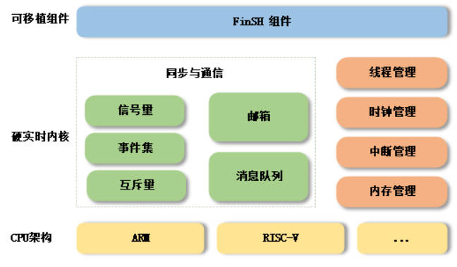

## 06-GD32F307E-START开发板评测 RT-Thread学习-时钟管理

### 1. 软硬件平台

1. GD32F307E-START Board开发板
2. MDK-ARM Keil

### 2.RT-Thread Nano 

#### 3. 时钟管理 定时器

​	**任何操作系统都需要提供一个时钟节拍，以供系统处理所有和时间有关的事件**，如线程的延时、线程的时间片轮转调度以及定时器超时等。**时钟节拍是特定的周期性中断，这个中断可以看做是系统心跳**，中断之间的时间间隔取决于不同的应用，一般是 1ms–100ms，**时钟节拍率越快，系统的实时响应越快，但是系统的额外开销就越大，从系统启动开始计数的时钟节拍数称为系统时间。**

RT-Thread 中，时钟节拍的长度可以根据 RT_TICK_PER_SECOND 的定义来调整，等于 1/RT_TICK_PER_SECOND 秒。