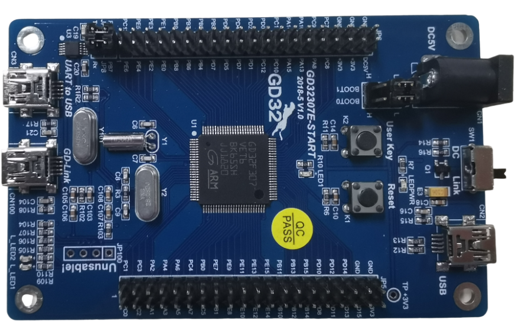
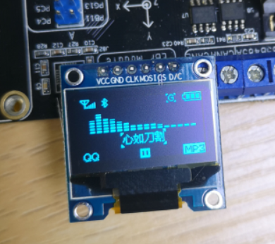
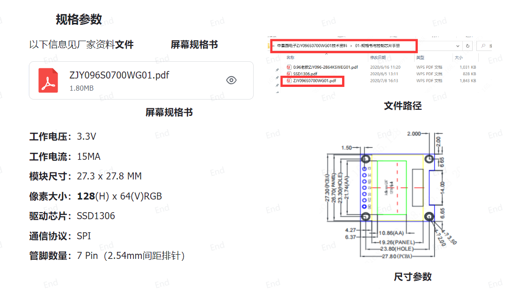
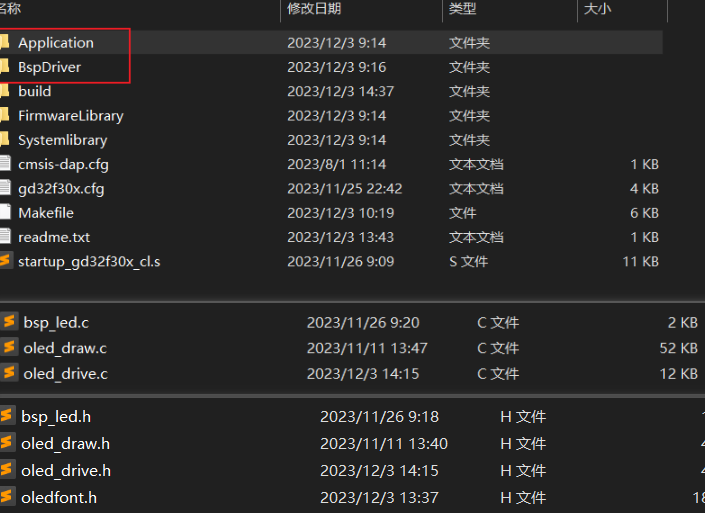
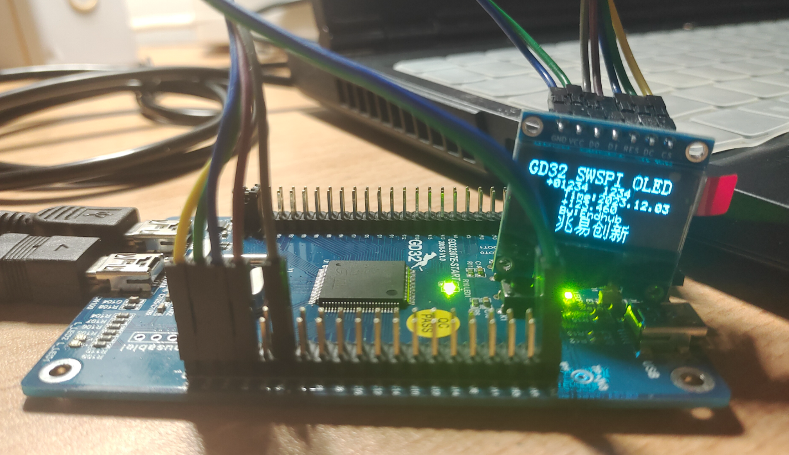
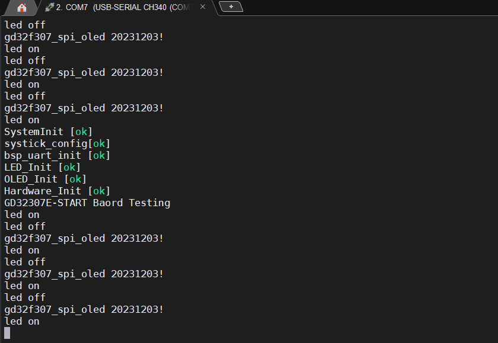

## 03-GD32F307E-START开发板评测 SPI-OLED显示模块移植
### 软硬件平台

1. GD32F307E-START Board开发板
2. GCC Makefile







| **接口** | **说明**                                        |
| -------- | ----------------------------------------------- |
| GND      | 电源地                                          |
| VCC      | 电源正（3.3V）                                  |
| D0       | 串行信号时钟输入                                |
| D1       | 串行信号数据输入                                |
| RES      | 复位信号输入（低电平有效）                      |
| DC       | 数据/命令控制（引脚拉高为数据，引脚拉低为命令） |
| CS       | 片选输入（只有CS拉低时，芯片才能使能MCU通信）   |

模块为SPI通信协议的从机，D0为SPI信号线（SCK），D1为SPI输出线（MOSI），CS为SPI片选线（NSS）。

### 软件SPI移植

1. 工程模板建立

   在之前的gcc makefile的工程模板上进行添加文件，同时oled部分代码参考梁山派GD32F4开发板资料进行。

   olde_drive.c olde_drive.h  // oled底层驱动文件，包括软件spi实现，oled引脚配置，oled初始化

   olde_draw.c olde_draw.h  // oled应用层文件，主要是绘图api实现（可以移植到其他开发板，不需要改，仅配置好驱动文件即可）

   

2. 配置引脚

   选择引脚，进入工程开始编写屏幕引脚初始化代码。

   为了方便后续移植，我在**oled_driver.h**处宏定义了每一个引脚，后续根据需要进行修改即可。

   ```c
   //-----------------OLED端口移植---------------- 
   #define RCU_LCD_D0      RCU_GPIOA//SCK
   #define PORT_LCD_D0     GPIOA
   #define GPIO_LCD_D0     GPIO_PIN_7
   
   #define RCU_LCD_D1      RCU_GPIOA//MOSI
   #define PORT_LCD_D1     GPIOA
   #define GPIO_LCD_D1     GPIO_PIN_3
   
   #define RCU_LCD_CS      RCU_GPIOC//NSS
   #define PORT_LCD_CS     GPIOC
   #define GPIO_LCD_CS     GPIO_PIN_0
   
   #define RCU_LCD_RES     RCU_GPIOA//RES
   #define PORT_LCD_RES    GPIOA
   #define GPIO_LCD_RES    GPIO_PIN_1
   
   #define RCU_LCD_DC      RCU_GPIOC //DC
   #define PORT_LCD_DC     GPIOC
   #define GPIO_LCD_DC     GPIO_PIN_2
   ```

   

3. 引脚gpio初始化 （重点1）

   ```c
   void OLED_Configuare(void)
   {
   
       //根据GPIO组初始化GPIO时钟 gd32  rcu_periph_clock_enable
       rcu_periph_clock_enable(RCU_LCD_D0);
       rcu_periph_clock_enable(RCU_LCD_D1);
       rcu_periph_clock_enable(RCU_LCD_CS);
       rcu_periph_clock_enable(RCU_LCD_DC);
       rcu_periph_clock_enable(RCU_LCD_RES);
       /* 配置CS */
       gpio_init(PORT_LCD_CS,GPIO_MODE_OUT_PP,GPIO_OSPEED_50MHZ,GPIO_LCD_CS);
       gpio_bit_write(PORT_LCD_CS, GPIO_LCD_CS, SET);
      /* 配置D0 */
       gpio_init(PORT_LCD_D0,GPIO_MODE_OUT_PP,GPIO_OSPEED_50MHZ,GPIO_LCD_D0);
       gpio_bit_write(PORT_LCD_D0, GPIO_LCD_D0, SET);
      /* 配置D1 */
       gpio_init(PORT_LCD_D1,GPIO_MODE_OUT_PP,GPIO_OSPEED_50MHZ,GPIO_LCD_D1);
       gpio_bit_write(PORT_LCD_D1, GPIO_LCD_D1, SET);
       //OLED_DC初始化设置
       gpio_init(PORT_LCD_DC,GPIO_MODE_OUT_PP,GPIO_OSPEED_50MHZ,GPIO_LCD_DC);
       gpio_bit_write(PORT_LCD_DC, GPIO_LCD_DC, SET);
       //GPIO_RES初始化设置
       gpio_init(PORT_LCD_RES,GPIO_MODE_OUT_PP,GPIO_OSPEED_50MHZ,GPIO_LCD_RES);
       gpio_bit_write(PORT_LCD_RES, GPIO_LCD_RES, SET);
   
   }
   ```

4. 端口宏定义设置

   ```c
   
   #define OLED_SCL_Clr() gpio_bit_write(PORT_LCD_D0, GPIO_LCD_D0, RESET)//SCL=SCLK
   #define OLED_SCL_Set() gpio_bit_write(PORT_LCD_D0, GPIO_LCD_D0, SET)
   
   #define OLED_SDA_Clr() gpio_bit_write(PORT_LCD_D1, GPIO_LCD_D1, RESET)//SDA=MOSI
   #define OLED_SDA_Set() gpio_bit_write(PORT_LCD_D1, GPIO_LCD_D1, SET)
   
   #define OLED_RES_Clr() gpio_bit_write(PORT_LCD_RES, GPIO_LCD_RES, RESET)//RES
   #define OLED_RES_Set() gpio_bit_write(PORT_LCD_RES,GPIO_LCD_RES, SET)
   
   #define OLED_DC_Clr()  gpio_bit_write(PORT_LCD_DC, GPIO_LCD_DC, RESET)//DC
   #define OLED_DC_Set()  gpio_bit_write(PORT_LCD_DC, GPIO_LCD_DC, SET)
                          
   #define OLED_CS_Clr()  gpio_bit_write(PORT_LCD_CS, GPIO_LCD_CS, RESET)//CS
   #define OLED_CS_Set()  gpio_bit_write(PORT_LCD_CS, GPIO_LCD_CS, SET)
   ```

5. OLED_WR_Byte函数配置（重点）

   ```c
   //==================================================================================================
   //  函数功能: OLED外设驱动函数部分
   //  函数标记: OLED_WR_Byte
   //  函数说明: 串行数据写入函数
   //  函数形参：data 要写入的串行数据  cmd  发送命令还是数据控制
   //  函数返回：无
   //-------------------------------------------------------------------------------------------------
   //  |   -   |   -   |   0   |   1   |   2   |   3   |   4   |   5   |   6   |   7   |   8   |   9   
   //==================================================================================================
   void OLED_WR_Byte(uint8_t data,uint8_t cmd)
   {   
       uint8_t i;             
       if(cmd)
       {
          OLED_DC_Set();
       }
       else
       {
          OLED_DC_Clr();
       }
     
       OLED_CS_Clr();
   
       for(i=0;i<8;i++)
       {
           OLED_SCL_Clr();
           
           if(data&0x80)
           {
              OLED_SDA_Set();
           }
           else
           {
              OLED_SDA_Clr();
           }
   
           OLED_SCL_Set();
           data<<=1;   
       }                         
       OLED_CS_Set();       
       OLED_DC_Set();        
   }
   ```

   

6. OLED初始化函数

   ```c
   void OLED_Init(void)
   { 	
       OLED_Configuare();
       
       OLED_RES_Clr();
       delay_1ms(200);
       OLED_RES_Set();
   
       OLED_WR_Byte(0xAE,OLED_CMD);//--display off
       OLED_WR_Byte(0x00,OLED_CMD);//---set low column address
       OLED_WR_Byte(0x10,OLED_CMD);//---set high column address
       OLED_WR_Byte(0x40,OLED_CMD);//--set start line address  
       OLED_WR_Byte(0xB0,OLED_CMD);//--set page address
       OLED_WR_Byte(0x81,OLED_CMD); // contract control
       OLED_WR_Byte(0xFF,OLED_CMD);//--128   
       OLED_WR_Byte(0xA1,OLED_CMD);//set segment remap 
       OLED_WR_Byte(0xA6,OLED_CMD);//--normal / reverse
       OLED_WR_Byte(0xA8,OLED_CMD);//--set multiplex ratio(1 to 64)
       OLED_WR_Byte(0x3F,OLED_CMD);//--1/32 duty
       OLED_WR_Byte(0xC8,OLED_CMD);//Com scan direction
       OLED_WR_Byte(0xD3,OLED_CMD);//-set display offset
       OLED_WR_Byte(0x00,OLED_CMD);//
       OLED_WR_Byte(0xD5,OLED_CMD);//set osc division
       OLED_WR_Byte(0x80,OLED_CMD);//
       OLED_WR_Byte(0xD8,OLED_CMD);//set area color mode off
       OLED_WR_Byte(0x05,OLED_CMD);//
       OLED_WR_Byte(0xD9,OLED_CMD);//Set Pre-Charge Period
       OLED_WR_Byte(0xF1,OLED_CMD);//
       OLED_WR_Byte(0xDA,OLED_CMD);//set com pin configuartion
       OLED_WR_Byte(0x12,OLED_CMD);//
       OLED_WR_Byte(0xDB,OLED_CMD);//set Vcomh
       OLED_WR_Byte(0x30,OLED_CMD);//
       OLED_WR_Byte(0x8D,OLED_CMD);//set charge pump enable
       OLED_WR_Byte(0x14,OLED_CMD);//
       OLED_WR_Byte(0xAF,OLED_CMD);//--turn on oled panel
   
   }  
   
   ```

   综上所述，软件spi oled驱动文件完成，接下来就是应用层文件。

   ```c
   #include "main.h"
   #include "oledfont.h" 
   
   //--------------------------------------------------------------------------------------------------
   //  自定义变量定义    |   0   |   1   |   2   |   3   |   4   |   5   |   6   |   7   |   8   |   9   
   //--------------------------------------------------------------------------------------------------
   uint8_t OLED_GRAM[128][8];
   //画图光标
   static int  _pointx=0;
   static int 	_pointy=0;
   
   //如有需要还可以自己迭代字体颜色 文字背景颜色等
   static Type_color _Draw=pix_white;
   static Type_color _fill=pix_white;
   //==================================================================================================
   //  函数功能: OLED显示函数部分
   //  函数标记: SetDrawColor
   //  函数说明: 划线 线条的颜色
   //-------------------------------------------------------------------------------------------------
   //  |   -   |   -   |   0   |   1   |   2   |   3   |   4   |   5   |   6   |   7   |   8   |   9   
   //==================================================================================================
   void SetDrawColor(Type_color value)	//就是划线 线条的颜色
   {
   	_Draw=value;
   }
   //==================================================================================================
   //  函数功能: OLED显示函数部分
   //  函数标记: GetDrawColor
   //  函数说明: 
   //-------------------------------------------------------------------------------------------------
   //  |   -   |   -   |   0   |   1   |   2   |   3   |   4   |   5   |   6   |   7   |   8   |   9   
   //==================================================================================================
   Type_color GetDrawColor(void)
   {
   	return _Draw;
   }
   //==================================================================================================
   //  函数功能: OLED显示函数部分
   //  函数标记: SetFillcolor
   //  函数说明: 填充 实心图形内的颜色
   //-------------------------------------------------------------------------------------------------
   //  |   -   |   -   |   0   |   1   |   2   |   3   |   4   |   5   |   6   |   7   |   8   |   9   
   //==================================================================================================
   void SetFillcolor(Type_color value)	//就是填充 实心图形内的颜色
   {
   	_fill=value;
   }
   //==================================================================================================
   //  函数功能: OLED显示函数部分
   //  函数标记: SetDrawColor
   //  函数说明: GetFillColor
   //-------------------------------------------------------------------------------------------------
   //  |   -   |   -   |   0   |   1   |   2   |   3   |   4   |   5   |   6   |   7   |   8   |   9   
   //==================================================================================================
   Type_color GetFillColor(void)
   {
   	return _fill;
   }
   //==================================================================================================
   //  函数功能: OLED外设驱动函数部分
   //  函数标记: OLED_Refresh_Gram
   //  函数说明: 更新显存到LCD	
   //-------------------------------------------------------------------------------------------------
   //  |   -   |   -   |   0   |   1   |   2   |   3   |   4   |   5   |   6   |   7   |   8   |   9   
   //==================================================================================================				    
   void OLED_Refresh_Gram(void)
   {
   	uint8_t i,n;		    
   	for(i=0;i<8;i++)  
   	{  
   		OLED_WR_Byte (0xb0+i,OLED_CMD);    //设置页地址（0~7）
   		OLED_WR_Byte (0x00,OLED_CMD);      //设置显示位置―列低地址
   		OLED_WR_Byte (0x10,OLED_CMD);      //设置显示位置―列高地址   
   		
   		for(n=0;n<128;n++)
             OLED_WR_Byte(OLED_GRAM[n][i],OLED_DATA); 
   	}   
   }
   //==================================================================================================
   //  函数功能: OLED外设驱动函数部分
   //  函数标记: Fill_picture
   //  函数说明: 无
   //-------------------------------------------------------------------------------------------------
   //  |   -   |   -   |   0   |   1   |   2   |   3   |   4   |   5   |   6   |   7   |   8   |   9   
   //==================================================================================================
   void Fill_picture(uint8_t fill_Data)
   {
   	uint8_t m,n;
   	for(m=0;m<8;m++)
   	{
         OLED_WR_Byte(0xb0+m,OLED_CMD);		 //page0-page1
         OLED_WR_Byte(0x00,OLED_CMD);		     //low column start address
         OLED_WR_Byte(0x10,OLED_CMD);		     //high column start address
         for(n=0;n<128;n++)
         {
           OLED_WR_Byte(fill_Data,OLED_DATA);
         }
   	}
   }
   
   //==================================================================================================
   //  实现功能: OLED_Set_Pos 定位光标
   //  函数标记: 外设驱动函数
   //  函数说明: 无
   //--------------------------------------------------------------------------------------------------
   //  输入参量: X - X方向坐标  取值范围 - 0~127
   //            Y - Y方向坐标  取值范围 - 0~  7
   //  输出参量: 无
   //--------------------------------------------------------------------------------------------------
   //  |   -   |   -   |   0   |   1   |   2   |   3   |   4   |   5   |   6   |   7   |   8   |   9   
   //==================================================================================================
   void OLED_Set_Pos(uint8_t X, uint8_t Y) 
   { 	
       OLED_WR_Byte(0xb0+Y,OLED_CMD);
   	OLED_WR_Byte(((X&0xf0)>>4)|0x10,OLED_CMD);
   	OLED_WR_Byte((X&0x0f),OLED_CMD); 
   }   
   
   //==================================================================================================
   //  实现功能: OLED 清除屏幕区域内容
   //  函数标记: 外设驱动函数
   //  函数说明: 无
   //--------------------------------------------------------------------------------------------------
   //  输入参量: X - X方向坐标  取值范围 - 0~127
   //            Y - Y方向坐标  取值范围 - 0~  7
   //            X_Size - X方向尺寸  取值范围 - 1~127
   //            Y_Size - Y方向尺寸  取值范围 - 1~  7
   //  输出参量: 无
   //--------------------------------------------------------------------------------------------------
   //  |   -   |   -   |   0   |   1   |   2   |   3   |   4   |   5   |   6   |   7   |   8   |   9   
   //==================================================================================================
   void OLED_AreaClear(uint8_t X, uint8_t Y, uint8_t X_Size, uint8_t Y_Size)
   {
       uint8_t i;                                // 定义局部变量 用于函数循环计数
       uint8_t j;                                // 定义局部变量 用于函数循环计数
   
       for(i=0; i<(Y_Size/8); i++)                     // 遍历每一行
       {
           OLED_Set_Pos(X, Y+i);                       // 设置显示坐标
           for(j=0; j<X_Size; j++)                     // 遍历每一列
           {
               OLED_WR_Byte(0x00,OLED_DATA);
           }
       }
   }
   
   //==================================================================================================
   //  实现功能: OLED 指定位置 显示字符 06x08像素
   //  函数标记: 应用函数 已完成 
   //  函数说明: 1. 位置选取不恰当 可能造成字符串显示不完全
   //            2. 如果字库不存在该文字则不显示
   //--------------------------------------------------------------------------------------------------
   //  输入参量: X - X方向坐标  取值范围 - 0~127
   //            Y - Y方向坐标  取值范围 - 0~  7
   //            Char - 待写字符   取值范围 - ASCII字符
   //  输出参量: 无
   //--------------------------------------------------------------------------------------------------
   //  |   -   |   -   |   0   |   1   |   2   |   3   |   4   |   5   |   6   |   7   |   8   |   9   
   //==================================================================================================
   void OLED_ShowChar_06x08(uint8_t X, uint8_t Y, uint8_t Char)
   {
       uint8_t i;                                // 定义局部变量 用于函数循环计数
       uint8_t j;                                // 定义局部变量 用于函数循环计数
       uint8_t FontCount;                        // 定义局部变量 用于记录字符字库个数
       
   
       
       FontCount=sizeof(OLED_ASCII_06x08_FontCode)/sizeof(OLED_ASCII_06x08_FontCode[0]);
   
       for(i=0; i<FontCount; i++)                      // 遍历每一字库
       {
           if(Char == OLED_ASCII_06x08_FontCode[i].Char)
           {
               OLED_Set_Pos(X,Y);                      // 设置显示坐标
               for(j=0; j<6; j++)                      // 遍历每一列
               {
                   OLED_WR_Byte(OLED_ASCII_06x08_FontCode[i].Code[j],OLED_DATA);
               }
               break;
           }
       }
   }
   
   //==================================================================================================
   //  实现功能: OLED 指定位置 显示字符串 06x08像素
   //  函数标记: 外设驱动函数
   //  函数说明: 1. 位置选取不恰当 可能造成字符串显示不完全
   //            2. 如果字库不存在该文字则不显示
   //            3. 06x08像素不能显示汉字 只能显示ASCII字符
   //--------------------------------------------------------------------------------------------------
   //  输入参量: X - X方向坐标  取值范围 - 0~127
   //            Y - Y方向坐标  取值范围 - 0~  7
   //            String - 待显示字符串  取值范围 - ASCII字符串
   //  输出参量: 无
   //--------------------------------------------------------------------------------------------------
   //  |   -   |   -   |   0   |   1   |   2   |   3   |   4   |   5   |   6   |   7   |   8   |   9   
   //==================================================================================================
   void OLED_ShowString_06x08(uint8_t X, uint8_t Y, uint8_t *String)
   { 
       while(*String)                                  // 判断字符串是否为空 
       {
           OLED_ShowChar_06x08(X, Y, *String);         // 指定位置显示字符
           String++;                                   // 字符串指针移动下一个字节
           X+=6;                                       // X坐标移动下一个位置
       }
   }
   //==================================================================================================
   //  实现功能: OLED 指定位置 显示字符 08x16像素
   //  函数标记: 应用函数 已完成 
   //  函数说明: 1. 位置选取不恰当 可能造成字符串显示不完全
   //            2. 如果字库不存在该文字则不显示
   //--------------------------------------------------------------------------------------------------
   //  输入参量: X - X方向坐标  取值范围 - 0~127
   //            Y - Y方向坐标  取值范围 - 0~  7
   //            Char - 待显示字符  取值范围 - ASCII字符
   //  输出参量: 无
   //--------------------------------------------------------------------------------------------------
   //  |   -   |   -   |   0   |   1   |   2   |   3   |   4   |   5   |   6   |   7   |   8   |   9   
   //==================================================================================================
   void OLED_ShowChar_08x16(uint8_t X, uint8_t Y, uint8_t Char)
   {
       uint8_t i;                                // 定义局部变量 用于函数循环计数
       uint8_t j;                                // 定义局部变量 用于函数循环计数
       uint8_t FontCount;                        // 定义局部变量 用于记录字符字库个数
       FontCount=sizeof(OLED_ASCII_08x16_FontCode)/sizeof(OLED_ASCII_08x16_FontCode[0]);
   
       for(i=0; i<FontCount; i++)                      // 循环查询字符字模位置
       {
           if(Char == OLED_ASCII_08x16_FontCode[i].Char)
           {
               OLED_Set_Pos(X,Y);                      // 设置显示坐标 用于显示字符
               for(j=0; j<8; j++)
               {
                   OLED_WR_Byte(OLED_ASCII_08x16_FontCode[i].Code[j],OLED_DATA);
               }
               OLED_Set_Pos(X,Y+1);                    // 设置显示坐标 用于显示字符
               for(j=8; j<16; j++)
               {
                   OLED_WR_Byte(OLED_ASCII_08x16_FontCode[i].Code[j],OLED_DATA);
               }
               break;
           }
       }
   }
   //==================================================================================================
   //  实现功能: OLED 指定位置 显示中英文混合字符串 08x16像素
   //  函数标记: 外设驱动函数
   //  函数说明: 1. 位置选取不恰当 可能造成字符串显示不完全
   //            2. 目前能显示英文和汉字混合字符串
   //--------------------------------------------------------------------------------------------------
   //  输入参量: X - X方向坐标  取值范围 - 0~127
   //            Y - Y方向坐标  取值范围 - 0~  7
   //            String - 待显示字符串  取值范围 - ASCII和汉字混合字符串
   //  输出参量: 无
   //--------------------------------------------------------------------------------------------------
   //  |   -   |   -   |   0   |   1   |   2   |   3   |   4   |   5   |   6   |   7   |   8   |   9   
   //==================================================================================================
   void OLED_ShowString_08x16(uint8_t X, uint8_t Y, uint8_t *String)
   {
       uint8_t Position = 0;                     // 定义局部变量 用于标记字符串位置
   
       while(*String)
       {
           // 判断字符串中的某字符的编码值是否小于0x80
           // 如果小于0x80 即为ASCII字符
           // 如果大于0x80 即为汉字字符串
           if(*String < 0x80)
           {
               // 显示ASCII字符
               OLED_ShowChar_08x16(X+Position*8, Y, *String);
               String++;                               // 字符串指针移动下一个字节
               Position++;                             // 字符串位置下一个位置
           }
           else
           {
              // 显示汉字
               OLED_ShowCHinese(X+Position*8, Y,*String);
               String+=2;                              // 字符串指针移动下一个字节
               Position+=2;                            // 字符串位置下一个位置
           }
       }
   }
   //==================================================================================================
   //  实现功能: OLED 显示汉字
   //  函数标记: 外设驱动函数
   //  函数说明: 无
   //--------------------------------------------------------------------------------------------------
   //  输入参量: X - X方向坐标  取值范围 - 0~127
   //            Y - Y方向坐标  取值范围 - 0~  7
   //            Chinese - 待显示汉字  取值范围 - 单个汉字组成的字符串
   //  输出参量: 无
   //--------------------------------------------------------------------------------------------------
   //  |   -   |   -   |   0   |   1   |   2   |   3   |   4   |   5   |   6   |   7   |   8   |   9   
   //==================================================================================================
   void OLED_ShowCHinese(uint8_t X,uint8_t Y,uint8_t Chinese)
   {      			    
   	  uint8_t count,adder=0;
   	  OLED_Set_Pos(X,Y);	
   	  for(count=0;count<16;count++)
   	  {
   			OLED_WR_Byte(CHinese[2*Chinese][count],OLED_DATA);
   			adder+=1;
   	  }	
   	  
   	  OLED_Set_Pos(X,Y+1);	
   	  
   	  for(count=0;count<16;count++)
   	  {	
   			OLED_WR_Byte(CHinese[2*Chinese+1][count],OLED_DATA);
   			adder+=1;
   	  }					
   }
   //==================================================================================================
   //  实现功能: OLED 显示数组
   //  函数标记: OLED_ShowArray_06x08
   //  函数说明: 无
   //--------------------------------------------------------------------------------------------------
   //  输入参量: X - X方向坐标  取值范围 - 0~127
   //            Y - Y方向坐标  取值范围 - 0~  7
   //            Array 待显示数组
   //            Count 待显示整型数字长度
   //  输出参量: 无
   //--------------------------------------------------------------------------------------------------
   //  |   -   |   -   |   0   |   1   |   2   |   3   |   4   |   5   |   6   |   7   |   8   |   9   
   //==================================================================================================
   void OLED_ShowArray_06x08(uint8_t X, uint8_t Y, uint8_t *Array, uint8_t Count)
   {
       uint8_t i;                                // 定义局部变量 用于函数循环计数
       uint8_t j;                                // 定义局部变量 用于函数循环计数
       uint8_t k;                                // 定义局部变量 用于函数循环计数
       uint8_t FontCount;                        // 定义局部变量 用于记录字符字库个数
   
       
       FontCount=sizeof(OLED_ASCII_06x08_FontCode)/sizeof(OLED_ASCII_06x08_FontCode[0]);
   
       for(i=0; i<Count; i++)
       {
           for(j=0; j<FontCount; j++)                  // 循环查询字符字模位置
           {
               if(*Array == OLED_ASCII_06x08_FontCode[j].Char)
               {
                   OLED_Set_Pos(X,Y);                  // 设置显示坐标 用于显示字符
                   for(k=0; k<6; k++)
                   {
                       OLED_WR_Byte(OLED_ASCII_06x08_FontCode[j].Code[k],OLED_DATA);
                   }
                   break;
               }
           }
           Array++;
           X += 6;                                     // 数组位置下一个位置
       }
   }
   //==================================================================================================
   //  实现功能: OLED 显示数组
   //  函数标记: OLED_ShowArray_08x16
   //  函数说明: 无
   //--------------------------------------------------------------------------------------------------
   //  输入参量: X - X方向坐标  取值范围 - 0~127
   //            Y - Y方向坐标  取值范围 - 0~  7
   //            Array 待显示数组
   //            Count 待显示整型数字长度
   //  输出参量: 无
   //--------------------------------------------------------------------------------------------------
   //  |   -   |   -   |   0   |   1   |   2   |   3   |   4   |   5   |   6   |   7   |   8   |   9   
   //==================================================================================================
   void OLED_ShowArray_08x16(uint8_t X, uint8_t Y, uint8_t *Array, uint8_t Count)
   {
       uint8_t i;                                // 定义局部变量 用于函数循环计数
       uint8_t j;                                // 定义局部变量 用于函数循环计数
       uint8_t k;                                // 定义局部变量 用于函数循环计数
       uint8_t FontCount;                        // 定义局部变量 用于记录字符字库个数
   
       FontCount=sizeof(OLED_ASCII_08x16_FontCode)/sizeof(OLED_ASCII_08x16_FontCode[0]);
   
       for(i=0; i<Count; i++)
       {
           for(j=0; j<FontCount; j++)                  // 循环查询字符字模位置
           {
               if(*Array == OLED_ASCII_08x16_FontCode[j].Char)
               {
                   OLED_Set_Pos(X,Y);                  // 设置显示坐标 用于显示字符
                   for(k=0; k<6; k++)
                   {
                       OLED_WR_Byte(OLED_ASCII_08x16_FontCode[j].Code[k],OLED_DATA);
                   }
                   break;
               }
           }
           Array++;
           X += 6;                                     // 数组位置下一个位置
       }
   }
   //==================================================================================================
   //  实现功能: OLED 指定位置 显示有符号整形数字
   //  函数标记: 外设驱动函数
   //  函数说明: 1.最大显示5位数字 位置选取不恰当 可能造成数字显示不完全
   //--------------------------------------------------------------------------------------------------
   //  输入参量: X - X方向坐标  取值范围 - 0~127
   //            Y - Y方向坐标  取值范围 - 0~  7
   //            IntegerNumber - 待显示整型数字 取值范围 - -32767~+32768
   //            Count - 待显示整型数字长度     取值范围 - 0~5；
   //  输出参量: 无
   //--------------------------------------------------------------------------------------------------
   //  |   -   |   -   |   0   |   1   |   2   |   3   |   4   |   5   |   6   |   7   |   8   |   9   
   //==================================================================================================
   void OLED_ShowNumber_SignedInteger_06x08(uint8_t X, uint8_t Y, signed short IntegerNumber, uint8_t Count)
   {
       uint8_t IntegerNumber_Array[5]={0};       // 定义局部数组 用于数组数据存储
       // 判断 整型数字正负
       if(IntegerNumber < 0)
       {
           IntegerNumber=0 - IntegerNumber;
           OLED_ShowChar_06x08(X, Y, '-');
       }
       else
       {
           OLED_ShowChar_06x08(X, Y, '+');
       }
   
       // 计算各位数值的字符
       if(Count>4) IntegerNumber_Array[0] = (IntegerNumber/10000) % 10 + 0x30;
       if(Count>3) IntegerNumber_Array[1] = (IntegerNumber/1000 ) % 10 + 0x30;
       if(Count>2) IntegerNumber_Array[2] = (IntegerNumber/100  ) % 10 + 0x30;
       if(Count>1) IntegerNumber_Array[3] = (IntegerNumber/10   ) % 10 + 0x30;
       if(Count>0) IntegerNumber_Array[4] = (IntegerNumber/1    ) % 10 + 0x30;
       
       // 执行显示操作
       OLED_ShowArray_06x08(X+6, Y, &IntegerNumber_Array[5-Count], Count);
   }
   
   //==================================================================================================
   //  实现功能: OLED 指定位置 显示有符号整形数字
   //  函数标记: 外设驱动函数
   //  函数说明: 1.最大显示5位数字 位置选取不恰当 可能造成数字显示不完全
   //--------------------------------------------------------------------------------------------------
   //  输入参量: X - X方向坐标  取值范围 - 0~127
   //            Y - Y方向坐标  取值范围 - 0~  7
   //            IntegerNumber - 待显示整型数字 取值范围 - -32767~+32768
   //            Count - 待显示整型数字长度     取值范围 - 0~5；
   //  输出参量: 无
   //--------------------------------------------------------------------------------------------------
   //  |   -   |   -   |   0   |   1   |   2   |   3   |   4   |   5   |   6   |   7   |   8   |   9   
   //==================================================================================================
   void OLED_ShowNumber_SignedInteger_08x16(uint8_t X, uint8_t Y, signed short IntegerNumber, uint8_t Count)
   {
       uint8_t IntegerNumber_Array[5]={0};       // 定义局部数组 用于数组数据存储
       // 判断 整型数字正负
       if(IntegerNumber < 0)
       {
           IntegerNumber=0 - IntegerNumber;
           OLED_ShowChar_08x16(X, Y, '-');
       }
       else
       {
           OLED_ShowChar_08x16(X, Y, '+');
       }
   
       // 计算各位数值的字符
       if(Count>4) IntegerNumber_Array[0] = (IntegerNumber/10000) % 10 + 0x30;
       if(Count>3) IntegerNumber_Array[1] = (IntegerNumber/1000 ) % 10 + 0x30;
       if(Count>2) IntegerNumber_Array[2] = (IntegerNumber/100  ) % 10 + 0x30;
       if(Count>1) IntegerNumber_Array[3] = (IntegerNumber/10   ) % 10 + 0x30;
       if(Count>0) IntegerNumber_Array[4] = (IntegerNumber/1    ) % 10 + 0x30;
       
       // 执行显示操作
       OLED_ShowArray_08x16(X+6, Y, &IntegerNumber_Array[5-Count], Count);
   }
   //==================================================================================================
   //  实现功能: OLED 指定位置 显示无符号整形数字
   //  函数标记: 外设驱动函数
   //  函数说明: 1.最大显示5位数字 位置选取不恰当 可能造成数字显示不完全
   //--------------------------------------------------------------------------------------------------
   //  输入参量: X - X方向坐标  取值范围 - 0~127
   //            Y - Y方向坐标  取值范围 - 0~  7
   //            IntegerNumber - 待显示整型数字 取值范围 - -32767~+32768
   //            Count - 待显示整型数字长度     取值范围 - 0~5；
   //  输出参量: 无
   //--------------------------------------------------------------------------------------------------
   //  |   -   |   -   |   0   |   1   |   2   |   3   |   4   |   5   |   6   |   7   |   8   |   9   
   //==================================================================================================
   void OLED_ShowNumber_UnsignedInteger_06x08(uint8_t X, uint8_t Y, uint16_t IntegerNumber, uint8_t Count)
   {
       uint8_t IntegerNumber_Array[5]={0};       // 定义局部数组 用于数组数据存储
   
       // 计算各位数值的字符
       if(Count>4) IntegerNumber_Array[0] = (IntegerNumber/10000) % 10 + 0x30;
       if(Count>3) IntegerNumber_Array[1] = (IntegerNumber/1000 ) % 10 + 0x30;
       if(Count>2) IntegerNumber_Array[2] = (IntegerNumber/100  ) % 10 + 0x30;
       if(Count>1) IntegerNumber_Array[3] = (IntegerNumber/10   ) % 10 + 0x30;
       if(Count>0) IntegerNumber_Array[4] = (IntegerNumber/1    ) % 10 + 0x30;
       
       // 执行显示操作
       OLED_ShowArray_06x08(X, Y, &IntegerNumber_Array[5-Count], Count);
   }
   
   //==================================================================================================
   //  实现功能: OLED 指定位置 显示无符号整形数字
   //  函数标记: 外设驱动函数
   //  函数说明: 1.最大显示5位数字 位置选取不恰当 可能造成数字显示不完全
   //--------------------------------------------------------------------------------------------------
   //  输入参量: X - X方向坐标  取值范围 - 0~127
   //            Y - Y方向坐标  取值范围 - 0~  7
   //            IntegerNumber - 待显示整型数字 取值范围 - -32767~+32768
   //            Count - 待显示整型数字长度     取值范围 - 0~5；
   //  输出参量: 无
   //--------------------------------------------------------------------------------------------------
   //  |   -   |   -   |   0   |   1   |   2   |   3   |   4   |   5   |   6   |   7   |   8   |   9   
   //==================================================================================================
   void OLED_ShowNumber_UnsignedInteger_08x16(uint8_t X, uint8_t Y, uint16_t IntegerNumber, uint8_t Count)
   {
       uint8_t IntegerNumber_Array[5]={0};       // 定义局部数组 用于数组数据存储
   
       // 计算各位数值的字符
       if(Count>4) IntegerNumber_Array[0] = (IntegerNumber/10000) % 10 + 0x30;
       if(Count>3) IntegerNumber_Array[1] = (IntegerNumber/1000 ) % 10 + 0x30;
       if(Count>2) IntegerNumber_Array[2] = (IntegerNumber/100  ) % 10 + 0x30;
       if(Count>1) IntegerNumber_Array[3] = (IntegerNumber/10   ) % 10 + 0x30;
       if(Count>0) IntegerNumber_Array[4] = (IntegerNumber/1    ) % 10 + 0x30;
       
       // 执行显示操作
       OLED_ShowArray_08x16(X, Y, &IntegerNumber_Array[5-Count], Count);
   }
   //==================================================================================================
   //  实现功能: OLED 指定位置 显示06x08大小的浮点数字
   //  函数标记: 外设驱动函数
   //  函数说明: float型数据有效数字显示7位 double型数据有效数字16位
   //--------------------------------------------------------------------------------------------------
   //  输入参量: X - X方向坐标  取值范围 - 0~127
   //            Y - Y方向坐标  取值范围 - 0~  7
   //            FloatNumber - 待显示浮点型数字  取值范围 - -99999.99999~99999.99999
   //            Count1 - 整数显示位数  取值范围 - 0~5
   //            Count2 - 小数显示位数  取值范围 - 0~5
   //  输出参量: 无
   //--------------------------------------------------------------------------------------------------
   //  |   -   |   -   |   0   |   1   |   2   |   3   |   4   |   5   |   6   |   7   |   8   |   9   
   //==================================================================================================
   void OLED_ShowNumber_Float_06x08(uint8_t X, uint8_t Y, float FloatNumber, uint8_t Count1, uint8_t Count2)
   {
       uint8_t Number_Integer_Array[5];          // 定义局部数组 用于存储整数位各位数据
       uint8_t Number_Decimal_Array[5];          // 定义局部数组 用于存储小数位各位数据
   
       unsigned long Number_Integer = 0;               // 定义局部变量 表示浮点数的 整数部分
       unsigned long Number_Decimal = 0;               // 定义局部变量 表示浮点数的 小数部分
   
       if(FloatNumber < 0)
       {
           FloatNumber= 0 - FloatNumber;
           OLED_ShowChar_06x08(X,Y,'-');
       }
       else
       {
           OLED_ShowChar_06x08(X,Y,'+');
       }
       //----------------------------------------------------------------------------------------------
       // 限制 显示字符数
       //----------------------------------------------------------------------------------------------
       // 由于由于float型的有效十进制数值最多为7位 即整数位 + 小数位 数量一定小于等于7
       while((Count1 + Count2 > 7 ))
       {
           if((Count1 > 5) && (Count1 != 0))
           {
               --Count1;
           }
           else
           {
               --Count2;
           }
       }
       Number_Integer = (unsigned long)(FloatNumber);                                      // 取整数部分
       Number_Decimal = (unsigned long)((FloatNumber - Number_Integer + 0.000005) * 1e5);  // 取小数部分 1e5科学计数法
   
       Number_Integer_Array[0] = Number_Integer/10000 % 10 + 0x30;     // 计算整数部分
       Number_Integer_Array[1] = Number_Integer/ 1000 % 10 + 0x30;
       Number_Integer_Array[2] = Number_Integer/  100 % 10 + 0x30;
       Number_Integer_Array[3] = Number_Integer/   10 % 10 + 0x30;
       Number_Integer_Array[4] = Number_Integer/    1 % 10 + 0x30;
   
       Number_Decimal_Array[0] = Number_Decimal/10000 % 10 + 0x30;     // 计算小数部分
       Number_Decimal_Array[1] = Number_Decimal/ 1000 % 10 + 0x30;
       Number_Decimal_Array[2] = Number_Decimal/  100 % 10 + 0x30;
       Number_Decimal_Array[3] = Number_Decimal/   10 % 10 + 0x30;
       Number_Decimal_Array[4] = Number_Decimal/    1 % 10 + 0x30;
   
       OLED_ShowArray_06x08(X+6,            Y, &Number_Integer_Array[5-Count1], Count1);   // 显示整数位
       OLED_ShowChar_06x08( X+(1+Count1)*6, Y, '.');                                       // 显示小数点
       OLED_ShowArray_06x08(X+(2+Count1)*6, Y, &Number_Decimal_Array[0],        Count2);   // 显示小数位
   }
   
   //==================================================================================================
   //  实现功能: OLED 指定位置 显示08x16大小的浮点数字
   //  函数标记: 外设驱动函数
   //  函数说明: float型数据有效数字显示7位 double型数据有效数字16位
   //--------------------------------------------------------------------------------------------------
   //  输入参量: X - X方向坐标  取值范围 - 0~127
   //            Y - Y方向坐标  取值范围 - 0~  7
   //            FloatNumber - 待显示浮点型数字  取值范围 - -99999.99999~99999.99999
   //            Count1 - 整数显示位数  取值范围 - 0~5
   //            Count2 - 小数显示位数  取值范围 - 0~5
   //  输出参量: 无
   //--------------------------------------------------------------------------------------------------
   //  |   -   |   -   |   0   |   1   |   2   |   3   |   4   |   5   |   6   |   7   |   8   |   9   
   //==================================================================================================
   void OLED_ShowNumber_Float_08x16(uint8_t X, uint8_t Y, float FloatNumber, uint8_t Count1, uint8_t Count2)
   {
       uint8_t Number_Integer_Array[5];          // 定义局部数组 用于存储整数位各位数据
       uint8_t Number_Decimal_Array[5];          // 定义局部数组 用于存储小数位各位数据
   
       unsigned long Number_Integer = 0;               // 定义局部变量 表示浮点数的 整数部分
       unsigned long Number_Decimal = 0;               // 定义局部变量 表示浮点数的 小数部分
   
       if(FloatNumber < 0)
       {
           FloatNumber= 0 - FloatNumber;
           OLED_ShowChar_08x16(X,Y,'-');
       }
       else
       {
           OLED_ShowChar_08x16(X,Y,'+');
       }
       //----------------------------------------------------------------------------------------------
       // 限制 显示字符数
       //----------------------------------------------------------------------------------------------
       // 由于由于float型的有效十进制数值最多为7位 即整数位 + 小数位 数量一定小于等于7
       while((Count1 + Count2 > 7 ))
       {
           if((Count1 > 5) && (Count1 != 0))
           {
               --Count1;
           }
           else
           {
               --Count2;
           }
       }
       Number_Integer = (unsigned long)(FloatNumber);                                      // 取整数部分
       Number_Decimal = (unsigned long)((FloatNumber - Number_Integer + 0.000005) * 1e5);  // 取小数部分 1e5科学计数法
   
       Number_Integer_Array[0] = Number_Integer/10000 % 10 + 0x30;     // 计算整数部分
       Number_Integer_Array[1] = Number_Integer/ 1000 % 10 + 0x30;
       Number_Integer_Array[2] = Number_Integer/  100 % 10 + 0x30;
       Number_Integer_Array[3] = Number_Integer/   10 % 10 + 0x30;
       Number_Integer_Array[4] = Number_Integer/    1 % 10 + 0x30;
   
       Number_Decimal_Array[0] = Number_Decimal/10000 % 10 + 0x30;     // 计算小数部分
       Number_Decimal_Array[1] = Number_Decimal/ 1000 % 10 + 0x30;
       Number_Decimal_Array[2] = Number_Decimal/  100 % 10 + 0x30;
       Number_Decimal_Array[3] = Number_Decimal/   10 % 10 + 0x30;
       Number_Decimal_Array[4] = Number_Decimal/    1 % 10 + 0x30;
   
       OLED_ShowArray_08x16(X+6,            Y, &Number_Integer_Array[5-Count1], Count1);   // 显示整数位
       OLED_ShowChar_08x16( X+(1+Count1)*6, Y, '.');                                       // 显示小数点
       OLED_ShowArray_08x16(X+(2+Count1)*6, Y, &Number_Decimal_Array[0],        Count2);   // 显示小数位
   }
   
   //==================================================================================================
   //  实现功能: OLED 指定位置 显示06x08大小的二进制数字
   //  函数标记: 外设驱动函数
   //  函数说明: 1. 位置选取不恰当 可能造成字符串显示不完全
   //            2. 显示8位二进制数字 主要作为寄存器数据显示
   //--------------------------------------------------------------------------------------------------
   //  输入参量: X - X方向坐标  取值范围 - 0~127
   //            Y - Y方向坐标  取值范围 - 0~  7
   //            BinaryNumber - 待显示二进制数字  取值范围 - 0~4294967295
   //            Count - 二进制显示位数  取值范围 - 1~16
   //  输出参量: 无
   //--------------------------------------------------------------------------------------------------
   //  |   -   |   -   |   0   |   1   |   2   |   3   |   4   |   5   |   6   |   7   |   8   |   9   
   //==================================================================================================
   void OLED_ShowNumber_Binary_06x08(uint8_t X, uint8_t Y, unsigned long BinaryNumber, uint8_t Count)
   {
       uint8_t i;                                // 定义局部变量 用于函数循环计数
   
       for(i=Count; i>0; i--)
       {
           if(BinaryNumber & ( 1 << (Count-1) ))
           {
               OLED_ShowChar_06x08(X, Y, '1');         // 显示二进制字符'1'
           }
           else
           {
               OLED_ShowChar_06x08(X, Y, '0');         // 显示二进制字符'1'
           }
           BinaryNumber <<= 1;                         // 移位运算
           X += 6;                                     // 数组位置下一个位置
       }
   }
   
   //==================================================================================================
   //  实现功能: OLED 指定位置 显示06x08大小的十六进制数字
   //  函数标记: 外设驱动函数
   //  函数说明: 1. 位置选取不恰当 可能造成字符串显示不完全
   //            2. 显示8位二进制数字 主要作为寄存器数据显示
   //--------------------------------------------------------------------------------------------------
   //  输入参量: X - X方向坐标  取值范围 - 0~127
   //            Y - Y方向坐标  取值范围 - 0~  7
   //            BinaryNumber - 待显示二进制数字  取值范围 - 0~4294967295
   //            Count - 二进制显示位数  取值范围 - 1~8
   //  输出参量: 无
   //--------------------------------------------------------------------------------------------------
   //  |   -   |   -   |   0   |   1   |   2   |   3   |   4   |   5   |   6   |   7   |   8   |   9   
   //==================================================================================================
   void OLED_ShowNumber_Hex_06x08(uint8_t X, uint8_t Y, unsigned long HexNumber, uint8_t Count)
   {
       uint8_t i;                                // 定义局部变量 用于函数循环计数
       unsigned long Number;                           // 定义局部变量 用于装载数据
       for(i=Count; i>0; i--)
       {
           Number = HexNumber>>(4*(i-1)) & 0x0000000F;
           if(Number<10)
           {
               OLED_ShowChar_06x08(X, Y, '0'+Number); 
           }
           else
           {
               OLED_ShowChar_06x08(X, Y, 'A'+(Number-10)); 
           }
           X += 6;                                     // 数组位置下一个位置
       }
   }
   
   //==================================================================================================
   //  实现功能: OLED 指定位置 画点
   //  函数标记: 外设驱动函数
   //  函数说明: 
   //--------------------------------------------------------------------------------------------------
    // 输入参量: //画点 
   //              //x:0~127
   //              //y:0~63
   //              //t:1 填充 0,清空	
   //--------------------------------------------------------------------------------------------------
   //  |   -   |   -   |   0   |   1   |   2   |   3   |   4   |   5   |   6   |   7   |   8   |   9   
   //==================================================================================================
   void OLED_DrawDot(uint8_t X,uint8_t Y,uint8_t T)
   {
   	  uint8_t pos,bx,temp=0;
   		if( X>127|| Y>63) return;
   		pos=(Y)/8;
   		bx=Y%8;
   		temp=1<<(bx);
   		if(T) 
               OLED_GRAM[X][pos]|=temp;
   		else 
               OLED_GRAM[X][pos]&=~temp;
           
   		OLED_Refresh_Gram();	
   }
   //==================================================================================================
   //  实现功能: OLED 指定位置 绘制直线数据
   //  函数标记: 外设驱动函数
   //  函数说明: 该点为8个像素的竖线 并非实际像素点
   //--------------------------------------------------------------------------------------------------
   //  输入参量: X1,X2 - X方向坐标  取值范围 - 0~127
   //            Y1,Y2 - Y方向坐标  取值范围 - 0~  7
   //  输出参量: 无
   //--------------------------------------------------------------------------------------------------
   //  |   -   |   -   |   0   |   1   |   2   |   3   |   4   |   5   |   6   |   7   |   8   |   9   
   //==================================================================================================
   void OLED_DrawLine(int X1,int Y1,int X2,int Y2)
   {
   	unsigned short us; 
   	unsigned short usX_Current, usY_Current;
   	
   	int lError_X = 0, lError_Y = 0, lDelta_X, lDelta_Y, lDistance; 
   	int lIncrease_X, lIncrease_Y; 	
   
   	lDelta_X = X2 - X1; //计算坐标增量 
   	lDelta_Y = Y2 - Y1; 
   
   	usX_Current = X1; 
   	usY_Current = Y1; 
   
   	if ( lDelta_X > 0 ) 
   		lIncrease_X = 1; 			//设置单步正方向 
   	else if ( lDelta_X == 0 ) 
   		lIncrease_X = 0;			//垂直线 
   	else 
   	{ 
   		lIncrease_X = -1;			//设置单步反方向 
   		lDelta_X = - lDelta_X;
   	} 
   
   	//Y轴的处理方式与上图X轴的处理方式同理
   	if ( lDelta_Y > 0 )
   		lIncrease_Y = 1; 
   	else if ( lDelta_Y == 0 )
   		lIncrease_Y = 0;			//水平线 
   	else 
   	{
   		lIncrease_Y = -1;
   		lDelta_Y = - lDelta_Y;
   	} 
   
   	//选取不那么陡的方向依次画点
   	if ( lDelta_X > lDelta_Y )
   		lDistance = lDelta_X;
   	else 
   		lDistance = lDelta_Y; 
   
   	//依次画点 进入缓存区 画好后再刷新缓冲区就好啦
   	for ( us = 0; us <= lDistance + 1; us ++ )					//画线输出 
   	{
   		OLED_DrawDot(usX_Current,usY_Current,GetDrawColor());	//画点 
   		lError_X += lDelta_X ; 
   		lError_Y += lDelta_Y ; 
   
   		if ( lError_X > lDistance ) 
   		{
   			lError_X -= lDistance; 
   			usX_Current += lIncrease_X; 
   		}  
   
   		if ( lError_Y > lDistance ) 
   		{ 
   			lError_Y -= lDistance; 
   			usY_Current += lIncrease_Y; 
   		} 		
   	}  
   }
   void MoveTo(int x,int y)
   {
   	_pointx=x;
   	_pointy=y;
   }
   void LineTo(int x,int y)
   {
   	OLED_DrawLine(_pointx,_pointy,x,y);
   	_pointx=x;
   	_pointy=y;
   
   }
   //绘制一个点
   void DrawPixel(int x,int y)
   {
   	OLED_DrawDot(x,y,GetDrawColor());
   }
   //功能:快速绘制一条水平线 w为长度
   void DrawFastHLine(int x, int y, unsigned char w)
   {
   	int end = x+w;
   	int a;
   	
   	Type_color color =GetDrawColor();
   	for ( a = MAX(0,x); a < MIN(end,SCREEN_COLUMN); a++)
   	{
   		OLED_DrawDot(a,y,color);
   	}
   }
   //功能:快速绘制一条垂直线 h为高度
   void DrawFastVLine(int x, int y, unsigned char h)
   {
   	int end = y+h;
   	int a;
   	
   	Type_color color =GetDrawColor();
   	for (a = MAX(0,y); a < MIN(end,SCREEN_ROW); a++)
   	{
   		OLED_DrawDot(x,a,color);
   	}
   }
   //绘制折线 开始和转折点的坐标 总点个数
   void DrawPolyLineTo(const TypeXY *points,int num)
   {
   	int i=0;
   	MoveTo(points[0].x,points[0].y);
   	for(i=1;i<num;i++)
   	{
   		LineTo(points[i].x,points[i].y);
   	}
   }
   //==================================================================================================
   //  实现功能: OLED 指定位置 绘制图像 Draw_BMP
   //  函数标记: 外设驱动函数
   //  函数说明: 
   //--------------------------------------------------------------------------------------------------
   //  输入参量: X - X方向坐标  取值范围 - 0~127
   //            Y - Y方向坐标  取值范围 - 0~  7
   //            X_Size - X方向尺寸大小 取值范围 - 0~127
   //            Y_Size - Y方向尺寸大小 取值范围 - 0~7
   //            Image - 图像数据
   //  输出参量: 无
   /*功能描述：显示显示BMP图片128×64起始点坐标(x,y),x的范围0～127，y为页的范围0～7*****************/
   //--------------------------------------------------------------------------------------------------
   //  |   -   |   -   |   0   |   1   |   2   |   3   |   4   |   5   |   6   |   7   |   8   |   9   
   //==================================================================================================
   void Draw_BMP(uint8_t X0,uint8_t Y0,uint8_t X1,uint8_t Y1,uint8_t BMP[])
   {
   	uint32_t j=0;
   	uint8_t x,y;
   
     if(Y1%8==0) y=Y1/8;      
     else y=Y1/8+1;
   	for(y=Y0;y<Y1;y++)
   	{
   		OLED_Set_Pos(X0,y);
       for(x=X0;x<X1;x++)
   	    {      
   	    	OLED_WR_Byte(BMP[j++],OLED_DATA);
   	    }
   	}
   } 
   
   //================================================================================================== 
   ///**
   // * @brief  在 oled 显示器上使用 Bresenham 算法画圆
   // * @param  usX_Center ：在特定扫描方向下圆心的X坐标
   // * @param  usY_Center ：在特定扫描方向下圆心的Y坐标
   // * @param  usRadius：圆的半径（单位：像素）
   // * @param  ucFilled ：选择是否填充该圆
   //  *   该参数为以下值之一：
   //  *     @arg 0 :空心圆
   //  *     @arg 1 :实心圆
   // * @retval 无
   // */
   //--------------------------------------------------------------------------------------------------
   //  |   -   |   -   |   0   |   1   |   2   |   3   |   4   |   5   |   6   |   7   |   8   |   9   
   //==================================================================================================
   void OLED_DrawCircle( uint16_t usX_Center, uint16_t usY_Center, uint16_t usRadius, uint8_t ucFilled )
   {
   	int16_t sCurrentX, sCurrentY;
   	int16_t sError;
   	
   	
   	sCurrentX = 0; sCurrentY = usRadius;	  
   	
   	sError = 3 - ( usRadius << 1 );     //判断下个点位置的标志
   	
   	
   	while ( sCurrentX <= sCurrentY )
   	{
   		int16_t sCountY;
   		
   		
   		if ( ucFilled ) 			
               for ( sCountY = sCurrentX; sCountY <= sCurrentY; sCountY ++ ) 
               {                      
                   OLED_DrawDot ( usX_Center + sCurrentX, usY_Center + sCountY,OLED_DATA );           //1，研究对象 
                   OLED_DrawDot ( usX_Center - sCurrentX, usY_Center + sCountY,OLED_DATA);           //2       
                   OLED_DrawDot ( usX_Center - sCountY,   usY_Center + sCurrentX,OLED_DATA);           //3
                   OLED_DrawDot ( usX_Center - sCountY,   usY_Center - sCurrentX,OLED_DATA );           //4
                   OLED_DrawDot ( usX_Center - sCurrentX, usY_Center - sCountY,OLED_DATA );           //5    
                   OLED_DrawDot ( usX_Center + sCurrentX, usY_Center - sCountY,OLED_DATA );           //6
                   OLED_DrawDot ( usX_Center + sCountY,   usY_Center - sCurrentX,OLED_DATA );           //7 	
                   OLED_DrawDot ( usX_Center + sCountY,   usY_Center + sCurrentX,OLED_DATA );           //0				
               }	
   		else
   		{          
                   OLED_DrawDot ( usX_Center + sCurrentX, usY_Center + sCurrentY,OLED_DATA );             //1，研究对象
                   OLED_DrawDot ( usX_Center - sCurrentX, usY_Center + sCurrentY,OLED_DATA );             //2      
                   OLED_DrawDot ( usX_Center - sCurrentY, usY_Center + sCurrentX,OLED_DATA );             //3
                   OLED_DrawDot ( usX_Center - sCurrentY, usY_Center - sCurrentX,OLED_DATA );             //4
                   OLED_DrawDot ( usX_Center - sCurrentX, usY_Center - sCurrentY,OLED_DATA );             //5       
                   OLED_DrawDot ( usX_Center + sCurrentX, usY_Center - sCurrentY,OLED_DATA);             //6
                   OLED_DrawDot ( usX_Center + sCurrentY, usY_Center - sCurrentX,OLED_DATA);             //7 
                   OLED_DrawDot ( usX_Center + sCurrentY, usY_Center + sCurrentX,OLED_DATA );             //0
       }					
   		sCurrentX ++;		
   		if ( sError < 0 ) 
   			sError += 4 * sCurrentX + 6;	  
   		else
   		{
   			sError += 10 + 4 * ( sCurrentX - sCurrentY );   
   			sCurrentY --;
   		} 		
   	}	
   }
   
   //==================================================================================================
   //  实现功能: OLED LCD_DrawRectangle
   //  函数标记: 外设驱动函数
   //  函数说明: 使用对角点填充矩形
   //--------------------------------------------------------------------------------------------------
   //  输入参量: uint32_t X1,  长度 宽度：俩点坐标(x1,y1  ,(x2,y2)
   //           uint32_t Y1, 
   //           uint32_t X2,
   //           uint32_t Y2，
   //--------------------------------------------------------------------------------------------------
   //  |   -   |   -   |   0   |   1   |   2   |   3   |   4   |   5   |   6   |   7   |   8   |   9   
   //==================================================================================================
   
   void LCD_DrawRectangle(uint16_t X1, uint16_t Y1, uint16_t X2, uint16_t Y2)
   {
           OLED_DrawLine(X1,Y1,X2,Y1);
           OLED_DrawLine(X1,Y1,X1,Y2);
           OLED_DrawLine(X1,Y2,X2,Y2);
           OLED_DrawLine(X2,Y1,X2,Y2);
   }
   
   //==================================================================================================
   //  实现功能: OLED OLED_Fill_Draw_circle //画圆填充
   //  函数标记: 外设驱动函数
   //  函数说明: 
   //--------------------------------------------------------------------------------------------------
   //  输入参量: //写画实心圆心(x0,y0),半径r，dot=1填充，dot=0不填充
   //--------------------------------------------------------------------------------------------------
   //  |   -   |   -   |   0   |   1   |   2   |   3   |   4   |   5   |   6   |   7   |   8   |   9   
   //==================================================================================================
   void OLED_Fill_Draw_circle(uint8_t X0,uint8_t Y0,uint8_t r,uint8_t dot)
   {	
   		uint8_t x = 0,y = 0,R = 0;
   		for(x = X0-r;x <= X0+r;x++)
           {
   				for(y = Y0-r; y <= Y0+r ;y++ )
                   {
   					R = sqrt(pow(r,2)-pow(x-X0,2))+Y0; //圆方程  x,y反置		
                       if( (y >= Y0 && y <= R) || (y < Y0 && y >= 2*Y0-R )|| dot == 0 )
                       {  //点限制在 圆方程内	
                           OLED_DrawDot(y,x,dot);
                       }	
   				}
   		}
   }
   //==================================================================================================
   //  实现功能: OLED_RollDisplay
   //  函数标记: 外设驱动函数
   //  函数说明: //水平滚动
   //  函数完成情况：有问题
   //--------------------------------------------------------------------------------------------------
   //  输入参量: 无
   //--------------------------------------------------------------------------------------------------
   //  |   -   |   -   |   0   |   1   |   2   |   3   |   4   |   5   |   6   |   7   |   8   |   9   
   //==================================================================================================
   
   void OLED_RollDisplay(void)
   {
           OLED_WR_Byte(0x2E,OLED_CMD);        //关闭滚动
           OLED_WR_Byte(0x29,OLED_CMD);        //水平向左或者右滚动 2A/29
           OLED_WR_Byte(0x00,OLED_CMD);        //虚拟字节
           OLED_WR_Byte(0x00,OLED_CMD);        //起始页 0
           OLED_WR_Byte(0x07,OLED_CMD);        //滚动时间间隔
           OLED_WR_Byte(0x07,OLED_CMD);        //终止页 7
           OLED_WR_Byte(0x00,OLED_CMD);        //虚拟字节
           OLED_WR_Byte(0xFF,OLED_CMD);        //虚拟字节
           OLED_WR_Byte(0x2F,OLED_CMD);        //开启滚动
   }
   
   //显示图片
   /*
       @brief          显示图片
       @param          x0：起始列地址
                       y0：起始页地址
                       x1：终止列地址
                       y1：终止页地址
                       BMP[]：存放图片代码的数组
       @retval         无
    */
   void OLED_DrawBMP(unsigned char x0, unsigned char y0, unsigned char x1, unsigned char y1, unsigned char BMP[])
   {
       unsigned int j = 0; //定义变量
       unsigned char x, y; //定义变量
   
       if(y1 % 8 == 0)
       {
           y = y1 / 8; //判断终止页是否为8的整数倍
       }
       else
       {
           y = y1 / 8 + 1;
       }
   
       for(y = y0; y < y1; y++) //从起始页开始，画到终止页
       {
           OLED_Set_Pos(x0, y); //在页的起始列开始画 
   
           for(x = x0; x < x1; x++) //画x1 - x0 列
           {
               //OLED_Write_Date(BMP[j++]);
               OLED_WR_Byte(BMP[j++],OLED_DATA); //画图片的点
           }
       }
   }
   
   //显示动图
   /*
       @brief          显示动图
       @param          x0：起始列地址
                   y0：起始页地址
                   x1：终止列地址
                   y1：终止页地址
                   k: 帧个数
                   m: 单帧数组大小
                   BMP[][m]：存放动图代码的数组
       @retval         无
    */
   void OLED_DrawGIF(unsigned char x0, unsigned char y0, unsigned char x1, unsigned char y1, unsigned char k, int m, const unsigned char GIF[][m])
   {
       unsigned int j = 0; //定义变量
       unsigned char x, y, i; //定义变量
   
       if(y1 % 8 == 0)
       {
           y = y1 / 8; //判断终止页是否为8的整数倍
       }
       else
       {
           y = y1 / 8 + 1;
       }
   
       for (i = 0; i < k; i++) //从第一帧开始画
       {
           j = 0;
   
           for(y = y0; y < y1; y++) //从起始页开始，画到终止页
           {
               OLED_Set_Pos(x0, y); //在页的起始列开始画
   
               for(x = x0; x < x1; x++) //画x1 - x0 列
               {
                   //OLED_Write_Date(GIF[i][j++]); //画图片的点
                   OLED_WR_Byte(GIF[i][j++],OLED_DATA); 
               }
           }
   
           //Delay_Ms(80);
       }
   }
   
   
   ```

### 测试

1. 主函数

   ```c
   //==================================================================================================
   //  实现功能: oled_test测试函数
   //  函数说明: 采用软件IIC 进行配置   SDA PB9  SCL in 
   //  函数备注:  测试正常
   //--------------------------------------------------------------------------------------------------
   //  |   -   |   -   |   0   |   1   |   2   |   3   |   4   |   5   |   6   |   7   |   8   |   9   
   //==================================================================================================  
   void oled_example(void)
   {
         OLED_ShowString_08x16(0,0,"GD32 SWSPI OLED");
         OLED_ShowNumber_SignedInteger_06x08(16,2,1234,5);
         OLED_ShowNumber_UnsignedInteger_06x08(64,2,1234,4);
         OLED_ShowString_06x08(32,3,"Time:2023.12.03");
         OLED_ShowNumber_Float_06x08(32,4,123.46,3,3);
         OLED_ShowString_06x08(32,5,"By:Endhub");
         OLED_ShowCHinese(32,6,5);
         OLED_ShowCHinese(48,6,6);
         OLED_ShowCHinese(64,6,7);
         OLED_ShowCHinese(80,6,8);
         //OLED_Clear();
   }      
   //
   int main(void)
   {
       Hardware_Init();
       printf("Hardware_Init [ok] \r\n");
       printf("GD32307E-START Baord Testing\r\n");
       OLED_Clear();
        while(1)
       {   
                
            HW_LED_Flash();
            oled_example(); //oled软件spi测试
            OLED_Display_scroll();
            printf("gd32f307_spi_oled 20231203! \r\n");
   
       }
   }
   ```

2. 测试效果

   

   