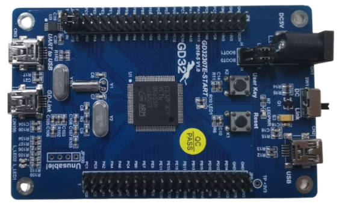
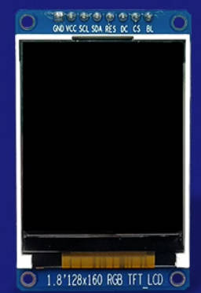
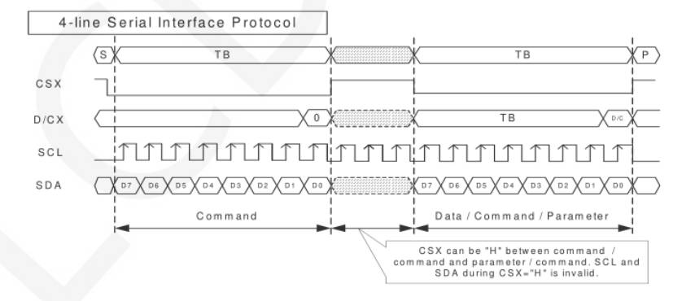
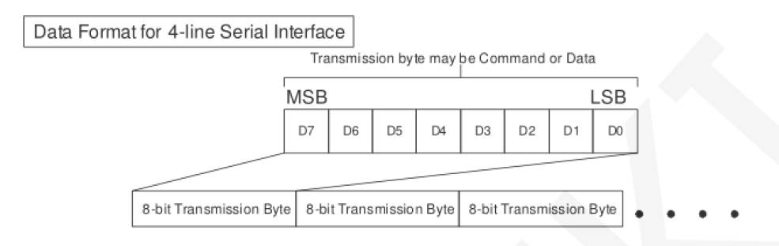
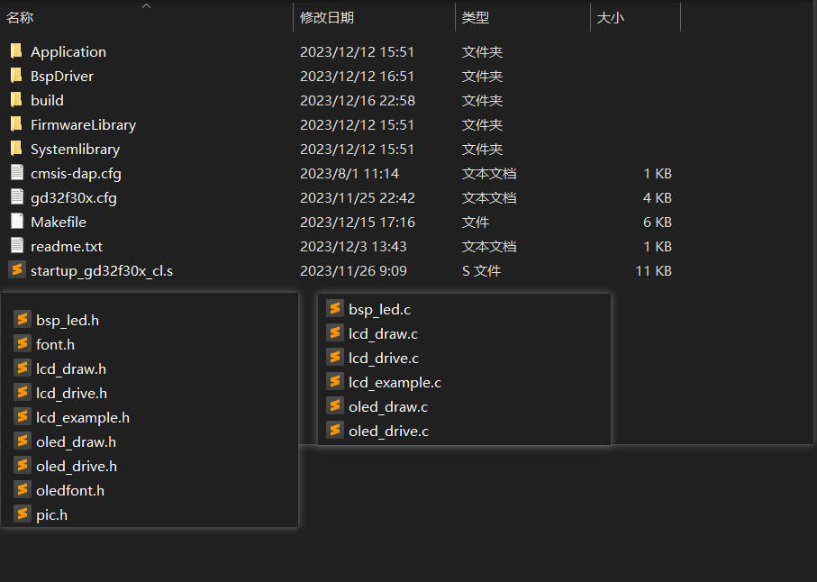
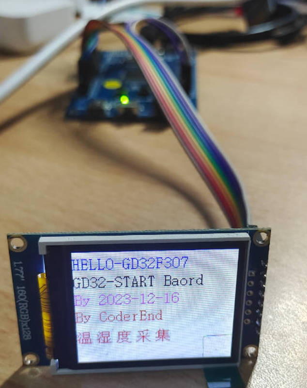
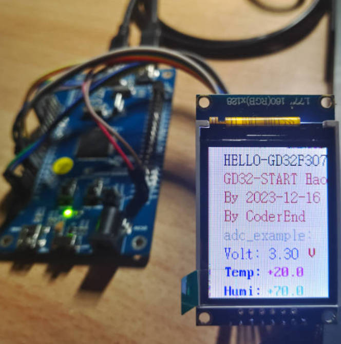

## 07-GD32F307E-START开发板评测 ST7735 SPI-LCD显示模块移植

### 软硬件平台

1. GD32F307E-START Board开发板
2. GCC Makefile
3. 1.8寸TFTLCD  分辨率128*160 驱动IC ST7735S




### 接口定义

| 序号 | 引脚标号 | 说明                                                    |
| ---- | -------- | ------------------------------------------------------- |
| 1    | GND      | 接地                                                    |
| 2    | VCC      | 5V/3.3V电源输入                                         |
| 3    | SCK      | SPI总线时钟信号                                         |
| 4    | SDA      | SPI总线写数据信号                                       |
| 5    | RESET    | 液晶屏复位信号，低电平复位                              |
| 6    | DC       | 液晶屏寄存器/数据选择信号，低电平：寄存器，高电平：数据 |
| 7    | CS       | 液晶屏片选信号，低电平使能                              |
| 8    | BLK      | 背光控制，高电平点亮，如无需控制则接3.3V常亮            |

ST7735的LCD模块有128x128, 128x160等不同分辨率, 对外的接线除了VCC和GND外有6根, 接线方式都是一样的

- SCL SPI时钟, 对应上位机SPI的SCK
- SDA SPI数据输入, 对应上位机SPI的MOSI
- RES 重启, 低电平有效, 工作时处于高电平
- DC 命令模式和数据模式切换位, 低电平为命令模式, 高电平为数据模式
- CS 片选信号, 对应上位机SPI的CS
- BL 背光, 高电平亮, 低电平灭

如果使用软件SPI, IO口可以随便选择, 如果是硬件SPI, 其中的CS, SCK, MOSI 和 MISO(ST7735未使用)只能使用特定的IO口。

### SPI通信协议简介



CSX为从机片选，仅当CSX为低电平时，芯片才会被使能。D/CX为芯片的数据/命令控制引脚，当DCX为低电平时写命令，为高电平时写数据。SCL为SPI总线时钟，每个上升沿传输1bit数据；SDA为SPI传输的数据，一次传输8bit数据，数据格式如下图所示：



**高位在前，先传输**
对于SPI通信而言，数据是有传输时序的，即时钟相位（CPHA）与时钟极性（CPOL）的组合：
CPOL的高低决定串行同步时钟的空闲状态电平，CPOL=0，为低电平。CPOL对传输协议没有很多的影响；
CPHA的高低决定串行同步时钟是在第一时钟跳变沿还是第二个时钟跳变沿数据被采集，当CPHL=0，在第一个跳变沿进行数据采集；

### 模拟SPI移植LCD屏幕

1. 工程模板建立

   在之前的gcc makefile的工程模板上进行添加文件，同时lcd部分代码参考梁山派GD32F4开发板资料进行。

   lcd_drive.c lcd_drive.h  // lcd底层驱动文件，包括软件spi实现，lcd引脚配置，lcd初始化

   lcd_draw.c lcd_draw.h  // lcd应用层文件，主要是绘图api实现（可以移植到其他开发板，不需要改，仅配置好驱动文件即可）

   

2. 配置引脚

   选择引脚，进入工程开始编写屏幕引脚初始化代码。

   为了方便后续移植，我在**oled_driver.h**处宏定义了每一个引脚，后续根据需要进行修改即可。

   ```c
   //-----------------LCD屏幕接口宏定义---------------- 
   #define RCU_LCD_SCLK     RCU_GPIOB
   #define PORT_LCD_SCLK    GPIOB
   #define GPIO_LCD_SCLK    GPIO_PIN_10
   
   #define RCU_LCD_MOSI     RCU_GPIOB
   #define PORT_LCD_MOSI    GPIOB
   #define GPIO_LCD_MOSI    GPIO_PIN_11
   
   #define RCU_LCD_RES      RCU_GPIOB
   #define PORT_LCD_RES     GPIOB
   #define GPIO_LCD_RES     GPIO_PIN_12
   
   #define RCU_LCD_DC       RCU_GPIOB
   #define PORT_LCD_DC      GPIOB
   #define GPIO_LCD_DC      GPIO_PIN_13
   
   #define RCU_LCD_CS       RCU_GPIOB
   #define PORT_LCD_CS      GPIOB
   #define GPIO_LCD_CS      GPIO_PIN_14
   
   #define RCU_LCD_BLK      RCU_GPIOB
   #define PORT_LCD_BLK     GPIOB
   #define GPIO_LCD_BLK     GPIO_PIN_15
   ```

   

3. 引脚gpio初始化 （重点1）

   ```c
   //==================================================================================================
   //  实现功能: LCD_GPIO_Init
   //  函数说明: 液晶IO初始化配置
   //  函数备注: 
   //--------------------------------------------------------------------------------------------------
   //  |   -   |   -   |   0   |   1   |   2   |   3   |   4   |   5   |   6   |   7   |   8   |   9   
   //==================================================================================================
   void lcd_gpio_init(void)
   {
     
     rcu_periph_clock_enable(RCU_LCD_SCLK);
     rcu_periph_clock_enable(RCU_LCD_MOSI);
     rcu_periph_clock_enable(RCU_LCD_RES);
     rcu_periph_clock_enable(RCU_LCD_DC);
     rcu_periph_clock_enable(RCU_LCD_CS);
     rcu_periph_clock_enable(RCU_LCD_BLK); 
   
     /* 配置SCLK SCL*/
     gpio_init(PORT_LCD_SCLK,GPIO_MODE_OUT_PP,GPIO_OSPEED_50MHZ,GPIO_LCD_SCLK);
     gpio_bit_write(PORT_LCD_SCLK, GPIO_LCD_SCLK, SET);
     /* 配置MOSI SDA */
     gpio_init(PORT_LCD_MOSI,GPIO_MODE_OUT_PP,GPIO_OSPEED_50MHZ,GPIO_LCD_MOSI);
     gpio_bit_write(PORT_LCD_MOSI, GPIO_LCD_MOSI, SET);
   
      /* 配置RES*/
     gpio_init(RCU_LCD_RES,GPIO_MODE_OUT_PP,GPIO_OSPEED_50MHZ,GPIO_LCD_RES);
     gpio_bit_write(RCU_LCD_RES, GPIO_LCD_RES, SET);
     /* 配置DC */
     gpio_init(PORT_LCD_DC,GPIO_MODE_OUT_PP,GPIO_OSPEED_50MHZ,GPIO_LCD_DC);
     gpio_bit_write(PORT_LCD_DC, GPIO_LCD_DC, SET);
   
   
    /* 配置CS*/
     gpio_init(PORT_LCD_CS,GPIO_MODE_OUT_PP,GPIO_OSPEED_50MHZ,GPIO_LCD_CS);
     gpio_bit_write(PORT_LCD_CS, GPIO_LCD_CS, SET);
     /* 配置BLK */
     gpio_init(PORT_LCD_BLK,GPIO_MODE_OUT_PP,GPIO_OSPEED_50MHZ,GPIO_LCD_BLK);
     gpio_bit_write(PORT_LCD_BLK, GPIO_LCD_BLK, SET);
   
   }
   ```

4. 端口宏定义设置

   ```c
   #define SOFTWARE_SPI_ENABLE    1
   
   #if SOFTWARE_SPI_ENABLE  
   
   #define LCD_SCLK_Clr()  gpio_bit_reset(PORT_LCD_SCLK,GPIO_LCD_SCLK)//SCL=SCLK
   #define LCD_SCLK_Set()  gpio_bit_set(PORT_LCD_SCLK,GPIO_LCD_SCLK)
   
   #define LCD_MOSI_Clr()  gpio_bit_reset(PORT_LCD_MOSI,GPIO_LCD_MOSI)//SDA=MOSI
   #define LCD_MOSI_Set()  gpio_bit_set(PORT_LCD_MOSI,GPIO_LCD_MOSI)
   
       
   #define LCD_RES_Clr()   gpio_bit_reset(PORT_LCD_RES,GPIO_LCD_RES)//RES  rst
   #define LCD_RES_Set()   gpio_bit_set(PORT_LCD_RES,GPIO_LCD_RES)
   
   #define LCD_DC_Clr()    gpio_bit_reset(PORT_LCD_DC,GPIO_LCD_DC)//DC  data command select
   #define LCD_DC_Set()    gpio_bit_set(PORT_LCD_DC,GPIO_LCD_DC)
                
   
   #define LCD_CS_Clr()    gpio_bit_reset(PORT_LCD_CS,GPIO_LCD_CS)//CS
   #define LCD_CS_Set()    gpio_bit_set(PORT_LCD_CS,GPIO_LCD_CS)
   
   #define LCD_BLK_LOW()   gpio_bit_reset(PORT_LCD_BLK,GPIO_LCD_BLK)//BLK
   #define LCD_BLK_Set()   gpio_bit_set(PORT_LCD_BLK,GPIO_LCD_BLK)
   
   #endif
   ```

5. 软件SPI代码实现

   ```c
   //==============================================
   //  实现功能: lcd_write_bus
   //  函数说明: 向SPI总线传输一个8位数据
   //==============================================
   void lcd_write_bus(unsigned char data)
   {
   	uint8_t i;
   	LCD_CS_Clr();
   	for(i=0;i<8;i++)
   	{			  
   		LCD_SCLK_Clr();
   		if(data&0x80)
   		{
   		   LCD_MOSI_Set();
   		}
   		else
   		{
   		   LCD_MOSI_Clr();
   		}
   		LCD_SCLK_Set();
   		data<<=1;
   	}	
     LCD_CS_Set();	
   }
   ```

   如果传输的数据位为1，则将SPI数据引脚拉高；传输的数据位为0，则将SPI数据引脚拉低。每次传输一个字节数据，高位在前，每个时钟上升沿传输1位数据。

6. LCD初始化函数

   ```C
   //==================================================================================================
   //  实现功能: Lcd_Init
   //  函数说明: LCD硬件初始化
   //  函数备注: LCD Init For 1.70Inch LCD Panel with ST7735R.
   //--------------------------------------------------------------------------------------------------
   //  |   -   |   -   |   0   |   1   |   2   |   3   |   4   |   5   |   6   |   7   |   8   |   9   
   //==================================================================================================
   void lcd_init(void)
   {	
   	
   	
   	lcd_gpio_init();
       LCD_RES_Clr();//复位
   	delay_1ms(100);
   	LCD_RES_Set();
   	delay_1ms(50);
        //    LCD_BLK_Set();//打开背光
        //    delay_1ms(100);
   
   	lcd_writeindex(0x11);//Sleep exit 退出睡眠模式
   	delay_1ms(120);
   
   	lcd_writeindex(0xB1); 
   	lcd_writedata(0x05); 
   	lcd_writedata(0x3C); 
   	lcd_writedata(0x3C); 
   	lcd_writeindex(0xB2); 
   	lcd_writedata(0x05);
   	lcd_writedata(0x3C); 
   	lcd_writedata(0x3C); 
   	lcd_writeindex(0xB3); 
   	lcd_writedata(0x05); 
   	lcd_writedata(0x3C); 
   	lcd_writedata(0x3C); 
   	lcd_writedata(0x05); 
   	lcd_writedata(0x3C); 
   	lcd_writedata(0x3C); 
   	//------------------------------------End ST7735S Frame Rate---------------------------------// 
   	lcd_writeindex(0xB4); //Dot inversion 
   	lcd_writedata(0x03); 
   	//------------------------------------ST7735S Power Sequence---------------------------------// 
   	lcd_writeindex(0xC0); 
   	lcd_writedata(0x28); 
   	lcd_writedata(0x08); 
   	lcd_writedata(0x04); 
   	lcd_writeindex(0xC1); 
   	lcd_writedata(0XC0); 
   	lcd_writeindex(0xC2); 
   	lcd_writedata(0x0D); 
   	lcd_writedata(0x00); 
   	lcd_writeindex(0xC3); 
   	lcd_writedata(0x8D); 
   	lcd_writedata(0x2A); 
   	lcd_writeindex(0xC4); 
   	lcd_writedata(0x8D); 
   	lcd_writedata(0xEE); 
   	//---------------------------------End ST7735S Power Sequence-------------------------------------// 
   	lcd_writeindex(0xC5); //VCOM 
   	lcd_writedata(0x1A); 
   	lcd_writeindex(0x36); //MX, MY, RGB mode 
   	
   	if(USE_HORIZONTAL==0)
   		lcd_writedata(0x00);
   	else if(USE_HORIZONTAL==1)
   		lcd_writedata(0xC0);
   	else if(USE_HORIZONTAL==2)
   		lcd_writedata(0x70);
   	else 
   		lcd_writedata(0xA0); 
   	//------------------------------------ST7735S Gamma Sequence---------------------------------// 
   	lcd_writeindex(0xE0); 
   	lcd_writedata(0x04); 
   	lcd_writedata(0x22); 
   	lcd_writedata(0x07); 
   	lcd_writedata(0x0A); 
   	lcd_writedata(0x2E); 
   	lcd_writedata(0x30); 
   	lcd_writedata(0x25); 
   	lcd_writedata(0x2A); 
   	lcd_writedata(0x28); 
   	lcd_writedata(0x26); 
   	lcd_writedata(0x2E); 
   	lcd_writedata(0x3A); 
   	lcd_writedata(0x00); 
   	lcd_writedata(0x01); 
   	lcd_writedata(0x03); 
   	lcd_writedata(0x13); 
   	
   	lcd_writeindex(0xE1); 
   	lcd_writedata(0x04); 
   	lcd_writedata(0x16); 
   	lcd_writedata(0x06); 
   	lcd_writedata(0x0D); 
   	lcd_writedata(0x2D); 
   	lcd_writedata(0x26); 
   	lcd_writedata(0x23); 
   	lcd_writedata(0x27); 
   	lcd_writedata(0x27); 
   	lcd_writedata(0x25); 
   	lcd_writedata(0x2D); 
   	lcd_writedata(0x3B); 
   	lcd_writedata(0x00); 
   	lcd_writedata(0x01); 
   	lcd_writedata(0x04); 
   	lcd_writedata(0x13); 
   	//------------------------------------End ST7735S Gamma Sequence-----------------------------// 
   	lcd_writeindex(0x3A); //65k mode 
   	lcd_writedata(0x05); 
   	lcd_writeindex(0x29); //Display on
   }
   ```

7. 驱动完整代码见仓库代码

### 测试

1. 主函数

   ```c
   #include "main.h"
   
   
   void Hardware_Init(void)
   {
   
       SystemInit (); 
       systick_config();
       bsp_uart_init();
       printf("SystemInit [ok] \r\n");
       printf("systick_config[ok] \r\n");
       printf("bsp_uart_init [ok] \r\n");
       HW_LED_Init();  
       printf("LED_Init [ok] \r\n");
       OLED_Init();
       printf("OLED_Init [ok] \r\n");
       lcd_init();
       printf("LCD_Init [ok] \r\n");
   }
   //==================================================================================================
   //  实现功能: oled_test测试函数
   //  函数说明: 采用软件IIC 进行配置   SDA PB9  SCL in 
   //  函数备注:  测试正常
   //--------------------------------------------------------------------------------------------------
   //  |   -   |   -   |   0   |   1   |   2   |   3   |   4   |   5   |   6   |   7   |   8   |   9   
   //==================================================================================================  
   void oled_example(void)
   {
         OLED_ShowString_08x16(0,0,"GD32 SWSPI OLED");
         OLED_ShowNumber_SignedInteger_06x08(16,2,1234,5);
         OLED_ShowNumber_UnsignedInteger_06x08(64,2,1234,4);
         OLED_ShowString_06x08(32,3,"Time:2023.12.03");
         OLED_ShowNumber_Float_06x08(32,4,123.46,3,3);
         OLED_ShowString_06x08(32,5,"By:Endhub");
         OLED_ShowCHinese(32,6,5);
         OLED_ShowCHinese(48,6,6);
         OLED_ShowCHinese(64,6,7);
         OLED_ShowCHinese(80,6,8);
         //OLED_Clear();
   }      
   
   int main(void)
   {
       // static uint8_t num   = 1;
       // num = num+1;
       // TFT_ShowNumber_UnsignedInteger_16x16(8,25,num,3,Blue1,White);
       // if (num >100)
       //   num = 0;
       // 
       Hardware_Init();
       printf("Hardware_Init [ok] \r\n");
       printf("GD32307E-START Baord Testing\r\n");
       printf("gd32f307_spi_lcd 20231216! \r\n");
       lcd_clear(White);               //清屏
       TFT_ShowString_16x16(0,5,"HELLO-GD32F307",Blue1,White);
       TFT_ShowString_16x16(0,25,"GD32-START Baord",Blue1,White);
       TFT_ShowString_16x16(0,45,"By 2023-12-17",Blue1,White);
       TFT_ShowString_16x16(0,65,"By CoderEnd",Blue1,White);
       TFT_ShowChinese(0,90,0,16,Gray0,Red);
       TFT_ShowChinese(20,90,1,16,Gray0,Red);
       TFT_ShowChinese(40,90,2,16,Gray0,Red);
       TFT_ShowChinese(60,90,3,16,Gray0,Red);
       TFT_ShowChinese(80,90,4,16,Gray0,Red);
   
       while(1)
       { 
   
       }
   }
   ```

2. 效果

​



