## 01-GD32F307E-START开发板评测 开箱、开发环境建立及工程模板测试（Keil-MDK GCC Template）

兆易GD32307E-START开发板搭载GD32 ARM Cortex-M4微控制器主流芯片GD32F307。

### 开箱

板子的做工还是非常精良小巧的。有两颗按键，一颗是复位，一颗是用户按键，同样也板载了一路LED灯，可以用来做板子的功能验证。同时支持GD-Link就不需要找下载器，但是板子的供电部分比较离谱，都是老款的接口，现在都不好找线，现在开发板都是type-c了。板但是板子的USB口为什么还是MINI-USB啊，过于离谱。而且，板子上有三个USB口，**居然其中的两个不能给板子供电！！！**

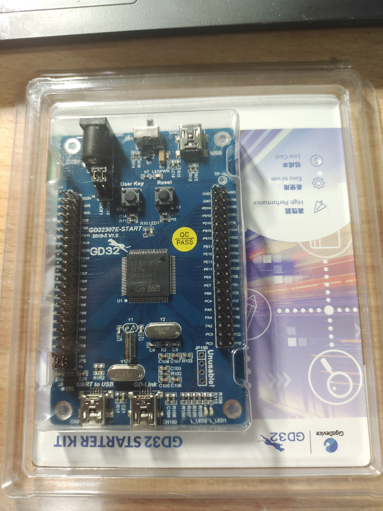

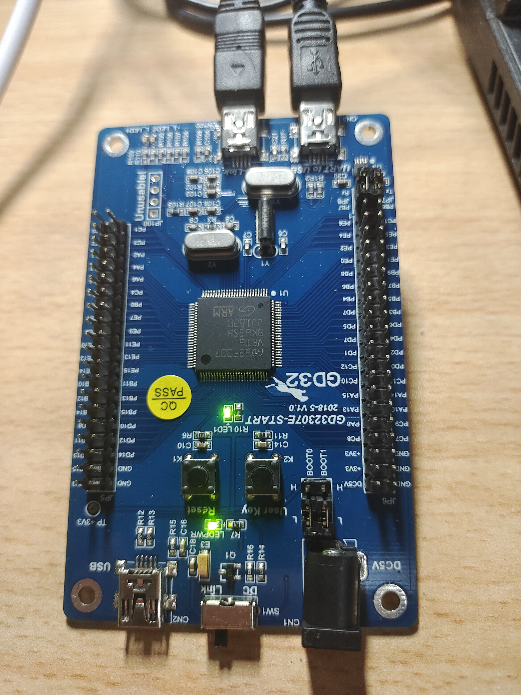

### 开发环境搭建（Windows）

1. MDK-ARM Keil
2. GCC

##### MDK-ARM Keil 环境搭建

1. 官网下载资料

   官网资料地址 https://www.gd32mcu.com/cn/download/0?kw=GD32F3

   1. GD32F30x系列MCU用户手册，支持GD32F303/GD32F305/GD32F307
   2. GD32F307xx系列MCU数据手册
   3. GD32F30x系列开发板套件资料

   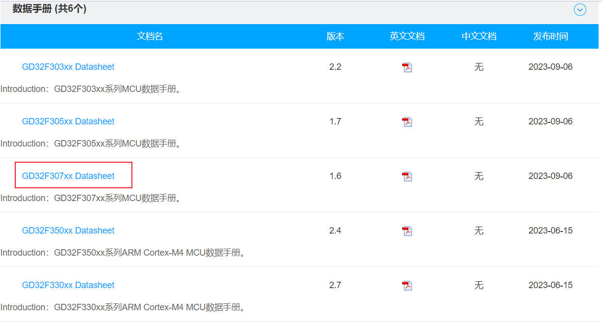


2.  GD32307E-START开发板配套资料

   https://www.xcc.com/sample/28?tag=sample-info-works

   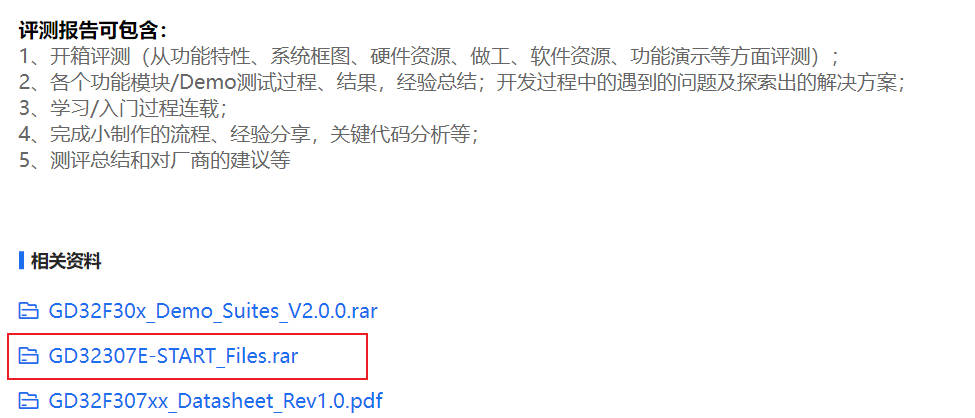

   固件库文件 	GD32F30x_Firmware_Library 

   板级Basic案例	GD32307-START-V1.0 Demo

   在后面搭建自己的工程模板时，可能会以某个案例作为基础，进行工程扩展。

   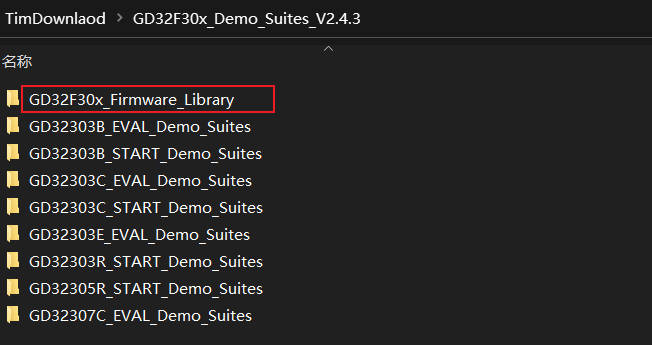

   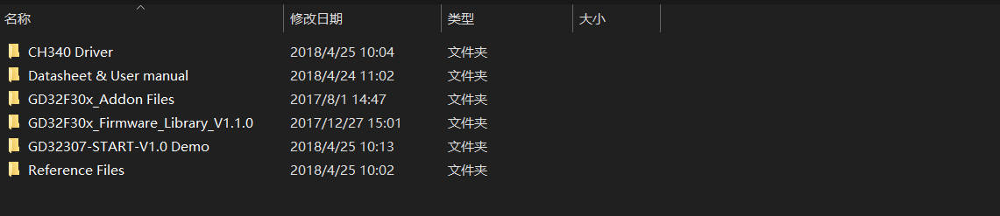

3. 工程环境搭建

   默认已经安装MDK-ARM Keil并破解，进行安装gd32f30x_pack文件。

   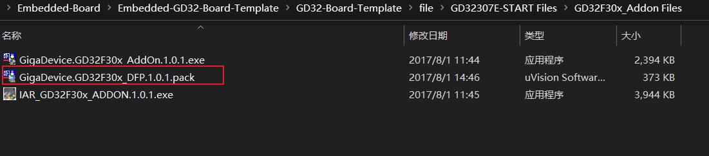

   打开 GD32307-START-V1.0 Demo文件下的02_USART_Printf工程，编译0错误0警告。

   下载代码

   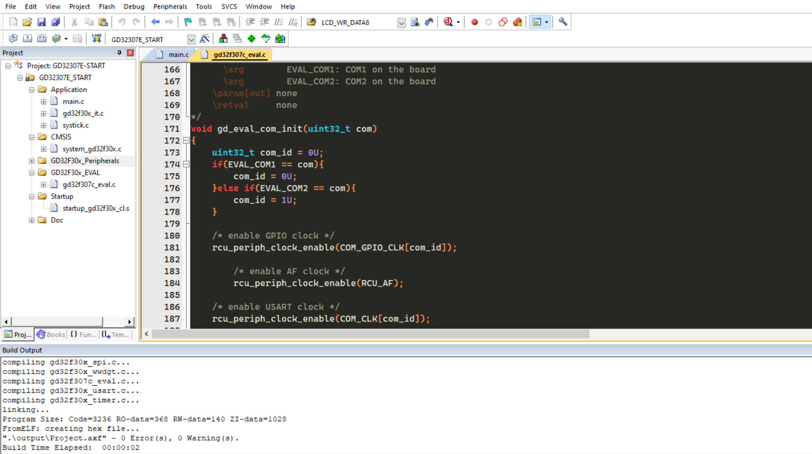

   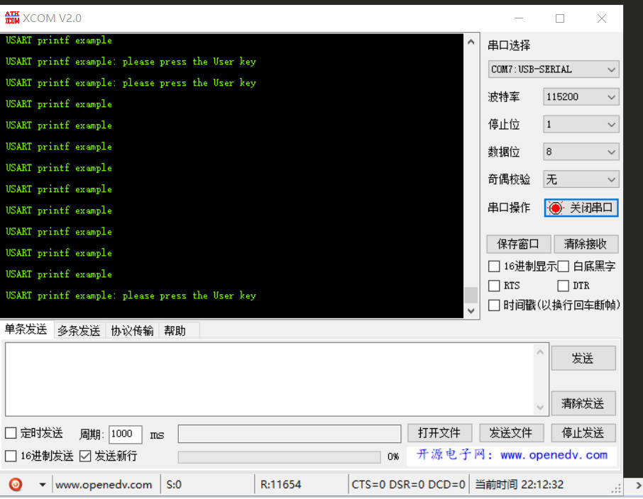

4. 工程模板测试

   GD32307-START-V1.0 Demo文件提供的固件库版本比较老，是GD32F30x_Firmware_Library_V1.1.0，但是最新的版本已经GD32F30x_Firmware_Library_V2.1.5，虽然老版也能使用，但是既然更新了，肯定是有好处的，而且为了搭建自己的工程模板，所以下面建立自己的模板。

   同时修改了串口部分的代码，添加板载led驱动，原工程案例里面使用是gd32f307c_eval开发板的配置和这个板子有一点区别，因此不在使用，但是保留文件，里面代码可以参考。
   
   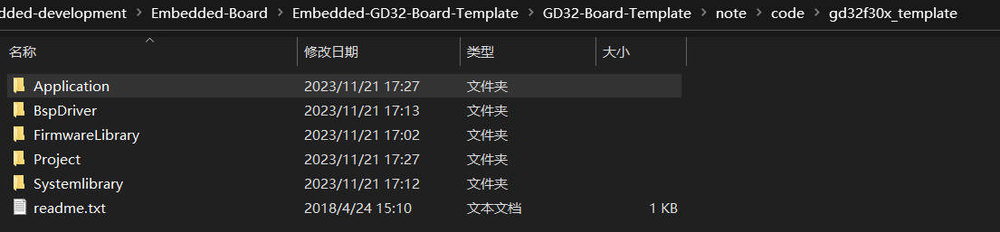
   
   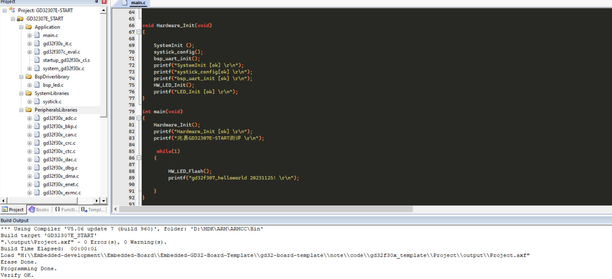

点灯效果 串口打印效果

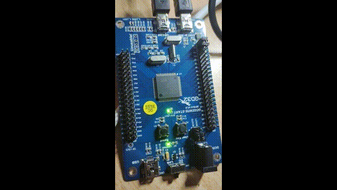

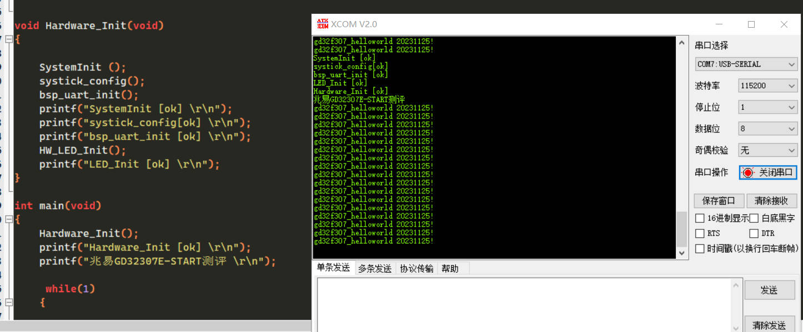

### GCC Makefile 环境搭建

搭建过程参考 https://gitee.com/End-ING/embedded-gcc-template

#### 1. GNU Arm Embedded Toolchain交叉编译器

进入arm开发者官网，往下滑动选择下载解压可用的ZIP压缩包文件

[下载链接： Downloads | GNU Arm Embedded Toolchain Downloads – Arm Developer](https://developer.arm.com/tools-and-software/open-source-software/developer-tools/gnu-toolchain/gnu-rm/downloads)


 将下载好的压缩包文件解压在gcc-arm-none-eabi”文件夹中，并记住文件内“bin”文件的路径，后续需添加到系统环境变量Path中。


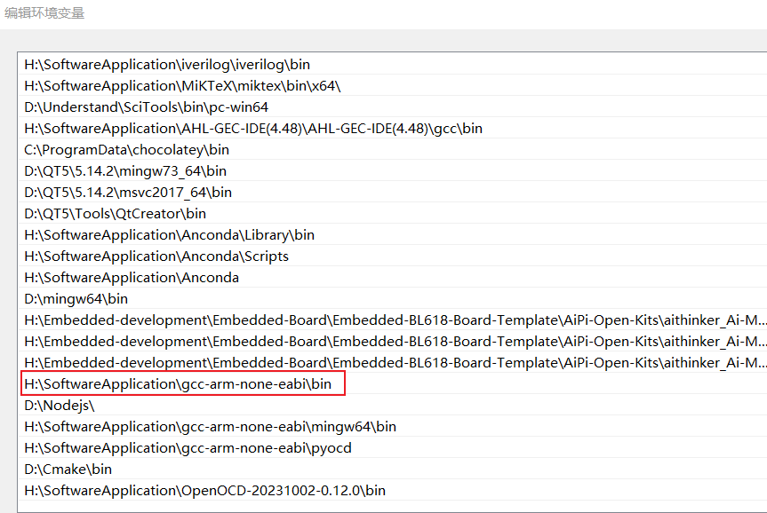

添加完环境变量后，进行测试，检测是否安装好。


#### 2. 安装**Mingw-w64 GCC**

点击链接进入到SourceForge官网，往下翻可以找到很多版本的下载链接，选择红色框内型号即可，不同前后缀的具体差异请参考:

[MinGW gcc下载链接及sjlj、dwarf、seh异同以及gcc安装_AMDDMA的博客-CSDN博客_seh和sjlj](https://blog.csdn.net/AMDDMA/article/details/111600238)

下载链接：

[MinGW-w64 - for 32 and 64 bit Windows - Browse Files at SourceForge.net](https://sourceforge.net/projects/mingw-w64/files/)

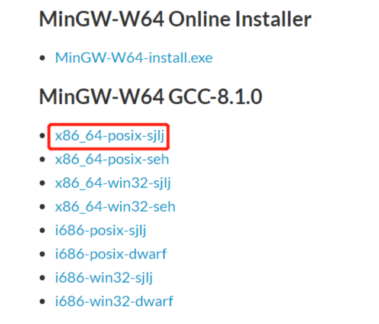

 同样，将下载好的文件解压到“gcc-arm-none-eabi”文件夹下，记住目录下的“bin”文件路径


进入“bin”文件内找到“mingw32-make”应用程序文件，复制一份并重命名为“make”。这么做有利于在命令行执行make指令，而不是输入mingw32-make。

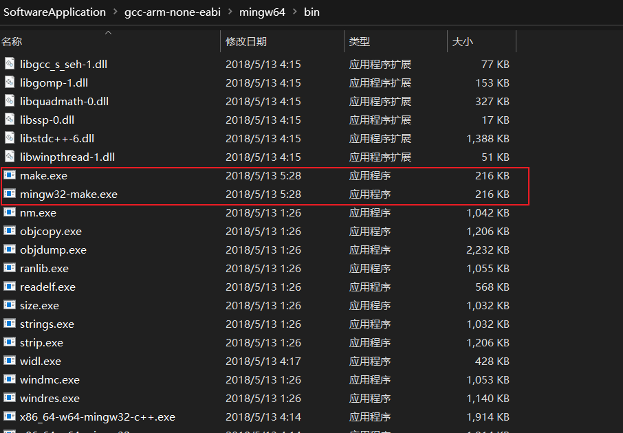

​		添加完环境变量后，进行测试，检测是否安装好。

​		    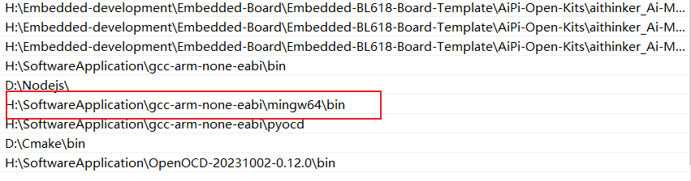  

​				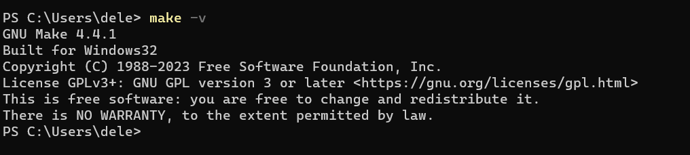

#### 3. 安装调试软件Download pre-built OpenOCD for Windows

默认安装Vscode,安装过程比较简单，参考其他文章。有了以上三个软件的支持，已经可以在VScode中编译并生成bin文件和hex文件了，但众所周知，程序员最大的工作是Debug，那就免不了需要一款调试软件了。

Debug常用的硬件有STLink、JLink，WCH-Link,DapLink.

Download pre-built OpenOCD for Windows下载链接：[OpenOCD for Windows](https://gnutoolchains.com/arm-eabi/openocd/)  

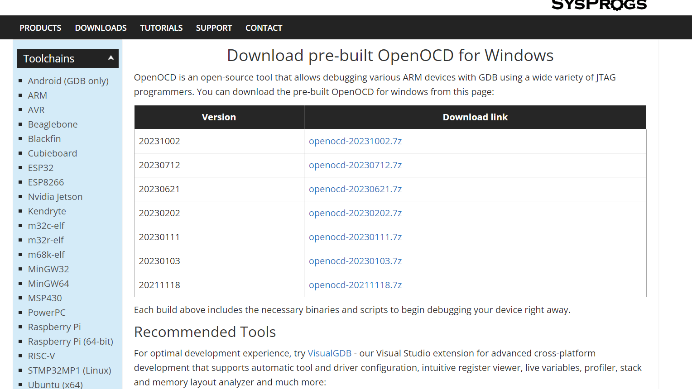

同样将下载好的压缩包解压至“OpenOCD-20231002-0.12.0”，记住文件内“bin”文件的路径。

  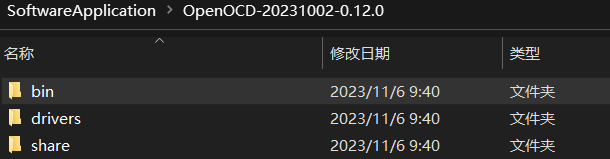


  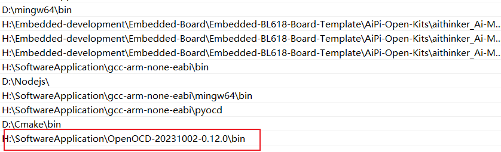

  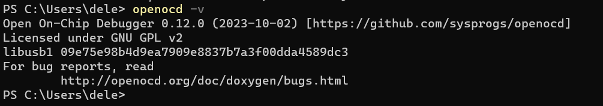

综上所述，基本的软件环境已经配置好。

### Makefile文件编写(重点)

```makefile
######################################
# target
######################################
TARGET = gd32f307


######################################
# building variables
######################################
# debug build?
DEBUG = 1
# optimization for size
OPT = -Os


#######################################
# paths
#######################################
# Build path
BUILD_DIR = build

######################################
# source
######################################
# C sources
C_SOURCES =  \
FirmwareLibrary/GD32F30x_standard_peripheral/Source/gd32f30x_bkp.c \
FirmwareLibrary/GD32F30x_standard_peripheral/Source/gd32f30x_crc.c \
FirmwareLibrary/GD32F30x_standard_peripheral/Source/gd32f30x_pmu.c \
FirmwareLibrary/GD32F30x_standard_peripheral/Source/gd32f30x_spi.c \
FirmwareLibrary/GD32F30x_standard_peripheral/Source/gd32f30x_misc.c \
FirmwareLibrary/GD32F30x_standard_peripheral/Source/gd32f30x_can.c \
FirmwareLibrary/GD32F30x_standard_peripheral/Source/gd32f30x_enet.c \
FirmwareLibrary/GD32F30x_standard_peripheral/Source/gd32f30x_fwdgt.c \
FirmwareLibrary/GD32F30x_standard_peripheral/Source/gd32f30x_fmc.c \
FirmwareLibrary/GD32F30x_standard_peripheral/Source/gd32f30x_dma.c \
FirmwareLibrary/GD32F30x_standard_peripheral/Source/gd32f30x_sdio.c \
FirmwareLibrary/GD32F30x_standard_peripheral/Source/gd32f30x_dbg.c \
FirmwareLibrary/GD32F30x_standard_peripheral/Source/gd32f30x_timer.c \
FirmwareLibrary/GD32F30x_standard_peripheral/Source/gd32f30x_wwdgt.c \
FirmwareLibrary/GD32F30x_standard_peripheral/Source/gd32f30x_adc.c \
FirmwareLibrary/GD32F30x_standard_peripheral/Source/gd32f30x_gpio.c \
FirmwareLibrary/GD32F30x_standard_peripheral/Source/gd32f30x_rtc.c \
FirmwareLibrary/GD32F30x_standard_peripheral/Source/gd32f30x_usart.c \
FirmwareLibrary/GD32F30x_standard_peripheral/Source/gd32f30x_exmc.c \
FirmwareLibrary/GD32F30x_standard_peripheral/Source/gd32f30x_rcu.c \
FirmwareLibrary/GD32F30x_standard_peripheral/Source/gd32f30x_exti.c \
FirmwareLibrary/GD32F30x_standard_peripheral/Source/gd32f30x_i2c.c \
FirmwareLibrary/GD32F30x_standard_peripheral/Source/gd32f30x_dac.c \
FirmwareLibrary/GD32F30x_standard_peripheral/Source/gd32f30x_ctc.c \
FirmwareLibrary/CMSIS/GD/GD32F30x/Source/system_gd32f30x.c \
Systemlibrary/Source/systick.c \
Systemlibrary/Source/uart.c \
BspDriver/Source/bsp_led.c \
Application/gd32f30x_it.c \
Application/gd32f307c_eval.c \
Application/main.c 

# ASM sources
ASM_SOURCES = \
Application/startup_gd32f30x_cl.S


#######################################
# binaries
#######################################
PREFIX = arm-none-eabi-
GCC_PATH = /SoftwareApplication/gcc-arm-none-eabi/bin
ifdef GCC_PATH
CC = $(GCC_PATH)/$(PREFIX)gcc
AS = $(GCC_PATH)/$(PREFIX)gcc -x assembler-with-cpp
CP = $(GCC_PATH)/$(PREFIX)objcopy
SZ = $(GCC_PATH)/$(PREFIX)size
else
CC = $(PREFIX)gcc
AS = $(PREFIX)gcc -x assembler-with-cpp
CP = $(PREFIX)objcopy
SZ = $(PREFIX)size
endif
HEX = $(CP) -O ihex
BIN = $(CP) -O binary -S
 
#######################################
# CFLAGS
#######################################
# cpu
CPU = -mcpu=cortex-m4

# fpu
# NONE for Cortex-M0/M0+/M3

# float-abi


# mcu
MCU = $(CPU) -mthumb $(FPU) $(FLOAT-ABI)

# macros for gcc
# AS defines
AS_DEFS = 

# C defines
C_DEFS =  \
-DUSE_STDPERIPH_DRIVER \
-DGD32F30X_CL


# AS includes
AS_INCLUDES = 

# C includes
C_INCLUDES =\
-I	FirmwareLibrary/CMSIS \
-I	FirmwareLibrary/CMSIS/GD/GD32F30x/Include \
-I	FirmwareLibrary/GD32F30x_standard_peripheral/Include \
-I	Systemlibrary/Include \
-I	Application \


# compile gcc flags
ASFLAGS = $(MCU) $(AS_DEFS) $(AS_INCLUDES) $(OPT) -Wall -fdata-sections -ffunction-sections

CFLAGS = $(MCU) $(C_DEFS) $(C_INCLUDES) $(OPT) -Wall -fdata-sections -ffunction-sections

ifeq ($(DEBUG), 1)
CFLAGS += -g -gdwarf-2
endif


# Generate dependency information
CFLAGS += -MMD -MP -MF"$(@:%.o=%.d)"


#######################################
# LDFLAGS
#######################################
# link script
LDSCRIPT = FirmwareLibrary/Link.ld

# libraries
LIBS = -lc -lm -lnosys 
LIBDIR = 
LDFLAGS = $(MCU) -u_printf_float -specs=nosys.specs -T$(LDSCRIPT) $(LIBDIR) $(LIBS) -Wl,-Map=$(BUILD_DIR)/$(TARGET).map,--cref -Wl,--gc-sections

# default action: build all
all: $(BUILD_DIR)/$(TARGET).elf $(BUILD_DIR)/$(TARGET).hex $(BUILD_DIR)/$(TARGET).bin


#######################################
# build the application
#######################################
# list of objects
OBJECTS = $(addprefix $(BUILD_DIR)/,$(notdir $(C_SOURCES:.c=.o)))
vpath %.c $(sort $(dir $(C_SOURCES)))
# list of ASM program objects
OBJECTS += $(addprefix $(BUILD_DIR)/,$(notdir $(ASM_SOURCES:.S=.o)))
vpath %.S $(sort $(dir $(ASM_SOURCES)))

$(BUILD_DIR)/%.o: %.c Makefile | $(BUILD_DIR) 
	@echo "[CC]    $<"
	@$(CC) -c $(CFLAGS) -Wa,-a,-ad,-alms=$(BUILD_DIR)/$(notdir $(<:.c=.lst)) $< -o $@

$(BUILD_DIR)/%.o: %.s Makefile | $(BUILD_DIR)
	@echo "[AS]    $<"
	@$(AS) -c $(CFLAGS) $< -o $@

$(BUILD_DIR)/$(TARGET).elf: $(OBJECTS) Makefile
	@echo "[HEX]   $< -> $@"
	@$(CC) $(OBJECTS) $(LDFLAGS) -o $@
	@$(SZ) $@

$(BUILD_DIR)/%.hex: $(BUILD_DIR)/%.elf | $(BUILD_DIR)
	@echo "[HEX]   $< -> $@"
	@$(HEX) $< $@
	
$(BUILD_DIR)/%.bin: $(BUILD_DIR)/%.elf | $(BUILD_DIR)
	@echo "[BIN]   $< -> $@"
	@$(BIN) $< $@	
	
$(BUILD_DIR):
	@mkdir $@		

#######################################
# program
#######################################
program:
	openocd -f /usr/share/openocd/scripts/interface/cmsis-dap.cfg -f /usr/share/openocd/scripts/target/stm32f4x.cfg -c "program build/$(TARGET).elf verify reset exit"

#######################################
# clean up
#######################################
clean:
	-del /q  $(BUILD_DIR)

#######################################
# dependencies
#######################################
-include $(wildcard $(BUILD_DIR)/*.d)

# *** EOF ***

```

#### make 测试

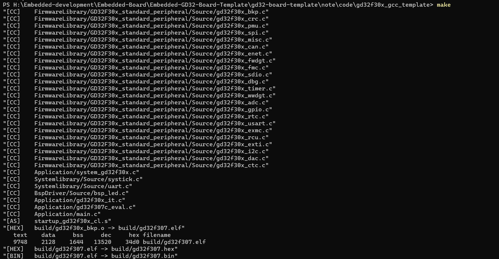

程序下载

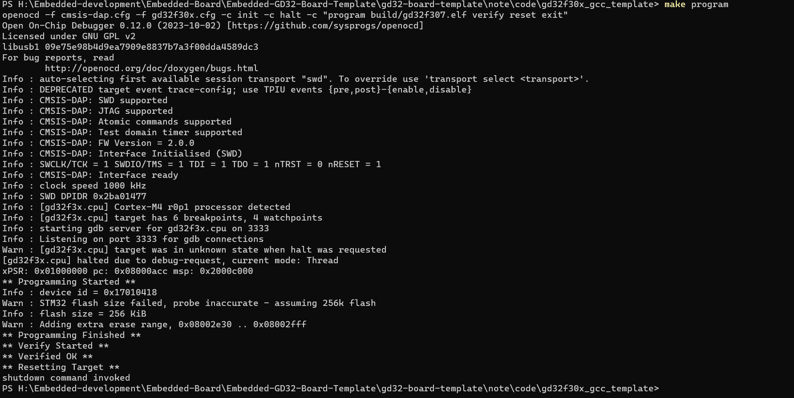

下载成功，点灯成功，但是GCC下面的打印没有解决，因此通过不同时间的延时，表示不同.

解决了 gcc下面的串口打印问题，在gcc下面使用_write进行定向printf。

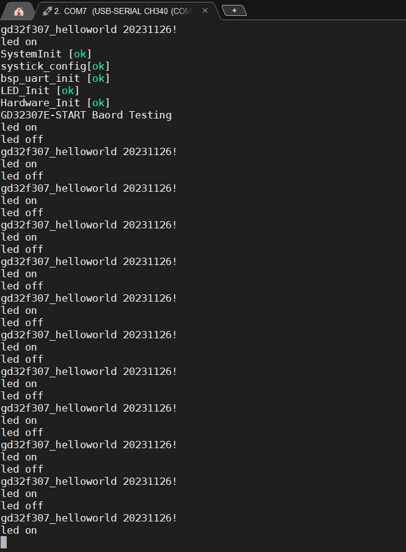

```c
#ifdef BUILD_PLATFORM_KEIL
// printf 
/* retarget the C library printf function to the USART */
int fputc(int ch, FILE *f)
{
    usart_data_transmit(USART0, (uint8_t)ch);
    while(RESET == usart_flag_get(USART0, USART_FLAG_TBE));
    return ch;
}
#endif
// gcc 环境下用此函数重定向printf
int _write (int fd, char *pBuffer, int size)
{
    uint32_t i;
    for (i = 0; i < size; i++)
    {
        usart_data_transmit(USART0, (uint8_t)pBuffer[i]);
        while(RESET == usart_flag_get(USART0, USART_FLAG_TBE)); 
    }
    return size;
}
```

综上所述，GD32F307E-START+开箱、开发环境建立及工程模板测试（Keil-MDK GCC Template)


