## 极海APM32F411V Tiny开发板评测05   Geehy Link与SEGGER-RTT调试

在日常的开发中，我们免不了使用各种各样的日志打印方式，使用调试器固然好用，但是无法直接打印局部变量以及会打断整个运行状态。我们常常使用的是[重定向]printf到串口打印输出，但是会对系统的实时性产生一定的影响，RTT技术可以在一定程度解决这个问题。

### SEGGER-RTT

使用`RTT(Real Time Transfer)`，可以从目标微控制器输出信息，以及以很高的速度将输入发送到应用程序，而**不会影响目标的实时行为**。 `SEGGER RTT`可与任何`J-Link`模型和支持后台内存访问的任何受支持的目标处理器一起使用，这些处理器是`Cortex-M`和`RX`目标。

`RTT`在双向上都支持多个通道，直至主机和目标，都可以用于不同目的，并为用户提供最大的自由度。

`RTT`默认实现是每个方向使用一个通道，该通道用于可打印的终端输入和输出。 使用`J-Link RTT Viewer`，该通道可用于多个“虚拟”终端，从而仅使用一个目标缓冲区即可打印到多个窗口（例如，一个用于标准输出，一个用于错误输出，一个用于调试输出）。 例如，可以使用一个附加的（主机）通道来发送配置文件或事件跟踪数据。

### Geehy Link与SEGGER-RTT使用

1. 安装jlink驱动

   JLink安装地址https://www.segger.com/downloads/jlink/#J-LinkSoftwareAndDocumentationPack

   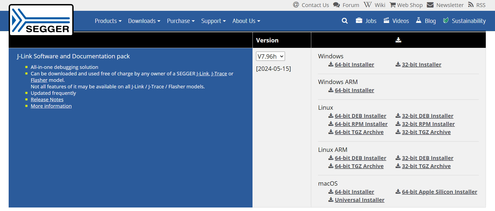

2. 移植SEGGER-RTT

   由于以前学习STM32的时候安装过jlink驱动，直接找到SEGGER文件

   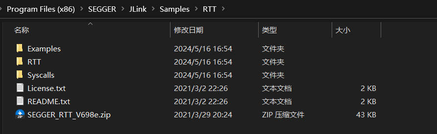

   复制RTT文件到工程目录下

   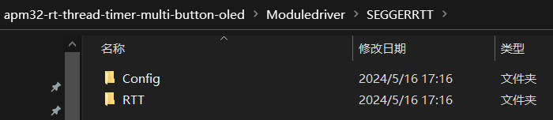

   我们将`xxx/JLink\Samples\RTT\SEGGER_RTT_V698e\`下的`RTT`和`Config`文件夹复制到我们的工程目录下，并加入到Keil工程中，别忘了添加头文件.

   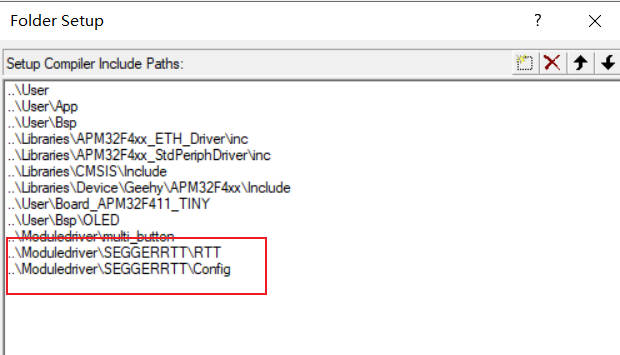

   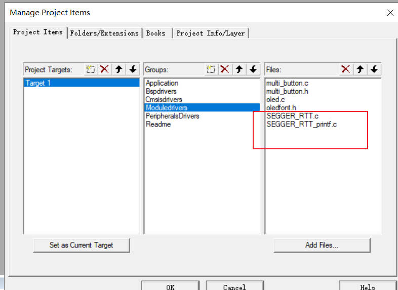

3. 调用SEGGER_RTT

   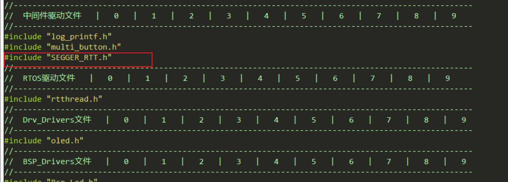

   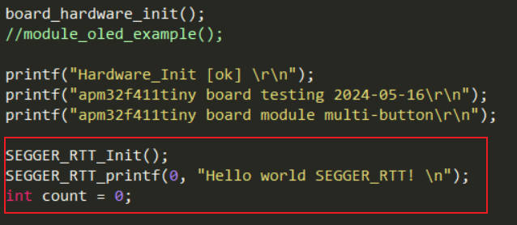

   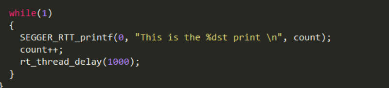

4. Geehy Link RTTView

   由于使用的是板载的Geehy Link（本质上应该是DAPLINK，国产芯片许多板载的LINK基本上都是这个进行的修改），Jlink的软件无法识别，因此我们使用了一个第三方的软件： https://github.com/XIVN1987/RTTView

   下载第三方软件（不要直接clone源码，建议下载发行版本），打开软件

   发行版本软件https://github.com/XIVN1987/RTTView/releases/tag/20211213

   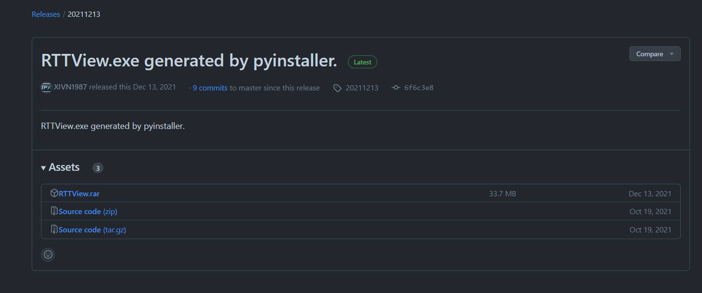

   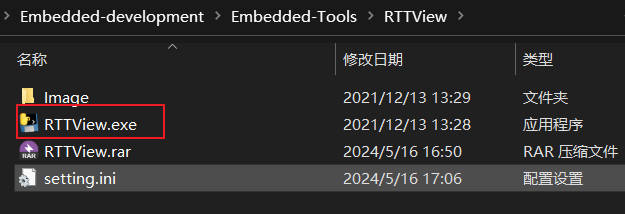

   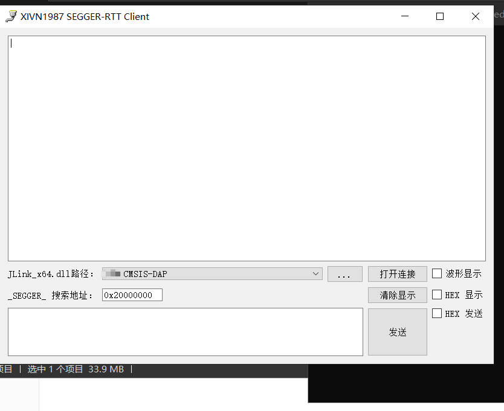

   当接上板子时，寻找link,打开连接即可看到SEGGER-RTT打印效果

   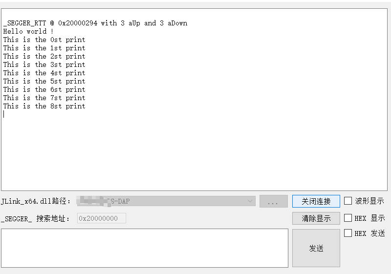
   
   

