## 极海APM32F411V Tiny开发板评测01 开箱点灯环境搭建与工程模板建立

### APM32简介

APM32系列为珠海极海半导体有限公司开发的基于Arm® Cortex®-M0+/M3/M4F内核的32位微控制器。
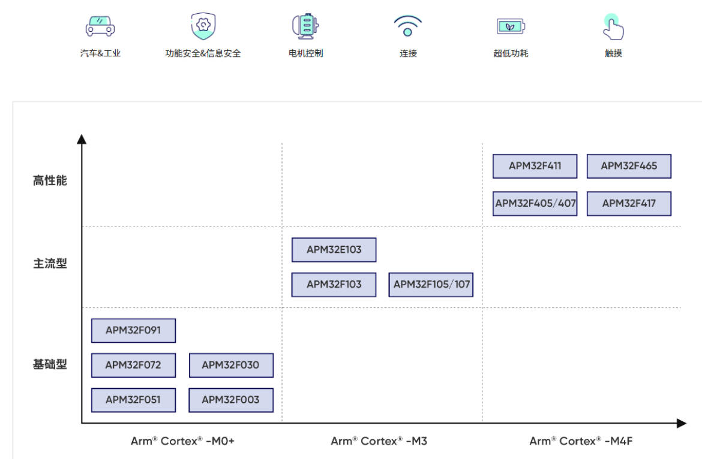
APM32F411系列为工业级高性能高适配型MCU，具有高速运算能力、多种工作模式、以及丰富的高精度外设资源；内置CRC32运算单元，可为用户提供高集成度、高可靠性的SoC方案；作为APM32F4系列MCU的拓展产品，可满足用户对产品功耗、性能、性价比等方面的综合需求。可广泛应用于网关设备、智能楼宇、工业控制器、智能电能表、双电机控制、便携式传感器等领域。
APM32F411的模块框图如下：
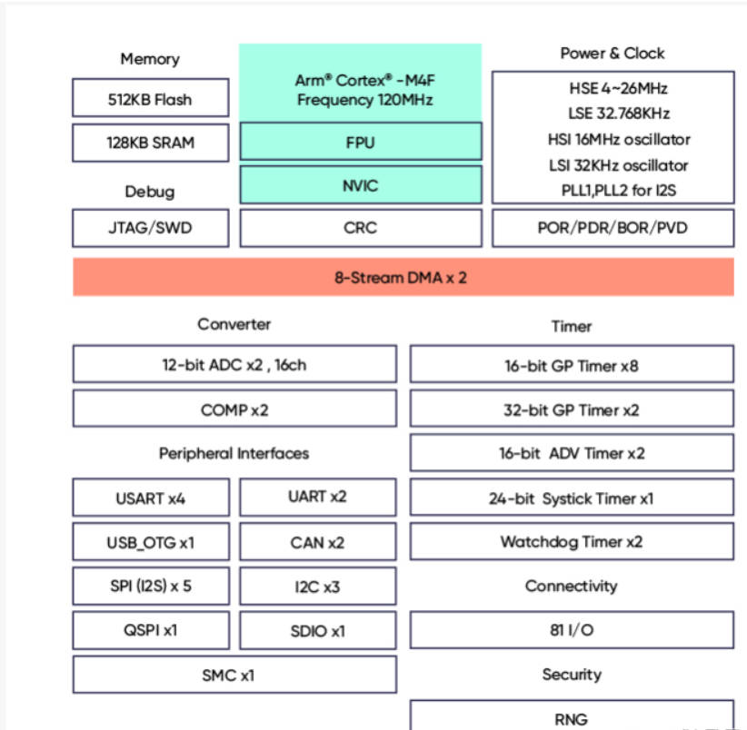

### APM32F411V Tiny Board开发板
APM32F411V Tiny Board开发板，是基础型APM32F4系列MCU，带仿真器功能的最小系统演示和开发平台，开发板预留了开放I/O、按键、串口、USB接口等基本功能外设。搭载了一颗APM32F411VET6 工业级高适配型MCU芯片，该芯片基于Arm® Cortex®-M4F内核、工作频率120MHz 、Flash高达512KB ，自带的仿真器功能模块支持用户进行仿真和下载程序。
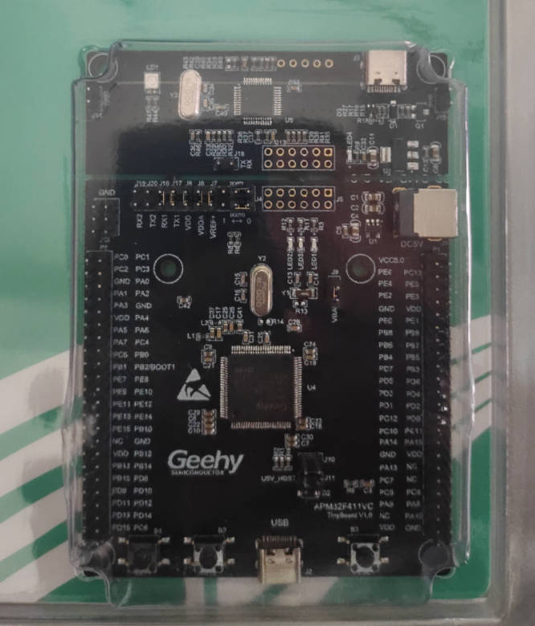

###  基础开发环境搭建
本评测采用MDK-Keil5环境开发，软件安装和使用可参考网络教程。 对于APM32F4111-Tiny开发板，可参考以下连接下载相关资料：

珠海极海半导体有限公司 | APM32F411系列
https://geehy.com/product/fifth/APM32F411

珠海极海半导体有限公司 | APM32F411V TINY Board
https://geehy.com/design/hardware_detail/33

1.在采用Keil5开放前，首先要安装芯片包。在安装好软件情况下，可以直接点击.pack进行。
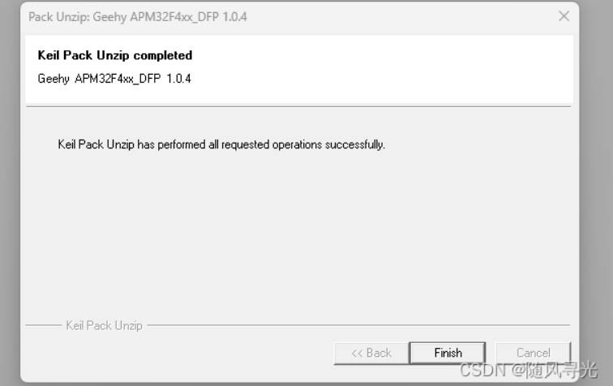
安装好后，可从keil芯片选型中查看到相关芯片。
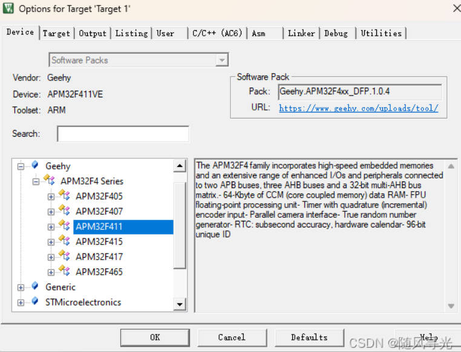
2.查看相关资料。
在APM32F4xx_SDK中，官方提供了驱动程序库与相关示例。
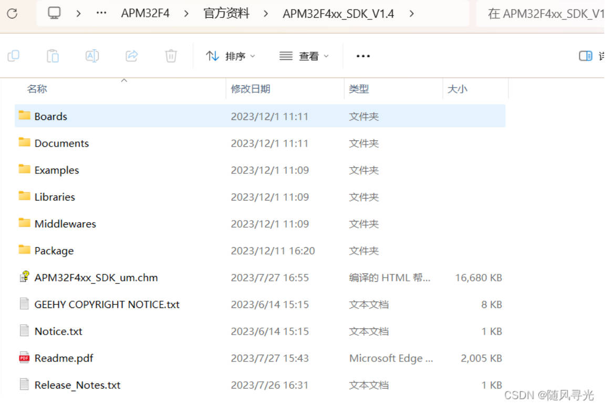
其中Examples、Libraries、Middlewares中，分别提供了程序例程、驱动库和中间件库。
3.查看官方例程
在搭建自己的工程环境前，需要对官方例程有一定的了解。
官方例程对驱动库、硬件板子做了一个分层。所有的例程中，只包含了每个工程必要的基础文件。

其Board层和Libraries层均位于APM32F4xx_SDK目录下。
故在使用例程时，可通过更改board.c进行适配。
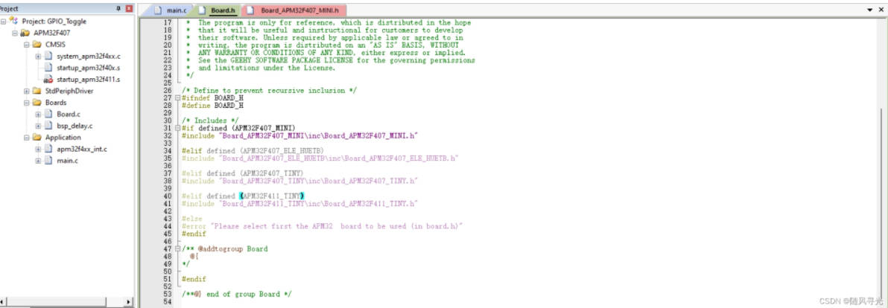
在APM32F4xx_SDK/Boards目录下，包含了各开发板的bsp驱动库。
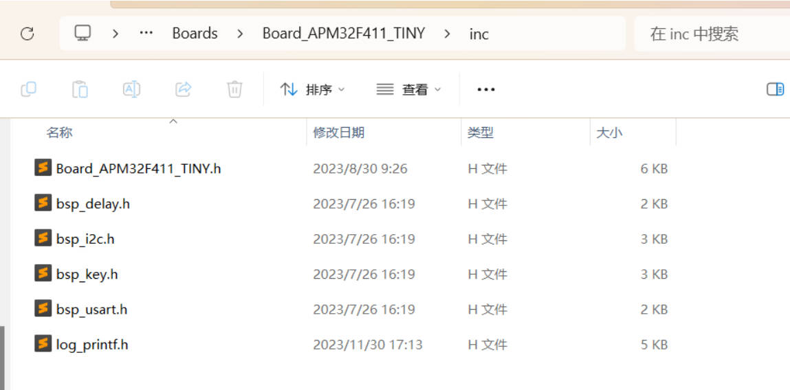
在每个例程中，部分基础中断的定义在apm32f4xx_int.c里。

4.搭建工程模板
首先，迁移基础的驱动库，可根据需要，直接复制Libraries文件。
（注：其中ETH_Driver暂时无用）
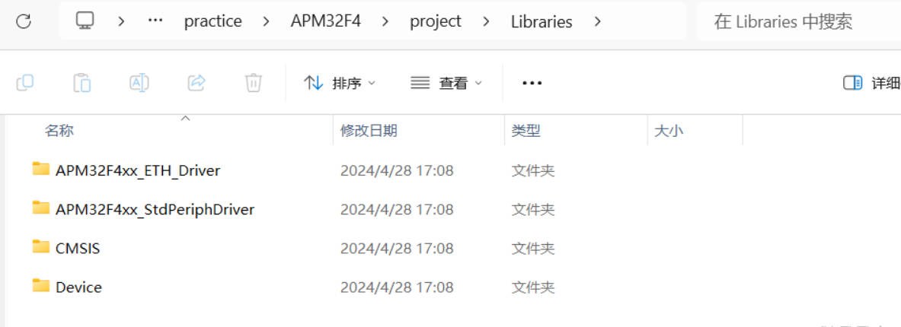
其次，根据需要迁移相应开发板的基础bsp软件模块，用于快速开发。
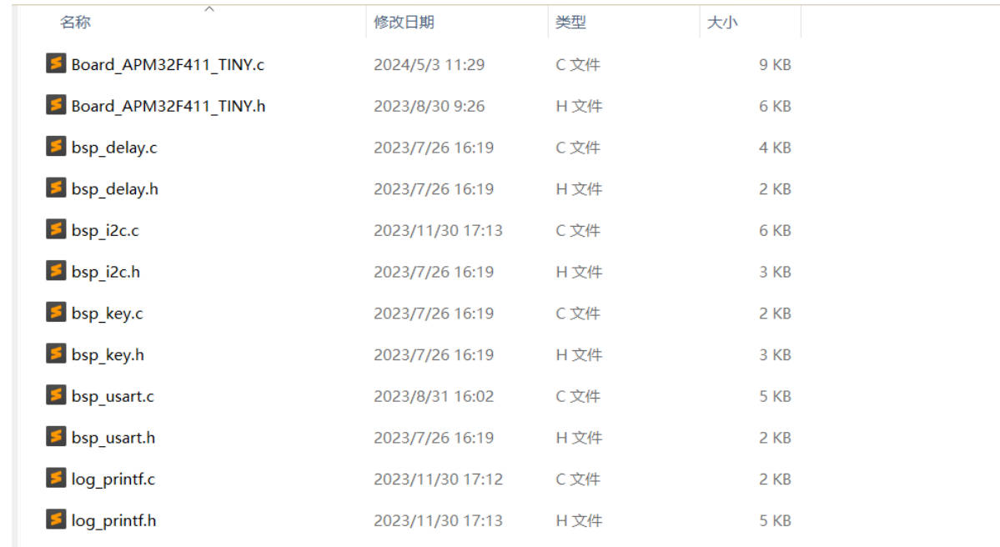
(此步可根据需要进行选择性移植，移植时还需要注意相关的中断移植，例如bsp_delay文件就依赖于单独的Systick中断函数，可参考例程中的apm32f4xx_int.c)

6.在迁移工程过程中，在编译apm32f4xx.h文件中出现了以下错误，说明EOF出现重复定义。

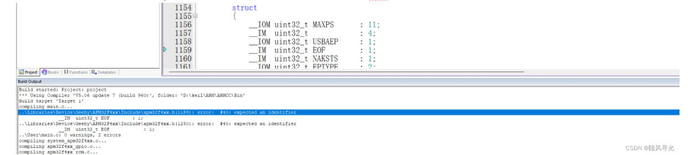
采用全局搜索，并未搜到同名定义。后发现在C语言基础库里出现了EOF定义。也就代表着<stdio.h>和<stdint.h>无法与"apm324xx.h"同时出现.
此错误采用AC6进行编译，可看到更详细的错误报告。
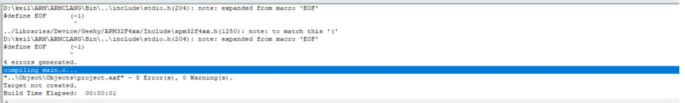
7.编译工程。

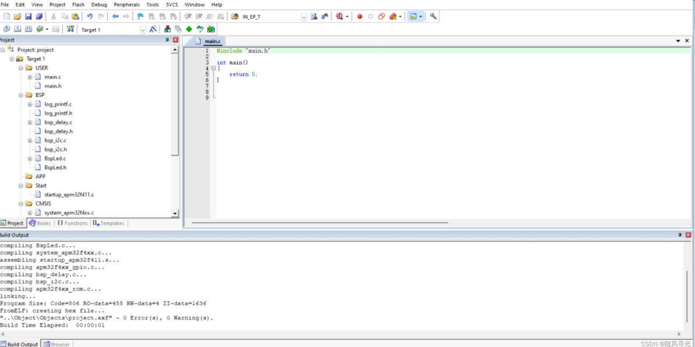至此，基础工程模板搭建完成。


### 点灯
1.将board层里的led单独分离出来。

```c
#include "main.h"
#include "Bspled.h"

#define LED2_PIN                         GPIO_PIN_6
#define LED2_GPIO_PORT                   GPIOE
#define LED2_GPIO_CLK                    RCM_AHB1_PERIPH_GPIOE

#define LED3_PIN                         GPIO_PIN_5
#define LED3_GPIO_PORT                   GPIOE
#define LED3_GPIO_CLK                    RCM_AHB1_PERIPH_GPIOE

#define LEDn                             2

GPIO_T* GPIO_PORT[LEDn] = {LED2_GPIO_PORT, LED3_GPIO_PORT};
const uint16_t GPIO_PIN[LEDn] = {LED2_PIN, LED3_PIN};
const uint32_t GPIO_CLK[LEDn] = {LED2_GPIO_CLK, LED3_GPIO_CLK};

/*!
 * @brief       Configures LED GPIO.
 *
 * @param       Led: Specifies the Led to be configured.
 *              This parameter can be one of following parameters:
 *              @arg LED2
 *              @arg LED3
 *
 * @retval      None
 */
void APM_LEDInit(Led_TypeDef Led)
{
    GPIO_Config_T  configStruct;

    /* Enable the GPIO_LED Clock */
    RCM_EnableAHB1PeriphClock(GPIO_CLK[Led]);

    /* Configure the GPIO_LED pin */
    GPIO_ConfigStructInit(&configStruct);
    configStruct.pin = GPIO_PIN[Led];
    configStruct.mode = GPIO_MODE_OUT;
    configStruct.speed = GPIO_SPEED_50MHz;

    GPIO_Config(GPIO_PORT[Led], &configStruct);
    GPIO_PORT[Led]->BSCL = GPIO_PIN[Led];
}
/*!
 * @brief       Turns selected LED On.
 *
 * @param       Led: Specifies the Led to be configured.
 *              This parameter can be one of following parameters:
 *              @arg LED2
 *              @arg LED3
 *
 * @retval      None
 */
void APM_LEDOn(Led_TypeDef Led)
{
    GPIO_PORT[Led]->BSCH |= GPIO_PIN[Led];
}
/*!
 * @brief       Turns selected LED Off.
 *
 * @param       Led: Specifies the Led to be configured.
 *              This parameter can be one of following parameters:
 *              @arg LED2
 *              @arg LED3
 *
 * @retval      None
 */
void APM_LEDOff(Led_TypeDef Led)
{
    GPIO_PORT[Led]->BSCL |= GPIO_PIN[Led];
}

/*!
 * @brief       Toggles the selected LED.
 *
 * @param       Led: Specifies the Led to be configured.
 *              This parameter can be one of following parameters:
 *              @arg LED2
 *              @arg LED3
 *
 * @retval      None
 */
void APM_LEDToggle(Led_TypeDef Led)
{
    GPIO_PORT[Led]->ODATA ^= GPIO_PIN[Led];
}

```
2.采用APM32F411V TINY Board自带的Geehy Link进行下载。
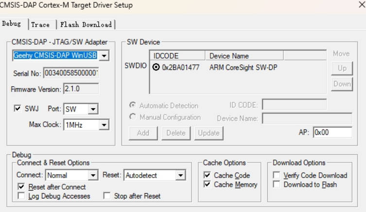
成功点亮。
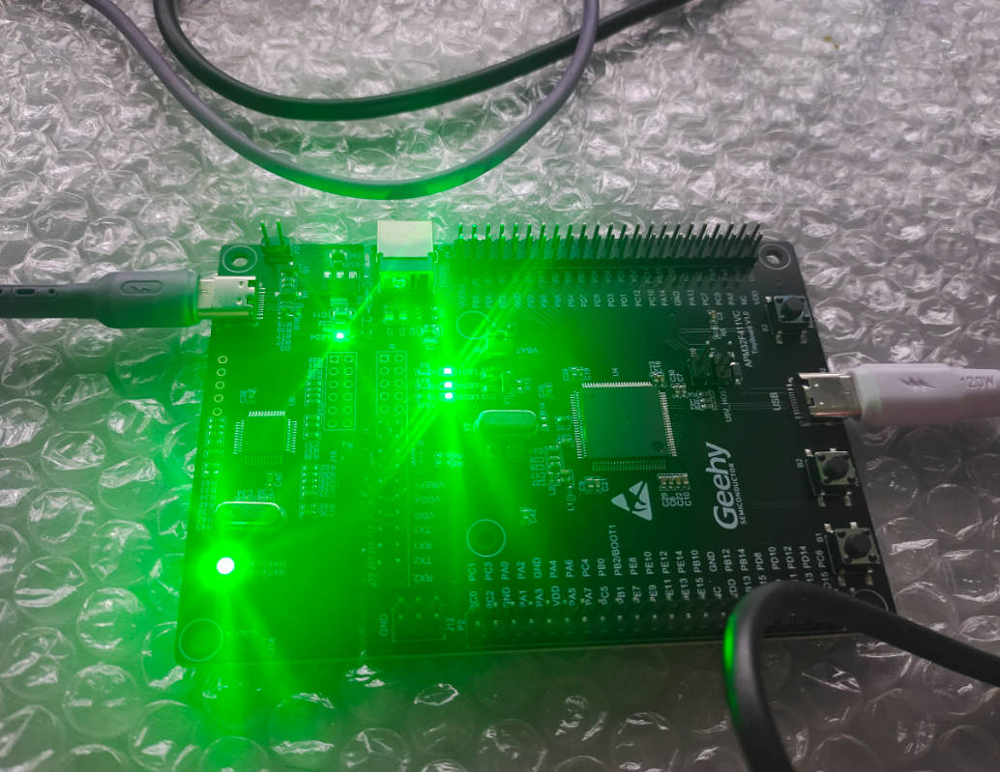

### 整体感受
就目前开箱评测来看，其整体开发和STM32类似，在keil环境下的基础开发环境搭建较为简单。需要注意的是，其基础例程，由于针对不同开发板进行了封装，无法单独形成每个工程，移植单独工程时稍微麻烦一些。
