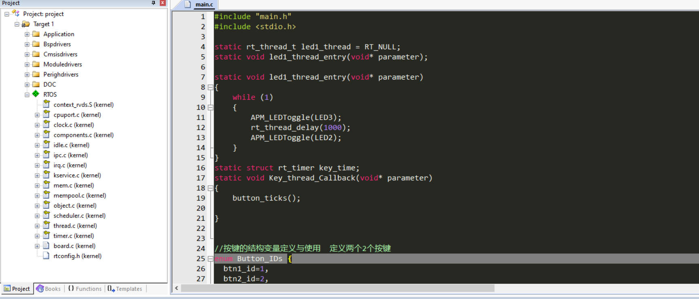
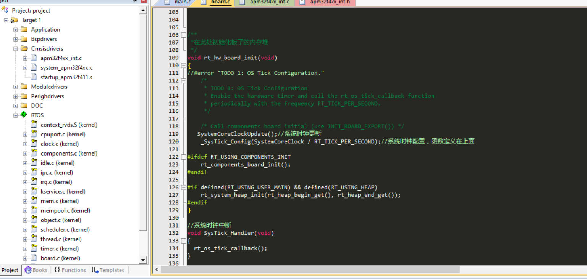
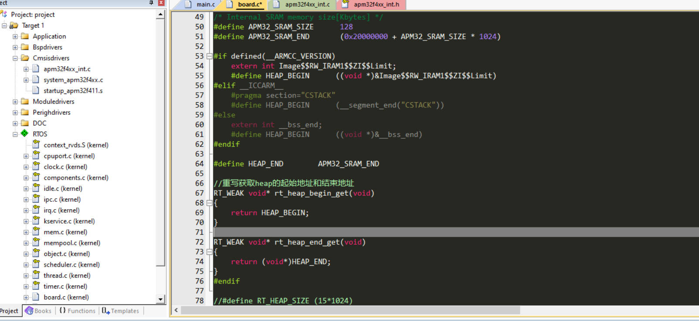
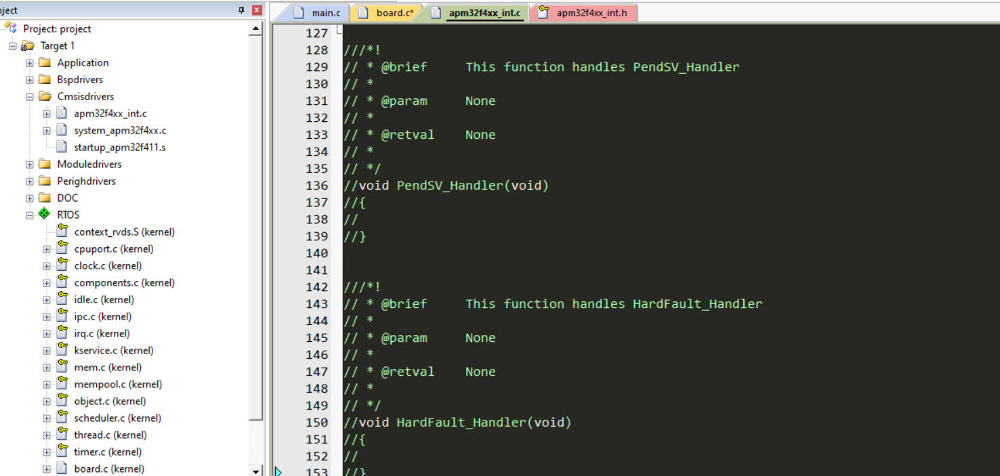
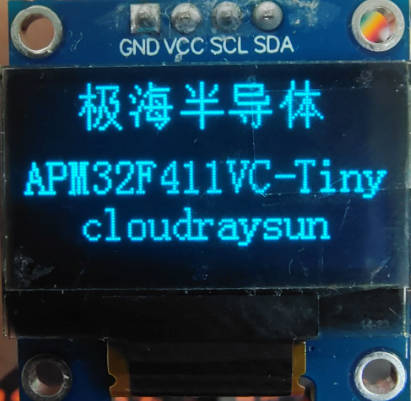

## 极海APM32F411V Tiny开发板评测03 RT-Thread Nano移植

### 1. 软硬件平台

1. APM32F411Tiny Board开发板
2. MDK-ARM Keil

### 2. 物联网RTOS—RT-Thread

 RT-Thread Nano 是一个极简版的硬实时内核，它是由 C 语言开发，采用面向对象的编程思维，具有良好的代码风格，是一款可裁剪的、抢占式实时多任务的 RTOS。其内存资源占用极小，功能包括任务处理、软件定时器、信号量、邮箱和实时调度等相对完整的实时操作系统特性。适用于大量使用的 32 位 ARM 入门级 MCU 的场合。

下图是 RT-Thread Nano 的软件框图，包含支持的 CPU 架构与内核源码，还有可拆卸的 FinSH 组件：


支持架构：ARM：Cortex M0/ M3/ M4/ M7 等、RISC-V 及其他。

功能：线程管理、线程间同步与通信、时钟管理、中断管理、内存管理。

#### RT-Thread Nano的特点

1. 下载简单

   RT-Thread Nano 以软件包的方式集成在 Keil MDK 与 CubeMX 中，可以直接在软件中下载 Nano 软件包获取源码，获取方式详见 基于 Keil MDK 移植 RT-Thread Nano 与 基于 CubeMX 移植 RT-Thread Nano 。同时也提供 下载 Nano 源码压缩包 的途径，方便在其他开发环境移植 RT-Thread Nano，如 基于 IAR 移植 RT-Thread Nano。

2. 代码简单 与RT-Thread 完整版不同的是，Nano 不含 Scons 构建系统，不需要 Kconfig 以及 Env 配置工具，也去除了完整版特有的 device 框架和组件，仅是一个纯净的内核。

3. 移植简单 由于 Nano 的极简特性，使 Nano 的移植过程变得极为简单。添加 Nano 源码到工程，就已完成 90% 的移植工作。

4. 易裁剪：Nano 的配置文件为 rtconfig.h，该文件中列出了内核中的所有宏定义，有些默认没有打开，如需使用，打开即可。

5. 易添加 FinSH 组件：FinSH 组件 可以很方便的在 Nano 上进行移植，而不再依赖 device 框架，只需要对接两个必要的函数即可完成 FinSH 移植。

6. 资源占用小：对 RAM 与 ROM 的开销非常小，在支持 semaphore 和 mailbox 特性，并运行两个线程 (main 线程 + idle 线程) 情况下，ROM 和 RAM 依然保持着极小的尺寸，RAM 占用约 1K 左右，ROM 占用 4K 左右。

### 移植过程

1. RT-Thread Nano 内核移植

   RT-Thread Nano移植较为简单，参考官方教程。我这里里面可能有少步骤的，大体也差不多。其实我实际对接内核就改了一个SystemClock_Config()函数的实现，其他的基本上没有太大变化，然后就是一些宏定义的打开，特别是你需要使用FINSH组件的时候。

   官方移植教程 [基于 Keil MDK 移植 RT-Thread Nano](https://gitee.com/link?target=https%3A%2F%2Fwww.rt-thread.org%2Fdocument%2Fsite%2F%23%2Frt-thread-version%2Frt-thread-nano%2Fnano-port-keil%2Fan0039-nano-port-keil%3Fid%3D%E5%9F%BA%E4%BA%8E-keil-mdk-%E7%A7%BB%E6%A4%8D-rt-thread-nano)

   1. 在之前的工程模板基础上，添加RT-Thread Nano代码文件。在keil里面添加文件即可。

      

   2. 需要注意是，RT-Thread/port里面需要选择与芯片匹配的文件，APM32F411是Cortex-M4内核的芯片，选择添加相关文件。Cortex-M 芯片内核移植文件如下：

   3. 将SysTick_Handler移到RTOS目录下的board.c内，并添加回调函数rt_os_tick_callback();复制例程中相关堆栈初始化的代码。

      由于 `SysTick_Handler()` 中断服务例程由用户在 board.c 中重新实现，做了系统 OS Tick，所以还需要删除工程里中原本已经实现的 `SysTick_Handler()` ，避免在编译时产生重复定义。如果此时对工程进行编译，没有出现函数重复定义的错误，则不用做修改.

      

      

   4. RT-Thread 会接管异常处理函数 `HardFault_Handler()` 和悬挂处理函数 `PendSV_Handler()`，这两个函数已由 RT-Thread 实现，所以需要删除工程里中断服务例程文件中的这两个函数，避免在编译时产生重复定义。如果此时对工程进行编译，没有出现函数重复定义的错误，则不用做修改。因此在我们的工程里面需要把apm32f4xx_int.c文件中的HardFault_Handler、PendSV_Handler、SysTick_Handler函数注释掉。

      

   5. 尝试移植中景园OLED代码。修改对应GPIO代码后，将延时改为RTT的延时函数后，正常使用。

      ```c
      #include "main.h"
      #include "oled.h"
      #include <stdlib.h>
      #include "oledfont.h"
      #include "Bsp_delay.h"
      
      //OLED的显存
      //存放格式如下.
      //[0]0 1 2 3 ... 127	
      //[1]0 1 2 3 ... 127	
      //[2]0 1 2 3 ... 127	
      //[3]0 1 2 3 ... 127	
      //[4]0 1 2 3 ... 127	
      //[5]0 1 2 3 ... 127	
      //[6]0 1 2 3 ... 127	
      //[7]0 1 2 3 ... 127 
      
      #define SIZE 8
      #define XLevelL		0x00
      #define XLevelH		0x10
      #define Max_Column	128
      #define Max_Row		64
      #define	Brightness	0xFF 
      #define X_WIDTH 	128
      #define Y_WIDTH 	64	    						  
      //-----------------OLED IIC端口定义----------------  					   
      
      #define OLED_SCLK_Clr() GPIO_ResetBit(GPIOB,GPIO_PIN_8) //CLK
      #define OLED_SCLK_Set() GPIO_SetBit(GPIOB,GPIO_PIN_8)
      
      #define OLED_SDIN_Clr() GPIO_ResetBit(GPIOB,GPIO_PIN_9)//SDA
      #define OLED_SDIN_Set() GPIO_SetBit(GPIOB,GPIO_PIN_9)
      
      #define OLED_CMD  0	//写命令
      #define OLED_DATA 1	//写数据
      
      
      /**********************************************
      //IIC Start
      **********************************************/
      void IIC_Start()
      {
      	OLED_SCLK_Set() ;
      	OLED_SDIN_Set();
      	OLED_SDIN_Clr();
      	OLED_SCLK_Clr();
      }
      /**********************************************
      //IIC Stop
      **********************************************/
      void IIC_Stop()
      {
      	OLED_SCLK_Set() ;
      //	OLED_SCLK_Clr();
      	OLED_SDIN_Clr();
      	OLED_SDIN_Set();
      }
      
      void IIC_Wait_Ack()
      {
      	OLED_SCLK_Set() ;
      	OLED_SCLK_Clr();
      }
      
      /**********************************************
      // IIC Write byte
      **********************************************/
      
      void Write_IIC_Byte(unsigned char IIC_Byte)
      {
      	unsigned char i;
      	unsigned char m,da;
      	da=IIC_Byte;
      	OLED_SCLK_Clr();
      	for(i=0;i<8;i++)		
      	{
      		m=da;
      
      		m=m&0x80;
      		if(m==0x80)
      		{OLED_SDIN_Set();}
      		else OLED_SDIN_Clr();
      			da=da<<1;
      		OLED_SCLK_Set();
      		OLED_SCLK_Clr();
      	}
      }
      
      /**********************************************
      // IIC Write Command
      **********************************************/
      void Write_IIC_Command(unsigned char IIC_Command)
      {
      	IIC_Start();
      	Write_IIC_Byte(0x78);            //Slave address,SA0=0
      	IIC_Wait_Ack();	
      	Write_IIC_Byte(0x00);			//write command
      	IIC_Wait_Ack();	
      	Write_IIC_Byte(IIC_Command); 
      	IIC_Wait_Ack();	
      	IIC_Stop();
      }
      
      /**********************************************
      // IIC Write Data
      **********************************************/
      void Write_IIC_Data(unsigned char IIC_Data)
      {
      	IIC_Start();
      	Write_IIC_Byte(0x78);			//D/C#=0; R/W#=0
      	IIC_Wait_Ack();	
      	Write_IIC_Byte(0x40);			//write data
      	IIC_Wait_Ack();	
      	Write_IIC_Byte(IIC_Data);
      	IIC_Wait_Ack();	
      	IIC_Stop();
      }
      void OLED_WR_Byte(unsigned dat,unsigned cmd)
      {
      	if(cmd)
      	{
      		Write_IIC_Data(dat);
      	}
      	else 
      	{
      		Write_IIC_Command(dat);
      	}
      }
      
      /********************************************
      // fill_Picture
      ********************************************/
      void fill_picture(unsigned char fill_Data)
      {
      	unsigned char m,n;
      	for(m=0;m<8;m++)
      	{
      		OLED_WR_Byte(0xb0+m,0);		//page0-page1
      		OLED_WR_Byte(0x00,0);		//low column start address
      		OLED_WR_Byte(0x10,0);		//high column start address
      		for(n=0;n<128;n++)
      		{
      			OLED_WR_Byte(fill_Data,1);
      		}
      	}
      }
      
      //坐标设置
      
      void OLED_Set_Pos(unsigned char x, unsigned char y) 
      { 	OLED_WR_Byte(0xb0+y,OLED_CMD);
      	OLED_WR_Byte(((x&0xf0)>>4)|0x10,OLED_CMD);
      	OLED_WR_Byte((x&0x0f),OLED_CMD); 
      }   	  
      //开启OLED显示    
      void OLED_Display_On(void)
      {
      	OLED_WR_Byte(0X8D,OLED_CMD);  //SET DCDC命令
      	OLED_WR_Byte(0X14,OLED_CMD);  //DCDC ON
      	OLED_WR_Byte(0XAF,OLED_CMD);  //DISPLAY ON
      }
      //关闭OLED显示     
      void OLED_Display_Off(void)
      {
      	OLED_WR_Byte(0X8D,OLED_CMD);  //SET DCDC命令
      	OLED_WR_Byte(0X10,OLED_CMD);  //DCDC OFF
      	OLED_WR_Byte(0XAE,OLED_CMD);  //DISPLAY OFF
      }		   			 
      //清屏函数,清完屏,整个屏幕是黑色的!和没点亮一样!!!	  
      void OLED_Clear(void)  
      {  
      	u8 i,n;		    
      	for(i=0;i<8;i++)  
      	{  
      		OLED_WR_Byte (0xb0+i,OLED_CMD);    //设置页地址（0~7）
      		OLED_WR_Byte (0x00,OLED_CMD);      //设置显示位置—列低地址
      		OLED_WR_Byte (0x10,OLED_CMD);      //设置显示位置—列高地址   
      		for(n=0;n<128;n++)OLED_WR_Byte(0,OLED_DATA); 
      	} //更新显示
      }
      void OLED_On(void)  
      {  
      	u8 i,n;		    
      	for(i=0;i<8;i++)  
      	{  
      		OLED_WR_Byte (0xb0+i,OLED_CMD);    //设置页地址（0~7）
      		OLED_WR_Byte (0x00,OLED_CMD);      //设置显示位置—列低地址
      		OLED_WR_Byte (0x10,OLED_CMD);      //设置显示位置—列高地址   
      		for(n=0;n<128;n++)OLED_WR_Byte(1,OLED_DATA); 
      	} //更新显示
      }
      //在指定位置显示一个字符,包括部分字符
      //x:0~127
      //y:0~63
      //mode:0,反白显示;1,正常显示				 
      //size:选择字体 16/12 
      void OLED_ShowChar(u8 x,u8 y,u8 chr,u8 Char_Size)
      {      	
      	unsigned char c=0,i=0;	
      		c=chr-' ';//得到偏移后的值			
      		if(x>Max_Column-1){x=0;y=y+2;}
      		if(Char_Size ==16)
      			{
      			OLED_Set_Pos(x,y);	
      			for(i=0;i<8;i++)
      			OLED_WR_Byte(F8X16[c*16+i],OLED_DATA);
      			OLED_Set_Pos(x,y+1);
      			for(i=0;i<8;i++)
      			OLED_WR_Byte(F8X16[c*16+i+8],OLED_DATA);
      			}
      			else {	
      				OLED_Set_Pos(x,y);
      				for(i=0;i<6;i++)
      				OLED_WR_Byte(F6x8[c][i],OLED_DATA);
      				
      			}
      }
      //m^n函数
      u32 oled_pow(u8 m,u8 n)
      {
      	u32 result=1;	 
      	while(n--)result*=m;    
      	return result;
      }				  
      //显示2个数字
      //x,y :起点坐标	 
      //len :数字的位数
      //size:字体大小
      //mode:模式	0,填充模式;1,叠加模式
      //num:数值(0~4294967295);	 		  
      void OLED_ShowNum(u8 x,u8 y,u32 num,u8 len,u8 size2)
      {         	
      	u8 t,temp;
      	u8 enshow=0;						   
      	for(t=0;t<len;t++)
      	{
      		temp=(num/oled_pow(10,len-t-1))%10;
      		if(enshow==0&&t<(len-1))
      		{
      			if(temp==0)
      			{
      				OLED_ShowChar(x+(size2/2)*t,y,' ',size2);
      				continue;
      			}else enshow=1; 
      		 	 
      		}
      	 	OLED_ShowChar(x+(size2/2)*t,y,temp+'0',size2); 
      	}
      } 
      //显示一个字符号串
      void OLED_ShowString(u8 x,u8 y,u8 *chr,u8 Char_Size)
      {
      	unsigned char j=0;
      	while (chr[j]!='\0')
      	{
      		OLED_ShowChar(x,y,chr[j],Char_Size);
      		x+=8;
      		if(x>120){x=0;y+=2;}
      			j++;
      	}
      }
      //显示汉字
      void OLED_ShowCHinese(u8 x,u8 y,u8 no)
      {      			    
      	u8 t,adder=0;
      	OLED_Set_Pos(x,y);	
          for(t=0;t<16;t++)
      	{
      		OLED_WR_Byte(Hzk[2*no][t],OLED_DATA);
      		adder+=1;
           }	
      	OLED_Set_Pos(x,y+1);	
          for(t=0;t<16;t++)
      	{	
      		OLED_WR_Byte(Hzk[2*no+1][t],OLED_DATA);
      		adder+=1;
            }					
      }
      /***********功能描述：显示显示BMP图片128×64起始点坐标(x,y),x的范围0～127，y为页的范围0～7*****************/
      void OLED_DrawBMP(unsigned char x0, unsigned char y0,unsigned char x1, unsigned char y1,unsigned char BMP[])
      { 	
       unsigned int j=0;
       unsigned char x,y;
        
        if(y1%8==0) y=y1/8;      
        else y=y1/8+1;
      	for(y=y0;y<y1;y++)
      	{
      		OLED_Set_Pos(x0,y);
          for(x=x0;x<x1;x++)
      	    {      
      	    	OLED_WR_Byte(BMP[j++],OLED_DATA);	    	
      	    }
      	}
      } 
      
      //初始化SSD1306					    
      void OLED_Init(void)
      {	
       	GPIO_Config_T  configStruct;
       	 /* Enable the GPIO_LED Clock */
          RCM_EnableAHB1PeriphClock(RCM_AHB1_PERIPH_GPIOB);
      	
          GPIO_ConfigStructInit(&configStruct);
          configStruct.pin = GPIO_PIN_8|GPIO_PIN_9;
          configStruct.mode = GPIO_MODE_OUT;
      	configStruct.otype = GPIO_OTYPE_PP;
      	configStruct.pupd = GPIO_PUPD_UP;
          configStruct.speed = GPIO_SPEED_50MHz;
      	GPIO_Config(GPIOB, &configStruct);
      	GPIO_SetBit(GPIOB,GPIO_PIN_8);
      	GPIO_SetBit(GPIOB,GPIO_PIN_9);
      	
      	rt_thread_delay(200);
      
      	OLED_WR_Byte(0xAE,OLED_CMD);//--display off
      	OLED_WR_Byte(0x00,OLED_CMD);//---set low column address
      	OLED_WR_Byte(0x10,OLED_CMD);//---set high column address
      	OLED_WR_Byte(0x40,OLED_CMD);//--set start line address  
      	OLED_WR_Byte(0xB0,OLED_CMD);//--set page address
      	OLED_WR_Byte(0x81,OLED_CMD); // contract control
      	OLED_WR_Byte(0xFF,OLED_CMD);//--128   
      	OLED_WR_Byte(0xA1,OLED_CMD);//set segment remap 
      	OLED_WR_Byte(0xA6,OLED_CMD);//--normal / reverse
      	OLED_WR_Byte(0xA8,OLED_CMD);//--set multiplex ratio(1 to 64)
      	OLED_WR_Byte(0x3F,OLED_CMD);//--1/32 duty
      	OLED_WR_Byte(0xC8,OLED_CMD);//Com scan direction
      	OLED_WR_Byte(0xD3,OLED_CMD);//-set display offset
      	OLED_WR_Byte(0x00,OLED_CMD);//
      	
      	OLED_WR_Byte(0xD5,OLED_CMD);//set osc division
      	OLED_WR_Byte(0x80,OLED_CMD);//
      	
      	OLED_WR_Byte(0xD8,OLED_CMD);//set area color mode off
      	OLED_WR_Byte(0x05,OLED_CMD);//
      	
      	OLED_WR_Byte(0xD9,OLED_CMD);//Set Pre-Charge Period
      	OLED_WR_Byte(0xF1,OLED_CMD);//
      	
      	OLED_WR_Byte(0xDA,OLED_CMD);//set com pin configuartion
      	OLED_WR_Byte(0x12,OLED_CMD);//
      	
      	OLED_WR_Byte(0xDB,OLED_CMD);//set Vcomh
      	OLED_WR_Byte(0x30,OLED_CMD);//
      	
      	OLED_WR_Byte(0x8D,OLED_CMD);//set charge pump enable
      	OLED_WR_Byte(0x14,OLED_CMD);//
      	
      	OLED_WR_Byte(0xAF,OLED_CMD);//--turn on oled panel
      }  
      ```

​			

