## 极海APM32F411V Tiny开发板评测 GCC Makefile Pyocd 工程模板建立

### 一、移植前的准备
###   1. 准备目标硬件（开发板/芯片/模组）

本教程将使用极海APM32F411V Tiny开发板进行示例移植。调试ARM Cortex M核还需要仿真器，如果您的开发板或者芯片模组没有板载仿真器，就需要连接外置的仿真器，如DAPLink之类的。

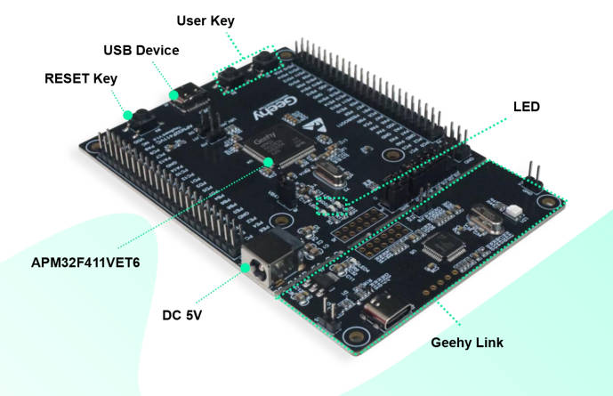

###   2.准备编译器环境

1）Windows or Linux (Windows，linux基本环境流程差不多，可能需要修改部分Makefile代码)

2）Jlink、Daplink、Wch-Link烧录器

3）GNU Arm Embedded Toolchain交叉编译器

4）Mingw-w64 GCC for Windows 64 

###   3.Windows环境搭建

##### GNU Arm Embedded Toolchain交叉编译器安装

进入arm开发者官网，往下滑动选择下载解压可用的ZIP压缩包文件

[下载链接： Downloads | GNU Arm Embedded Toolchain Downloads – Arm Developer](https://developer.arm.com/tools-and-software/open-source-software/developer-tools/gnu-toolchain/gnu-rm/downloads)


 将下载好的压缩包文件解压在gcc-arm-none-eabi”文件夹中，并记住文件内“bin”文件的路径，后续需添加到系统环境变量Path中。

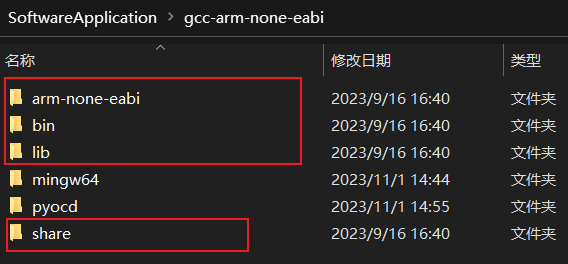


添加完环境变量后，进行测试，检测是否安装好。


##### 安装**Mingw-w64 GCC**

点击链接进入到SourceForge官网，往下翻可以找到很多版本的下载链接，选择红色框内型号即可，不同前后缀的具体差异请参考:

[MinGW gcc下载链接及sjlj、dwarf、seh异同以及gcc安装_AMDDMA的博客-CSDN博客_seh和sjlj](https://blog.csdn.net/AMDDMA/article/details/111600238)

下载链接：

[MinGW-w64 - for 32 and 64 bit Windows - Browse Files at SourceForge.net](https://sourceforge.net/projects/mingw-w64/files/)

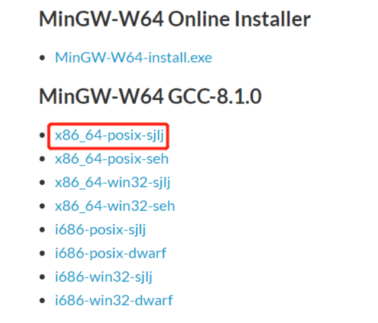

 同样，将下载好的文件解压到“gcc-arm-none-eabi”文件夹下，记住目录下的“bin”文件路径


进入“bin”文件内找到“mingw32-make”应用程序文件，复制一份并重命名为“make”。这么做有利于在命令行执行make指令，而不是输入mingw32-make。


​		添加完环境变量后，进行测试，检测是否安装好。

​		      

### 3.创建工程，编写Makefile

1. 工程结构

   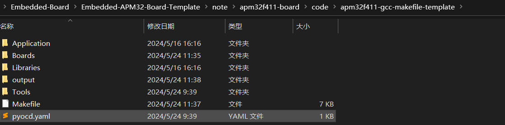

2. Makefile

   ```makefile
   ######################################
   # target
   ######################################
   TARGET = apm32f411_gcc_template
   
   
   ######################################
   # building variables
   ######################################
   # debug build?
   DEBUG = 1
   # optimization
   OPT = -Og
   
   
   #######################################
   # paths
   #######################################
   # Build path
   BUILD_DIR = output
   
   ######################################
   # source
   ######################################
   # C sources
   C_SOURCES =  \
   Application/Source/main.c \
   Application/Source/apm32f4xx_int.c \
   Application/Source/system_apm32f4xx.c \
   Boards/Board_APM32F411_TINY.c \
   Libraries/APM32F4xx_StdPeriphDriver/src/apm32f4xx_adc.c \
   Libraries/APM32F4xx_StdPeriphDriver/src/apm32f4xx_can.c \
   Libraries/APM32F4xx_StdPeriphDriver/src/apm32f4xx_crc.c \
   Libraries/APM32F4xx_StdPeriphDriver/src/apm32f4xx_cryp.c \
   Libraries/APM32F4xx_StdPeriphDriver/src/apm32f4xx_cryp_aes.c \
   Libraries/APM32F4xx_StdPeriphDriver/src/apm32f4xx_cryp_des.c \
   Libraries/APM32F4xx_StdPeriphDriver/src/apm32f4xx_cryp_tdes.c \
   Libraries/APM32F4xx_StdPeriphDriver/src/apm32f4xx_dac.c \
   Libraries/APM32F4xx_StdPeriphDriver/src/apm32f4xx_dbgmcu.c \
   Libraries/APM32F4xx_StdPeriphDriver/src/apm32f4xx_dci.c \
   Libraries/APM32F4xx_StdPeriphDriver/src/apm32f4xx_dma.c \
   Libraries/APM32F4xx_StdPeriphDriver/src/apm32f4xx_dmc.c \
   Libraries/APM32F4xx_StdPeriphDriver/src/apm32f4xx_eint.c \
   Libraries/APM32F4xx_StdPeriphDriver/src/apm32f4xx_fmc.c \
   Libraries/APM32F4xx_StdPeriphDriver/src/apm32f4xx_gpio.c \
   Libraries/APM32F4xx_StdPeriphDriver/src/apm32f4xx_hash.c \
   Libraries/APM32F4xx_StdPeriphDriver/src/apm32f4xx_hash_md5.c \
   Libraries/APM32F4xx_StdPeriphDriver/src/apm32f4xx_hash_sha1.c \
   Libraries/APM32F4xx_StdPeriphDriver/src/apm32f4xx_i2c.c \
   Libraries/APM32F4xx_StdPeriphDriver/src/apm32f4xx_iwdt.c \
   Libraries/APM32F4xx_StdPeriphDriver/src/apm32f4xx_misc.c \
   Libraries/APM32F4xx_StdPeriphDriver/src/apm32f4xx_pmu.c \
   Libraries/APM32F4xx_StdPeriphDriver/src/apm32f4xx_rcm.c \
   Libraries/APM32F4xx_StdPeriphDriver/src/apm32f4xx_rng.c \
   Libraries/APM32F4xx_StdPeriphDriver/src/apm32f4xx_rtc.c \
   Libraries/APM32F4xx_StdPeriphDriver/src/apm32f4xx_sdio.c \
   Libraries/APM32F4xx_StdPeriphDriver/src/apm32f4xx_smc.c \
   Libraries/APM32F4xx_StdPeriphDriver/src/apm32f4xx_spi.c \
   Libraries/APM32F4xx_StdPeriphDriver/src/apm32f4xx_syscfg.c \
   Libraries/APM32F4xx_StdPeriphDriver/src/apm32f4xx_tmr.c \
   Libraries/APM32F4xx_StdPeriphDriver/src/apm32f4xx_usart.c \
   Libraries/APM32F4xx_StdPeriphDriver/src/apm32f4xx_wwdt.c
   
   # ASM sources
   ASM_SOURCES =  \
   Tools/startup_apm32f411.s
   
   
   #######################################
   # binaries
   #######################################
   PREFIX = arm-none-eabi-
   GCC_PATH = /SoftwareApplication/gcc-arm-none-eabi/bin # 添加gcc-arm-none-eabi路径
   # The gcc compiler bin path can be either defined in make command via GCC_PATH variable (> make GCC_PATH=xxx)
   # either it can be added to the PATH environment variable.
   ifdef GCC_PATH
   CC = $(GCC_PATH)/$(PREFIX)gcc
   AS = $(GCC_PATH)/$(PREFIX)gcc -x assembler-with-cpp
   CP = $(GCC_PATH)/$(PREFIX)objcopy
   SZ = $(GCC_PATH)/$(PREFIX)size
   else
   CC = $(PREFIX)gcc
   AS = $(PREFIX)gcc -x assembler-with-cpp
   CP = $(PREFIX)objcopy
   SZ = $(PREFIX)size
   endif
   HEX = $(CP) -O ihex
   BIN = $(CP) -O binary -S
   #######################################
   # CFLAGS
   #######################################
   # cpu
   CPU = -mcpu=cortex-m4
   
   # fpu
   FPU = -mfpu=fpv4-sp-d16
   
   # float-abi
   FLOAT-ABI = -mfloat-abi=hard
   
   # mcu
   MCU = $(CPU) -mthumb $(FPU) $(FLOAT-ABI)
   
   # macros for gcc
   # AS defines
   AS_DEFS = 
   
   # C defines
   C_DEFS =  \
   -DAPM32F411 \
   -DAPM32F411_TINY
   
   
   # AS includes
   AS_INCLUDES = 
   
   # C includes
   C_INCLUDES =  \
   -ILibraries/APM32F4xx_StdPeriphDriver/inc \
   -ILibraries/Device/Geehy/APM32F4xx/Include \
   -ILibraries/CMSIS/Include \
   -IBoards \
   -IApplication/Include \
   
   
   # compile gcc flags
   ASFLAGS = $(MCU) $(AS_DEFS) $(AS_INCLUDES) $(OPT) -Wall -fdata-sections -ffunction-sections
   
   CFLAGS += $(MCU) $(C_DEFS) $(C_INCLUDES) $(OPT) -Wall -fdata-sections -ffunction-sections
   
   ifeq ($(DEBUG), 1)
   CFLAGS += -g -gdwarf-2
   endif
   
   
   # Generate dependency information
   CFLAGS += -MMD -MP -MF"$(@:%.o=%.d)"
   
   
   #######################################
   # LDFLAGS
   #######################################
   # link script
   LDSCRIPT = Tools/APM32F4xxxE_FLASH.ld
   
   # libraries
   LIBS = -lc -lm -lnosys 
   LIBDIR = 
   LDFLAGS = $(MCU) -specs=nano.specs -T$(LDSCRIPT) $(LIBDIR) $(LIBS) -Wl,-Map=$(BUILD_DIR)/$(TARGET).map,--cref -Wl,--gc-sections
   
   # default action: build all
   all: $(BUILD_DIR)/$(TARGET).elf $(BUILD_DIR)/$(TARGET).hex $(BUILD_DIR)/$(TARGET).bin
   
   #######################################
   # build the application
   #######################################
   # list of objects
   OBJECTS = $(addprefix $(BUILD_DIR)/,$(notdir $(C_SOURCES:.c=.o)))
   vpath %.c $(sort $(dir $(C_SOURCES)))
   # list of ASM program objects
   OBJECTS += $(addprefix $(BUILD_DIR)/,$(notdir $(ASM_SOURCES:.s=.o)))
   vpath %.s $(sort $(dir $(ASM_SOURCES)))
   
   $(BUILD_DIR)/%.o: %.c Makefile | $(BUILD_DIR) 
   	@echo "[CC]    $<"
   	@$(CC) -c $(CFLAGS) -Wa,-a,-ad,-alms=$(BUILD_DIR)/$(notdir $(<:.c=.lst)) $< -o $@
   
   $(BUILD_DIR)/%.o: %.s Makefile | $(BUILD_DIR)
   	@echo "[AS]    $<"
   	@$(AS) -c $(CFLAGS) $< -o $@
   
   $(BUILD_DIR)/$(TARGET).elf: $(OBJECTS) Makefile
   	@echo "[HEX]   $< -> $@"
   	@$(CC) $(OBJECTS) $(LDFLAGS) -o $@
   	@$(SZ) $@
   
   $(BUILD_DIR)/%.hex: $(BUILD_DIR)/%.elf | $(BUILD_DIR)
   	@echo "[HEX]   $< -> $@"
   	@$(HEX) $< $@
   	
   $(BUILD_DIR)/%.bin: $(BUILD_DIR)/%.elf | $(BUILD_DIR)
   	@echo "[BIN]   $< -> $@"
   	@$(BIN) $< $@	
   	
   $(BUILD_DIR):
   	@mkdir $@	
   #######################################
   # flash
   #######################################
   flash: $(BUILD_DIR)/$(TARGET).bin
   	pyocd erase -c -t apm32f411ve --config pyocd.yaml
   	pyocd load output/$(TARGET).hex -t apm32f411ve --config pyocd.yaml
   #pyocd load -e sector -t apm32f411vc $(BUILD_DIR)/$(TARGET).bin
   #pyocd flash --erase chip --target apm32f411ve --pack=Geehy.APM32F4xx_DFP.1.0.4.pack $(BUILD_DIR)/$(TARGET).hex
   #######################################
   # clean up
   #######################################
   clean:
   	-del /q $(BUILD_DIR)   # del windows系统删除命令
   #######################################
   # dependencies
   #######################################
   -include $(wildcard $(BUILD_DIR)/*.d)
   
   # *** EOF ***
   ```

3. 编译

   执行make命令

   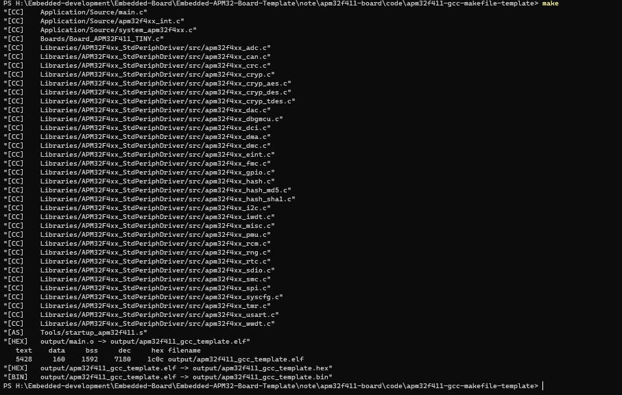

   ### 4.Linux环境搭建

   1. 安装GNU Arm Embedded Toolchain交叉编译器

      进入arm开发者官网，往下滑动选择下载解压可用的ZIP压缩包文件 ，选择linux版本

      也可以直接在linux系统中下载，这里使用的Ubuntu 22.04 

      ```bash
      sudo apt-get install gcc-arm-none-eabi
      ```

      下载完成查看

      ```bash
      arm-none-eabi-gcc -v
      ```

      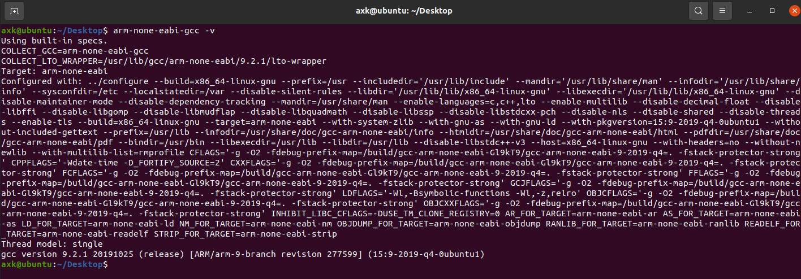

   2. 修改Makefile

      注释GCC_PATH

      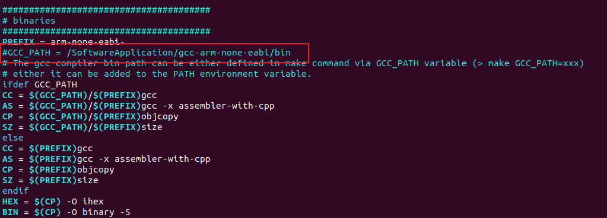

      修改 clean命令

      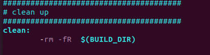

      make 

      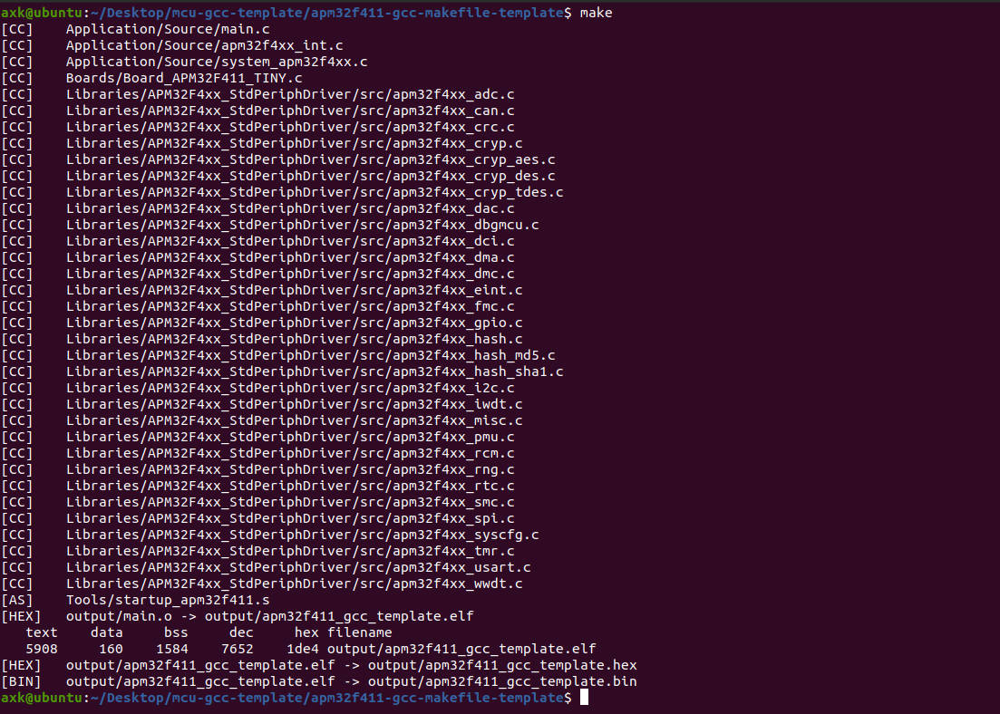

### 5.下载程序

1. 注意 printf重定向

   ```c
   /*!
   * @brief       Redirect C Library function printf to serial port.
   *              After Redirection, you can use printf function.
   *
   * @param       ch:  The characters that need to be send.
   *
   * @retval      The characters that need to be send.
   *
   * @note
   */
   int __io_putchar(int ch)
   {
       /* send a byte of data to the serial port */
       USART_TxData(DEBUG_USART, ch);
   
       /* wait for the data to be send */
       while (USART_ReadStatusFlag(DEBUG_USART, USART_FLAG_TXBE) == RESET);
   
       return ch;
   }
   
   /*!
   * @brief       Redirect C Library function printf to serial port.
   *              After Redirection, you can use printf function.
   *
   * @param       file:  Meaningless in this function.
   *
   * @param       *ptr:  Buffer pointer for data to be sent.
   *
   * @param       len:  Length of data to be sent.
   *
   * @retval      The characters that need to be send.
   *
   * @note
   */
   int _write(int file, char* ptr, int len)
   {
       int i;
       for (i = 0; i < len; i++)
       {
           __io_putchar(*ptr++);
       }
   
       return len;
   }
   ```

2. 测试结果

   pyocd daplink 下载
   
   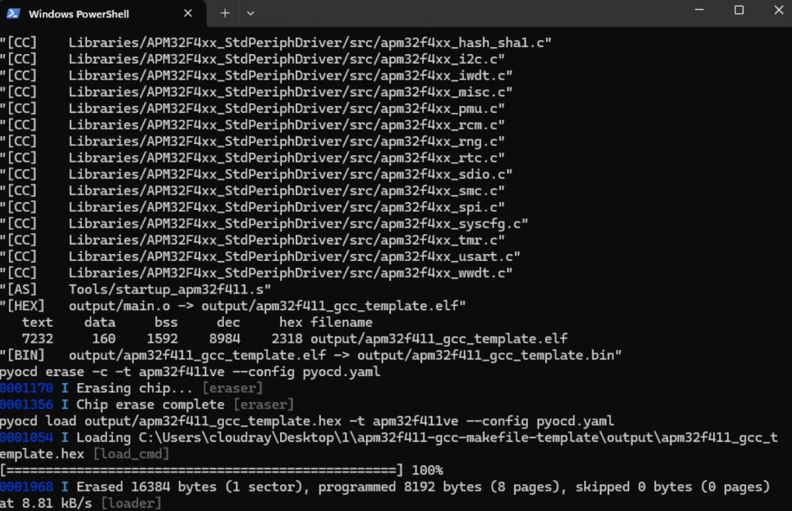
   
   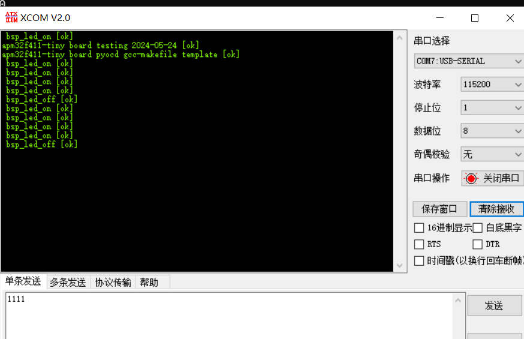
