---
sidebar_position: 3
---

## 立创开发板 开源嵌入式组件移植测试 01-TencentOS tiny内核移植


### 一、移植前的准备


###   1. 准备目标硬件（开发板/芯片/模组）

TencentOS tiny支持ARM Cortex M核芯片和RISC-V内核的芯片的移植，比如STM32 基于Cortex M核全系列、GD32 基于Cortex M核全系列、NXP 基于Cortex M核全系列等。本教程将使用立创开发板GD32F407进行示例移植，其他 ARM Cortex M系列开发板和芯片移植方法类似。调试ARM Cortex M核还需要仿真器，如果您的开发板或者芯片模组没有板载仿真器，就需要连接外置的仿真器，如J-Link、DAPLink之类的。

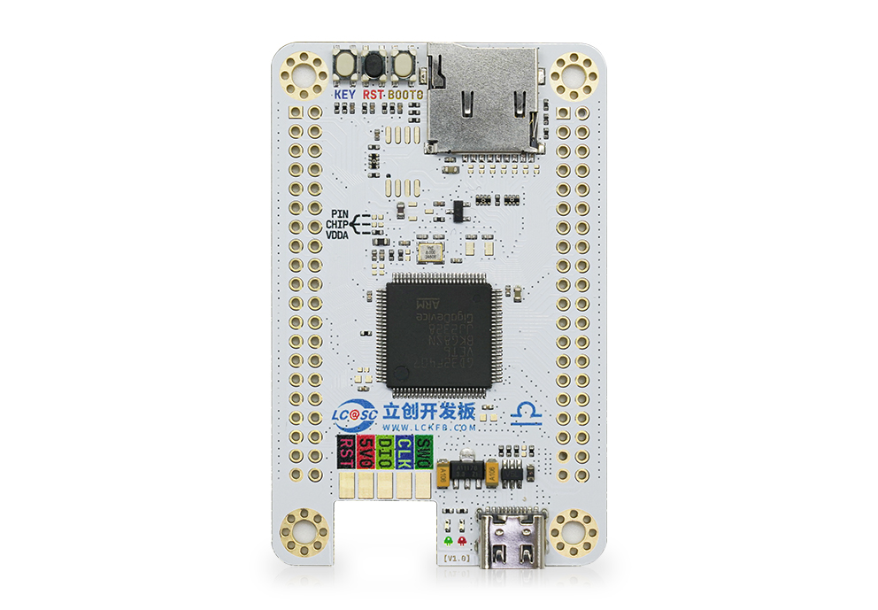


###   2.准备编译器环境

本移植指南针对的是Keil编译器，所以我们移植内核前需要先安装Keil编译器，能编译ARM Cortex M核的Keil编译器现在也叫MDK。


###   3. 准备芯片对应的裸机工程

移植TencentOS tiny基础内核需要您提前准备一个芯片对应的裸机工程，裸机工程包含基本的芯片启动文件、基础配置（时钟、主频等）、以及串口、基本GPIO驱动用于RTOS测试。

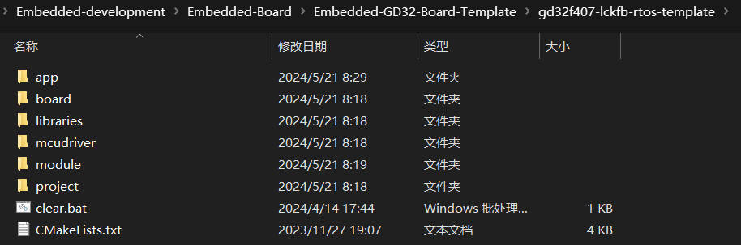


###   4. 准备TencentOS tiny的源码
TencentOS tiny的源码已经开源，github下载地址为：https://github.com/Tencent/TencentOS-tiny.git

| 一级目录 | 二级目录 | 说明                                                         |
| -------- | -------- | ------------------------------------------------------------ |
| arch     | arm      | TencentOS tiny适配的IP核架构（含M核中断、调度、tick相关代码） |
| kernel   | core     | TencentOS tiny内核源码                                       |
|          | pm       | TencentOS tiny低功耗模块源码                                 |
| osal     | cmsis_os | TencentOS tiny提供的cmsis os 适配                            |

由于本教程只介绍TencentOS tiny的内核移植，所以这里只需要用到 arch、kernel、osal目录下的源码。

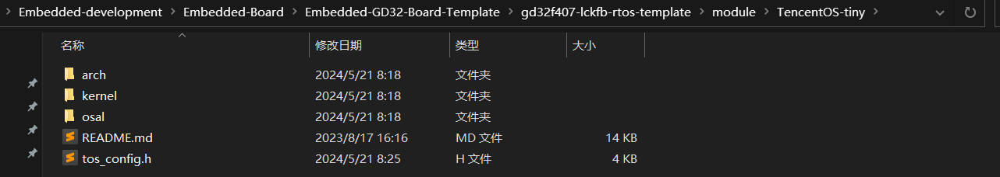


### 二、内核移植

打开keil工程，开始添加TencentOS tiny的内核代码。


#### 1. 添加arch平台代码

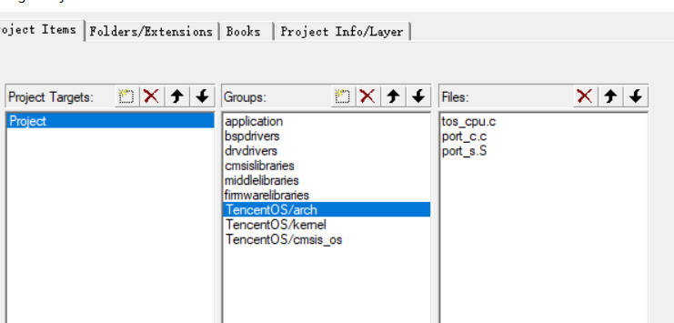

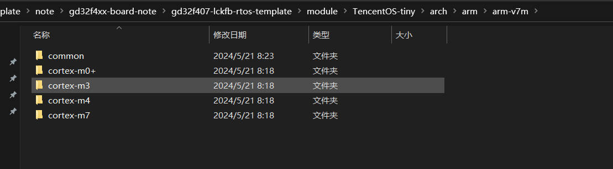

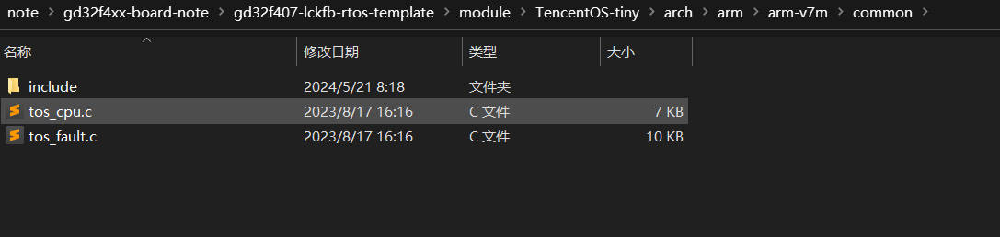

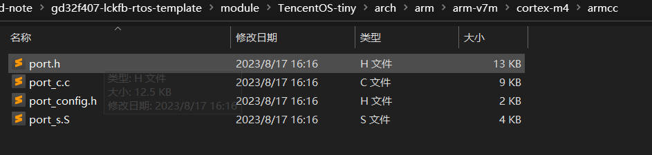

tos_cpu.c是TencentOS tiny 的CPU适配文件，包括堆栈初始化，中断适配等，如果您的芯片是ARM Cortex M核，该文件可以不做改动，M0、M3 、M4、M7是通用的，其他IP核需要重新适配；

port_s.S 文件是TencentOS tiny的任务调度汇编代码，主要做弹栈压栈等处理的，port_c.c适配systick等，这两个文件 每个IP核和编译器都是不一样的，如果您的芯片是ARM Cortex M核，我们都已经适配好，比如现在我们移植的芯片是GD32F407VET6，是ARM Cortex M4核，使用的编译器是KEIL，所以我们选择arch\arm\arm-v7m\cortex-m4\armcc下的适配代码，如果你的开发板是STM32F429IG，M4核，编译器是GCC，则可以选择arch\arm\arm-v7m\cortex-m4\gcc目录下的适配文件。


#### 2. 添加内核源码

内核源码kerne目录下包含core和pm两个目录，其中core下为基础内核，pm是内核中的低功耗组件；基础移植的时候可以不添加pm目录下的代码，如下图所示，添加全部基本内核源码：

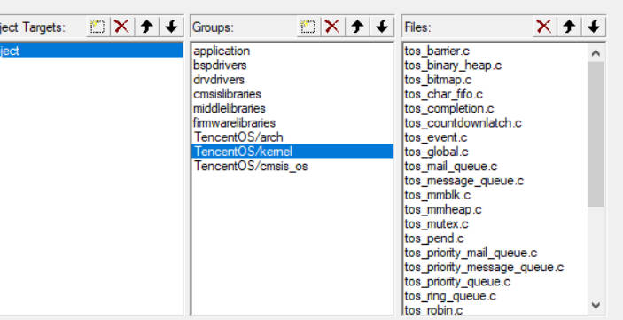

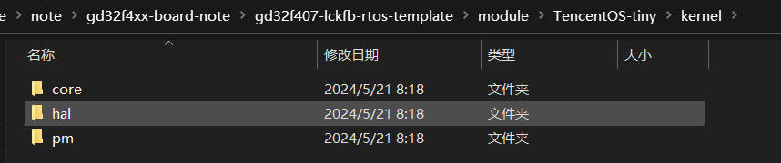

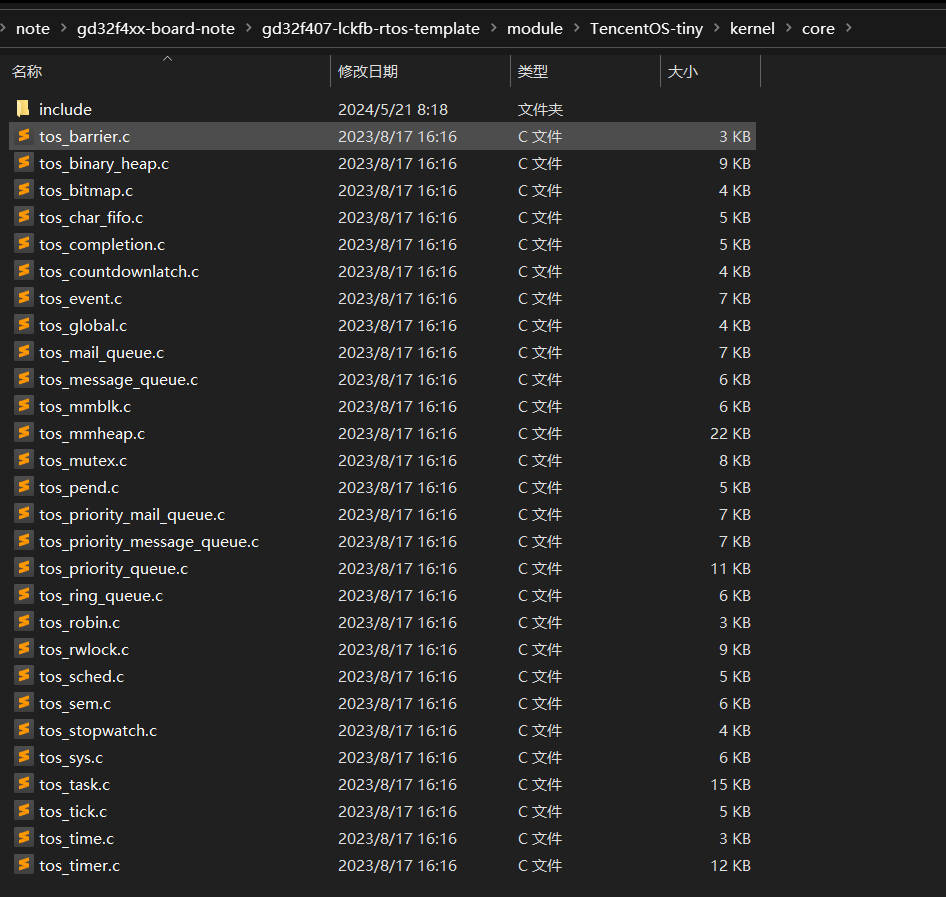


#### 3. 添加cmsis os源码

cmsis os是TencentOS tiny为了兼容cmsis标准而适配的OS抽象层，可以简化大家将业务从其他RTOS迁移到TencentOS tiny的工作量。

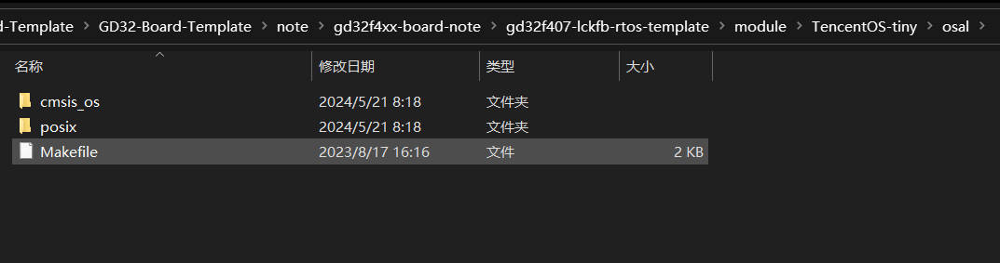

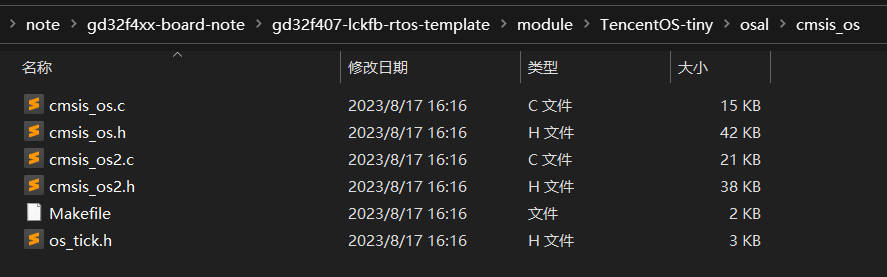

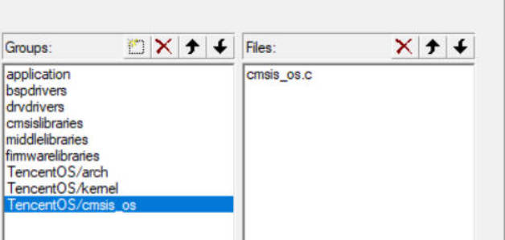


#### 4. 添加TencentOS tiny头文件目录

添加头文件目录前，我们在要移植的工程目录下新增一个 TOS_CONFIG文件夹，用于存放TencentOS tiny的配置头文件，也就是接下来要新建的tos_config.h文件；

TencentOS tiny所有要添加的头文件目录如下：

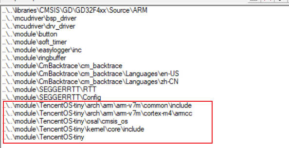


#### 5. 新建TencentOS tiny系统配置文件 tos_config.h

```c
#ifndef _TOS_CONFIG_H_
#define  _TOS_CONFIG_H_

#include "gd32f4xx.h"

#define TOS_CFG_TASK_PRIO_MAX           10u

#define TOS_CFG_ROUND_ROBIN_EN          1u

#define TOS_CFG_OBJECT_VERIFY_EN        1u

#define TOS_CFG_OBJ_DYNAMIC_CREATE_EN   1u

#define TOS_CFG_EVENT_EN                1u

#define TOS_CFG_MMBLK_EN                1u

#define TOS_CFG_MMHEAP_EN               1u

#define TOS_CFG_MMHEAP_DEFAULT_POOL_SIZE        0x8000

#define TOS_CFG_MUTEX_EN                1u

#define TOS_CFG_TIMER_EN                1u

#define TOS_CFG_PWR_MGR_EN              0u

#define TOS_CFG_TICKLESS_EN             0u

#define TOS_CFG_SEM_EN                  1u

#define TOS_CFG_TASK_STACK_DRAUGHT_DEPTH_DETACT_EN      1u

#define TOS_CFG_FAULT_BACKTRACE_EN      0u

#define TOS_CFG_IDLE_TASK_STK_SIZE      512u

#define TOS_CFG_CPU_TICK_PER_SECOND     1000u

#define TOS_CFG_CPU_CLOCK               (SystemCoreClock)

#define TOS_CFG_TIMER_AS_PROC           1u

#define TOS_CFG_MAIL_QUEUE_EN           1u


/*
宏定义注释参考版本
#define TOS_CFG_TASK_PRIO_MAX           10u 	// 配置TencentOS tiny默认支持的最大优先级数量

#define TOS_CFG_ROUND_ROBIN_EN          0u		// 配置TencentOS tiny的内核是否开启时间片轮转

#define TOS_CFG_OBJECT_VERIFY_EN           1u	// 配置TencentOS tiny是否校验指针合法

#define TOS_CFG_TASK_DYNAMIC_CREATE_EN  1u		// TencentOS tiny 动态任务创建功能宏

#define TOS_CFG_EVENT_EN                1u		// TencentOS tiny 事件模块功能宏

#define TOS_CFG_MMBLK_EN                1u		//配置TencentOS tiny是否开启内存块管理模块

#define TOS_CFG_MMHEAP_EN               1u		//配置TencentOS tiny是否开启动态内存模块

#define TOS_CFG_MMHEAP_DEFAULT_POOL_EN  1u		// TencentOS tiny 默认动态内存池功能宏

#define TOS_CFG_MMHEAP_DEFAULT_POOL_SIZE        0x100	// 配置TencentOS tiny默认动态内存池大小

#define TOS_CFG_MUTEX_EN                1u		// 配置TencentOS tiny是否开启互斥锁模块

#define TOS_CFG_MESSAGE_QUEUE_EN        1u		// 配置TencentOS tiny是否开启消息队列模块

#define TOS_CFG_MAIL_QUEUE_EN           1u		// 配置TencentOS tiny是否开启消息邮箱模块

#define TOS_CFG_PRIORITY_MESSAGE_QUEUE_EN	1u	// 配置TencentOS tiny是否开启优先级消息队列模块

#define TOS_CFG_PRIORITY_MAIL_QUEUE_EN	1u		// 配置TencentOS tiny是否开启优先级消息邮箱模块

#define TOS_CFG_TIMER_EN                1u		// 配置TencentOS tiny是否开启软件定时器模块

#define TOS_CFG_PWR_MGR_EN              0u		// 配置TencentOS tiny是否开启外设电源管理模块

#define TOS_CFG_TICKLESS_EN             0u		// 配置Tickless 低功耗模块开关

#define TOS_CFG_SEM_EN                  1u		// 配置TencentOS tiny是否开启信号量模块

#define TOS_CFG_TASK_STACK_DRAUGHT_DEPTH_DETACT_EN      1u	// 配置TencentOS tiny是否开启任务栈深度检测

#define TOS_CFG_FAULT_BACKTRACE_EN      0u		// 配置TencentOS tiny是否开启异常栈回溯功能

#define TOS_CFG_IDLE_TASK_STK_SIZE      128u	// 配置TencentOS tiny空闲任务栈大小

#define TOS_CFG_CPU_TICK_PER_SECOND     1000u	// 配置TencentOS tiny的tick频率

#define TOS_CFG_CPU_CLOCK               (SystemCoreClock)	// 配置TencentOS tiny CPU频率

#define TOS_CFG_TIMER_AS_PROC           1u		// 配置是否将TIMER配置成函数模式

 */

#endif


```
按照上面的模板配置好TencentOS tiny的各项功能后，将tos_config.h 文件放入要移植的工程目录下即可，例如本教程是放到\gd32f407-lckfb-rtos-template\module\TencentOS-tiny目录下。

这样，TencentOS tiny的源码就全部添加完毕了。


###  三、创建TencentOS tiny任务，测试移植结果

#### 1. 修改部分代码
**修改gd32f4xx_it.c的中断函数,在gd32f4xx_it.c文件中包含 tos_k.h 头文件**

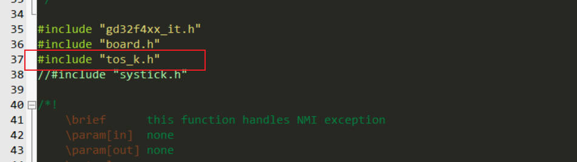

在gd32f4xx_it.c文件中的PendSV_Handler函数前添加___weak关键字，因为该函数在TencentOS tiny的调度汇编中已经重新实现；或者直接注释。

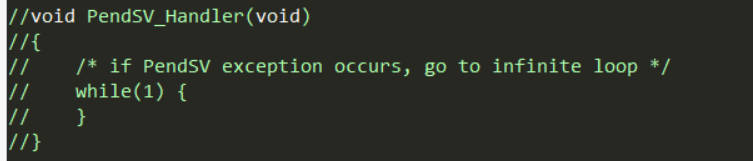

同时在SysTick_Handler函数中添加TencentOS tiny的调度处理函数，如下图所示：

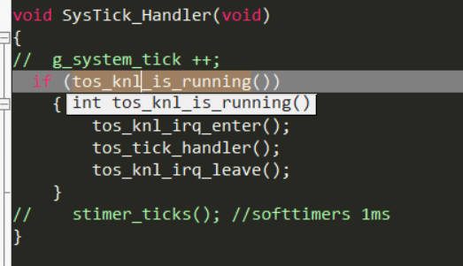


#### 2.  编写TencentOS tiny 测试任务
在mian.c 中添加TencentOS tiny 头文件，编写任务函数

```c
 #include "cmsis_os.h"
 //task1
#define TASK1_STK_SIZE       256
void task1(void *pdata);
osThreadDef(task1, osPriorityNormal, 1, TASK1_STK_SIZE);

//task2
#define TASK2_STK_SIZE       256
void task2(void *pdata);
osThreadDef(task2, osPriorityNormal, 1, TASK2_STK_SIZE);

void task1(void *pdata)
{
    int count = 1;
    while (1)
    {
        printf("\r\nHello world!\r\n###This is task1 ,count is %d \r\n", count++);
        osDelay(2000);
    }
}
void task2(void *pdata)
{
    int count = 1;
    while (1)
    {
        printf("\r\nHello TencentOS !\r\n***This is task2 ,count is %d \r\n", count++);
        osDelay(1000);
    }
}
```

如图：

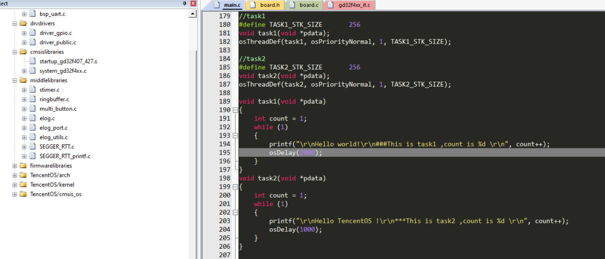

继续在main.c 的mian函数中硬件外设初始化代码后添加TencentOS tiny的初始化代码：

```c
 osKernelInitialize(); //TOS Tiny kernel initialize
 osThreadCreate(osThread(task1), NULL);// Create task1
 osThreadCreate(osThread(task2), NULL);// Create task2
 osKernelStart();//Start TOS Tiny
```


 如图：

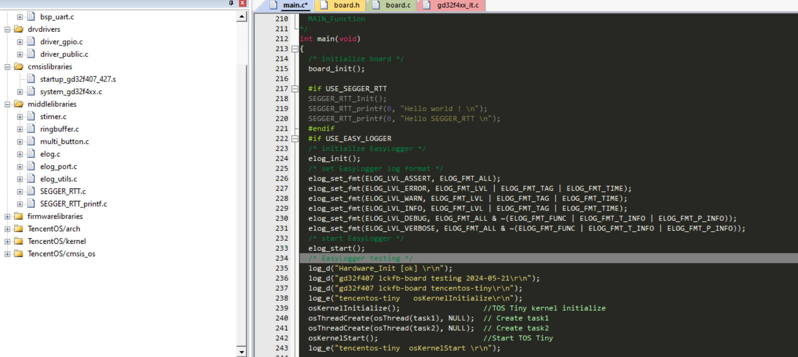


####  3. 编译下载测试TencentOS tiny移植结果

按照上图指示，进行编译下载到开发板即可完成TencentOS tiny的测试，如下图所示，可以看到串口交替打印信息，表示两个任务正在进行调度，切换运行：

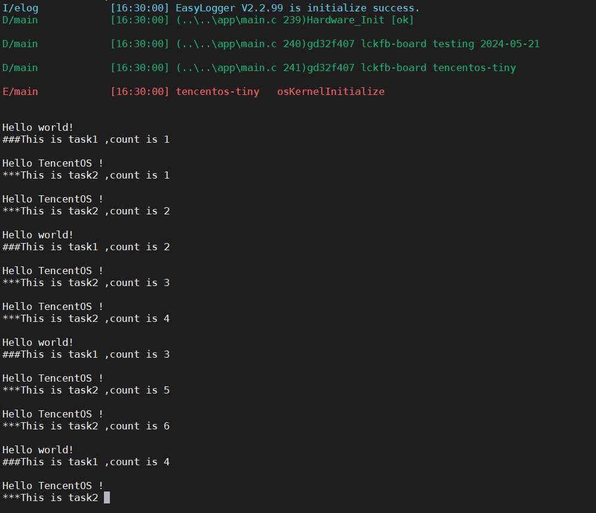


