## 04-安信可小安派开发板学习 Ai-M61-32S开发板从0开始点灯

#### 参考博文 

代码编译烧录 https://bbs.ai-thinker.com/forum.php?mod=viewthread&tid=43739

环境搭建 https://bbs.ai-thinker.com/forum.php?mod=viewthread&tid=520

软硬件平台

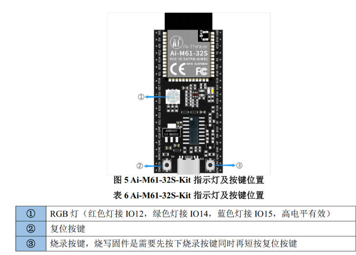

1. 搭建环境

   搭建环境这一波，拉新活动基本上所有人的搭建过了，基本上只要make成功就ok了，上面的博文也提供了教程就别说了。接下来的关键就是找sdk.这是开发最重要的东西。

   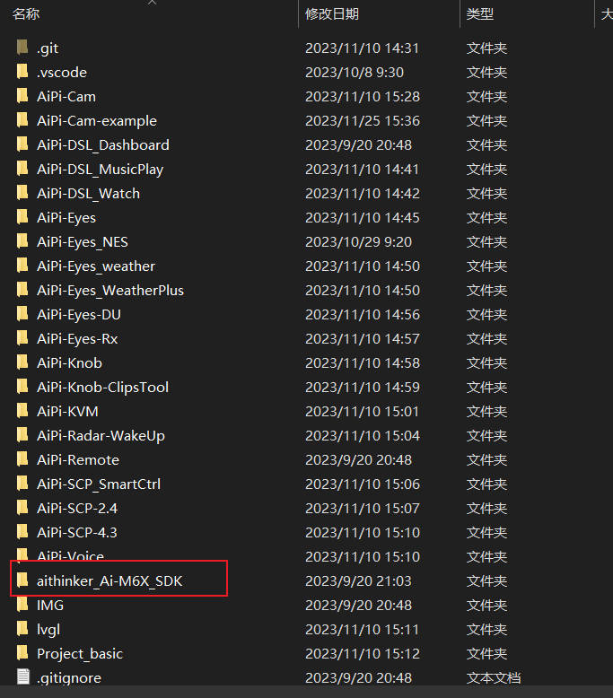

2. 选择例程

    在Ai-M6X-SDK中找到examples找到gpio外设的文件，examples提供了丰富的开发案例，可以学习。

   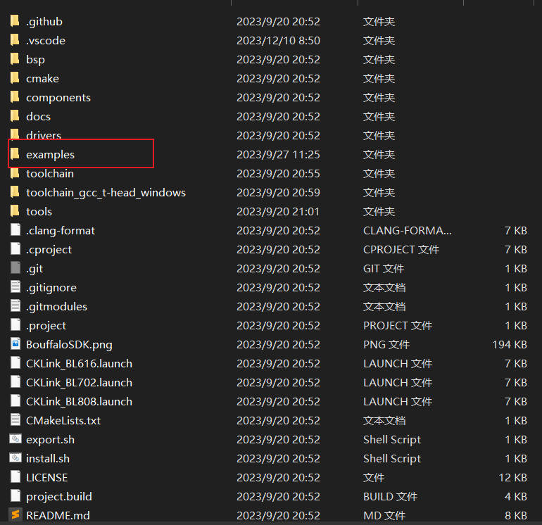

   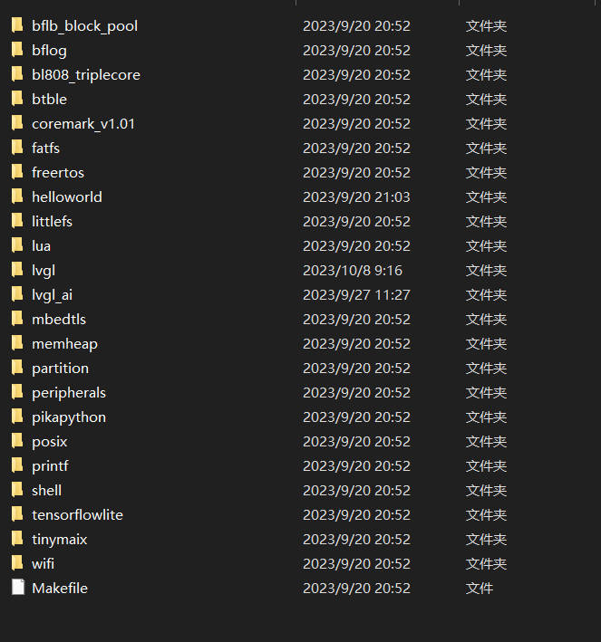

   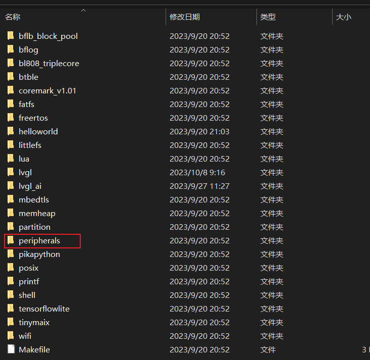

   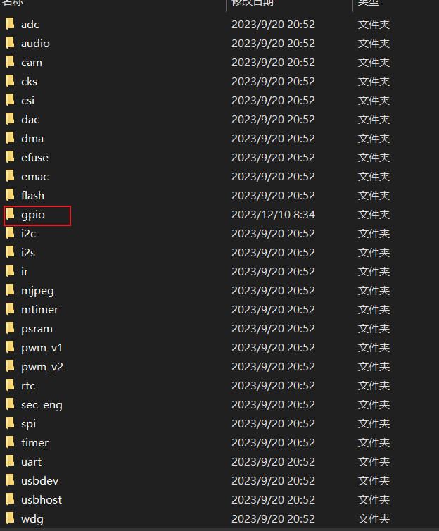

   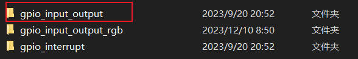

3. 编写代码

   把gpio_input_output复制出来一份，命名为gpio_input_output_rgb,当然你可以选择直接用给的例程，不需要重新建立，我这个只是为了更清晰一点。

   修改cmakelist.txt,project(gpio_input_output_rgb)

   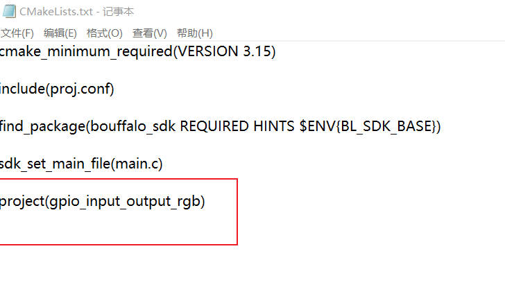

   编写代码，

   ```c
   #include "bflb_gpio.h"
   #include "board.h"
   
   struct bflb_device_s *gpio;
   
   uint32_t gpio_group[] = {GPIO_PIN_12, GPIO_PIN_14, GPIO_PIN_15};
   int main(void)
   {
       board_init();
   
       gpio = bflb_device_get_by_name("gpio"); // get gpio device
   
       // set gpio pin mode
       bflb_gpio_init(gpio, GPIO_PIN_12, GPIO_OUTPUT | GPIO_PULLUP | GPIO_SMT_EN | GPIO_DRV_0);
       bflb_gpio_init(gpio, GPIO_PIN_14, GPIO_OUTPUT | GPIO_PULLUP | GPIO_SMT_EN | GPIO_DRV_0);
       bflb_gpio_init(gpio, GPIO_PIN_15, GPIO_OUTPUT | GPIO_PULLUP | GPIO_SMT_EN | GPIO_DRV_0);
   
       
       bflb_gpio_reset(gpio, GPIO_PIN_12);
       bflb_gpio_reset(gpio, GPIO_PIN_14);
       bflb_gpio_reset(gpio, GPIO_PIN_15);
       uint8_t i = 0;
       while (1) {
           for(uint8_t j = 0; j < 2; j++) {
               bflb_gpio_set(gpio, gpio_group[i]);
               bflb_mtimer_delay_ms(200);
               bflb_gpio_reset(gpio, gpio_group[i]);
               bflb_mtimer_delay_ms(200);
           }
           bflb_gpio_set(gpio, gpio_group[i]);
           bflb_mtimer_delay_ms(500);
           bflb_gpio_reset(gpio, gpio_group[i]);
           i = (i + 1) % 3;
       }
   }
   ```

4. 下载代码

   通过type-c数据线连接电脑，查看设备管理器，查看端口。因为板载了ch340芯片，不需要其他工具。

   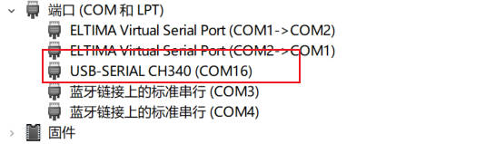

   打开终端软件，输入命令 make clean，先清除之前可能编译出现的build,之后重新make

   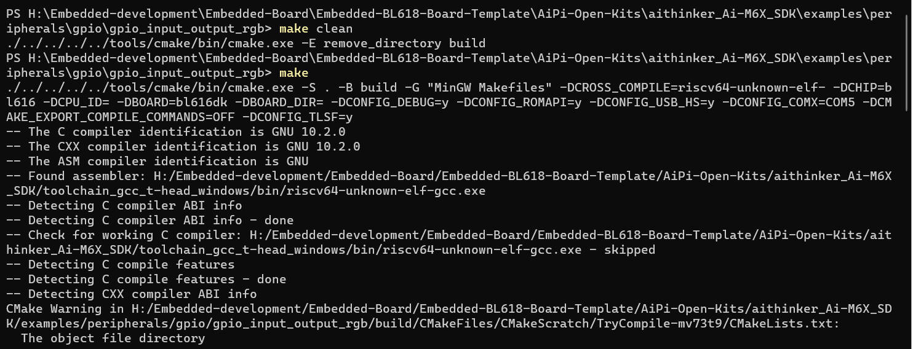

   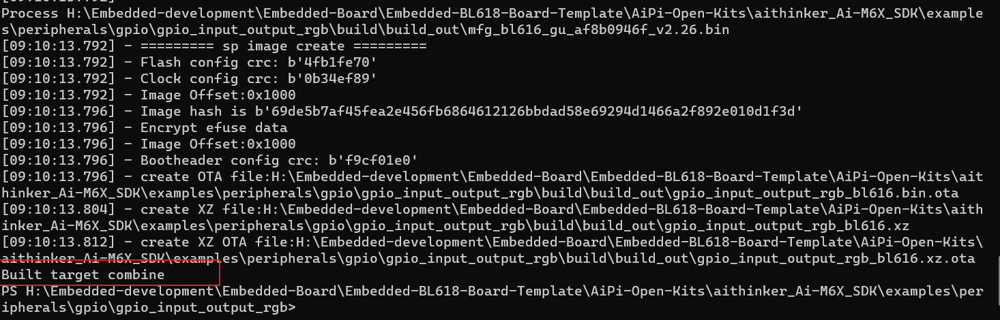

   准备下载代码。先按住IO2这个按键进入烧录代码模式，这个要一直按着。之后按下EN按键，松开，然后命令行输入make flash COMX=COM16，进入烧录。

   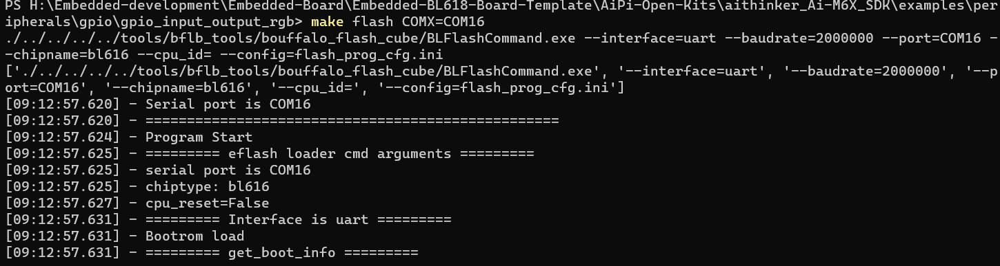

   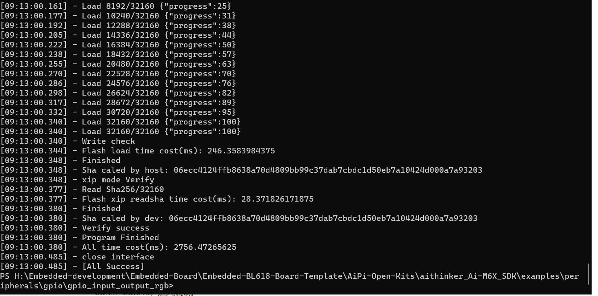

   下载成功后，按下en进行复位就可以看到rgb灯闪烁了。

5. 观察现象

   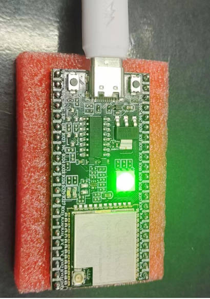

