## 01-安信可小安派开发板学习 搭建Windows开发环境

Ai-Pi-Eyes 系列是安信可开源团队专门为Ai-M61-32S设计的开发板，支持WiFi6、BLE5.3。所搭载的Ai-M61-32S 模组具有丰富的外设接口，具体包括 DVP、MJPEG、Dispaly、AudioCodec、USB2.0、SDU、以太网 (EMAC)、SD/MMC(SDH)、SPI、UART、I2C、I2S、PWM、GPDAC、GPADC、ACOMP 和 GPIO 等。集成了SPI屏幕接口，DVP摄像头接口，预留TF卡座，并且引出USB接口，可接入USB摄像头。

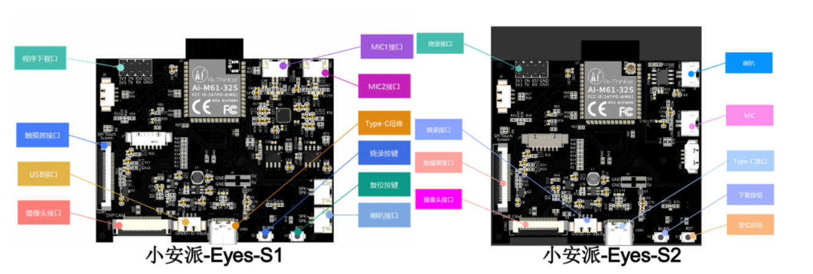

### 1. Vscode Git工具安装

**VScode** 是非常强大的代码编辑器，很多方便的功能都可以通过插件来实现，比如快速注释，代码跳转等功能。

**git 工具** 是必要的，拉取代码和管理代码的功能，小安派的源码全都是放在git 远程仓库上，想要下载源码，必须使用git 工具。

**下载连接：**https://docs.ai-thinker.com/eyes

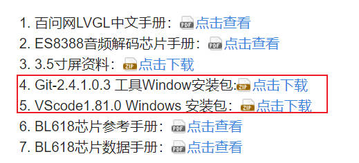

### 2.克隆源码

直接在桌面或者某个文件夹里找个空的位置点击 **鼠标右键** 选择 `Open Git bash here` 即可打开安装好的git 工具。接着输入指令（可以复制运行）：

```git
git clone https://gitee.com/Ai-Thinker-Open/AiPi-Open-Kits.git
```

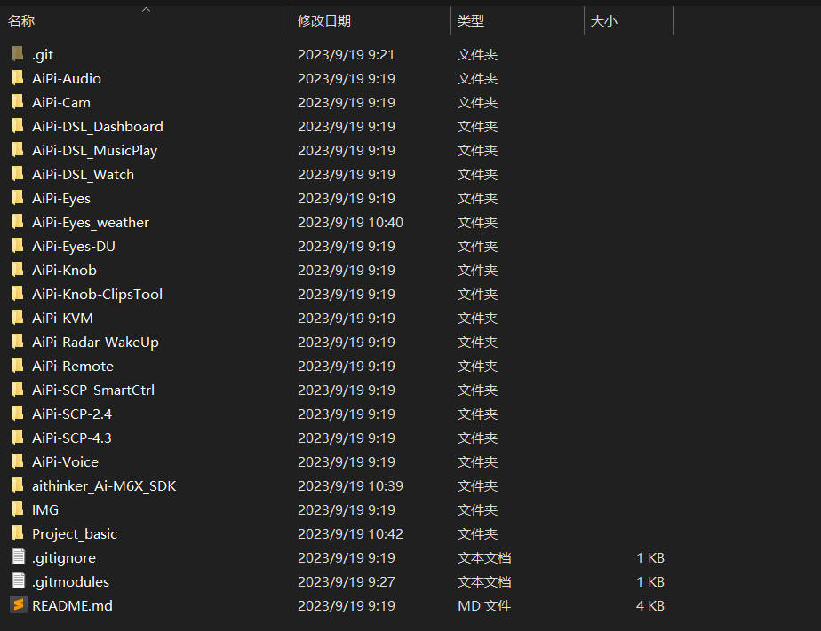

下载克隆小安派的aithinker_Ai-M6X_SDK。建议直接在github下载，通过官方的git请求容易出现拉取不下来，我没有成功拉取下来

```
https://github.com/Ai-Thinker-Open/aithinker_Ai-M6X_SDK
```

但是toolchain tools是空文件夹，需要从gituhub更新下载，但是我在实验过程中发现速度太慢，而且经常性拉取不下来，所以使用了其他的方法。

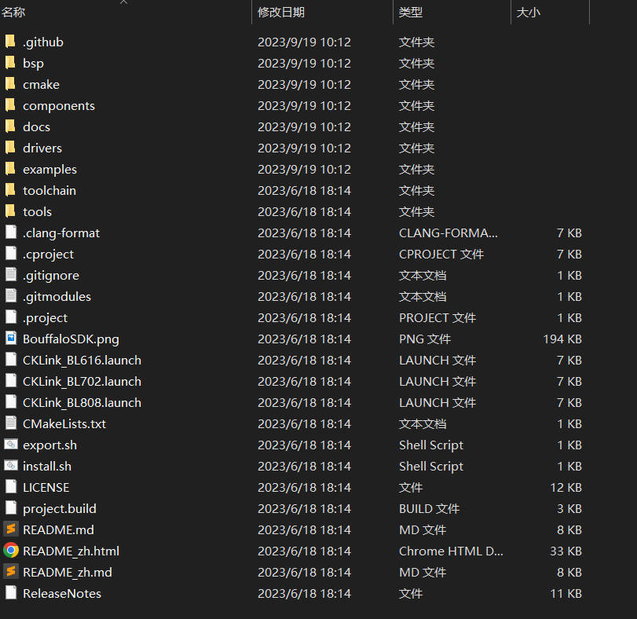

### 4.设置windows编译工具链

- 下载 GCC 工具链

在`aithinker_Ai-M6X_SDK/toolchain`文件夹中拉取工具链，直接适用git 工具拉取：

```
git clone https://gitee.com/bouffalolab/toolchain_gcc_t-head_windows.git
```

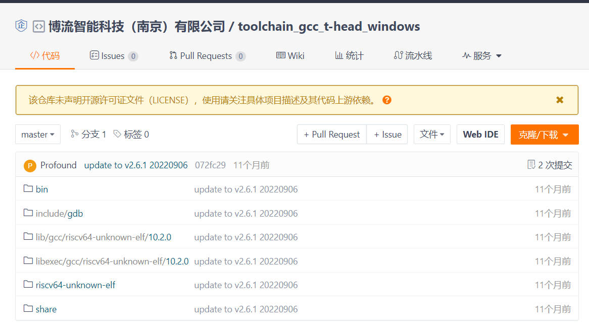

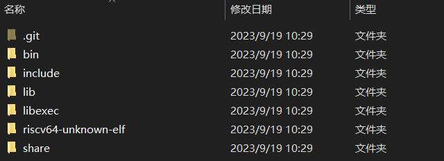

下载BouffaloSDK  获取tools工具链 解决拉取失败问题

```
git clone https://github.com/bouffalolab/bouffalo_sdk.git 
```

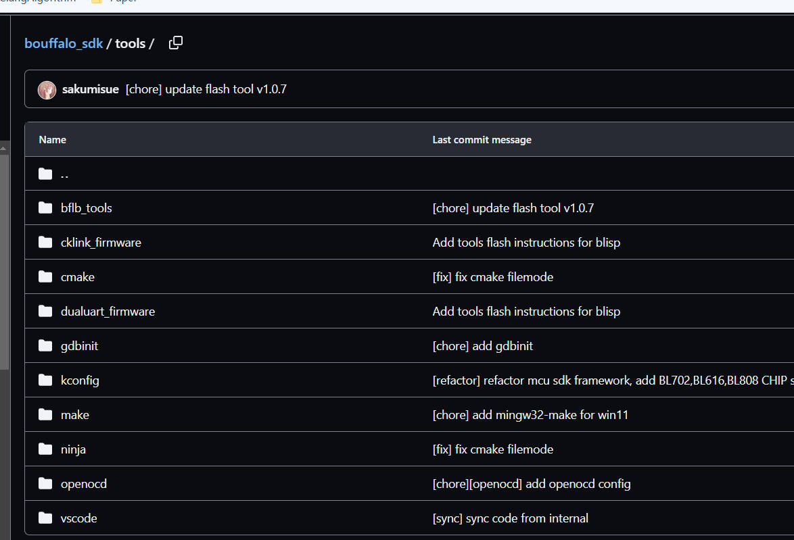

- 安装 cmake

无需安装， bouffalo_sdk/tools/cmake 目录下已经提供 windows 版本 cmake 工具

- 安装 make

无需安装， bouffalo_sdk/tools/make 目录下已经提供 windows 版本 make 工具

- 安装 ninja

无需安装， bouffalo_sdk/tools/ninja 目录下已经提供 windows 版本 ninja 工具

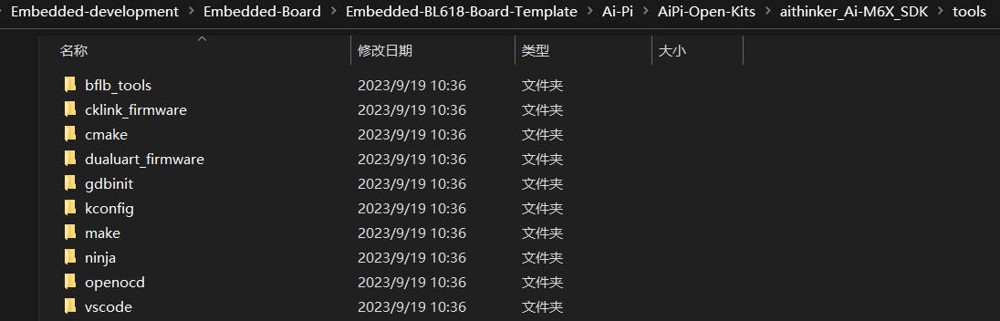

- 配置环境变量

将 make、ninja、gcc 工具链路径配置到系统环境变量中

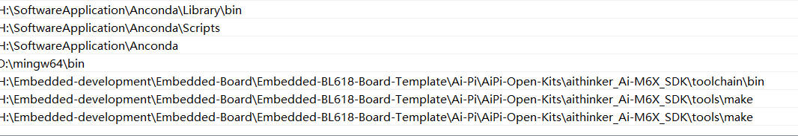

### 5.验证是否成功设置

在桌面按住 `shift` 键点击`鼠标右键`打开**PowerShell** 。在PowerShell 输入：

```shell
make -v
```

成功输出信息：

```shell
GNU Make 4.2.1
Built for x86_64-w64-mingw32
Copyright (C) 1988-2016 Free Software Foundation, Inc.
License GPLv3+: GNU GPL version 3 or later <http://gnu.org/licenses/gpl.html>
This is free software: you are free to change and redistribute it.
There is NO WARRANTY, to the extent permitted by law.
```


输入：

```shell
 riscv64-unknown-elf-gcc -v
```

成功时输出信息：

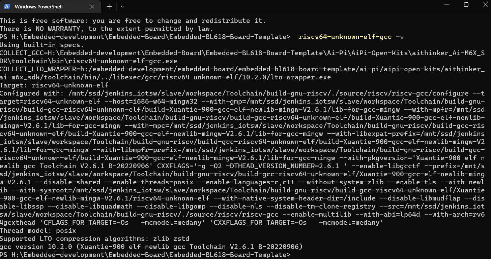

### 6.编译程序测试


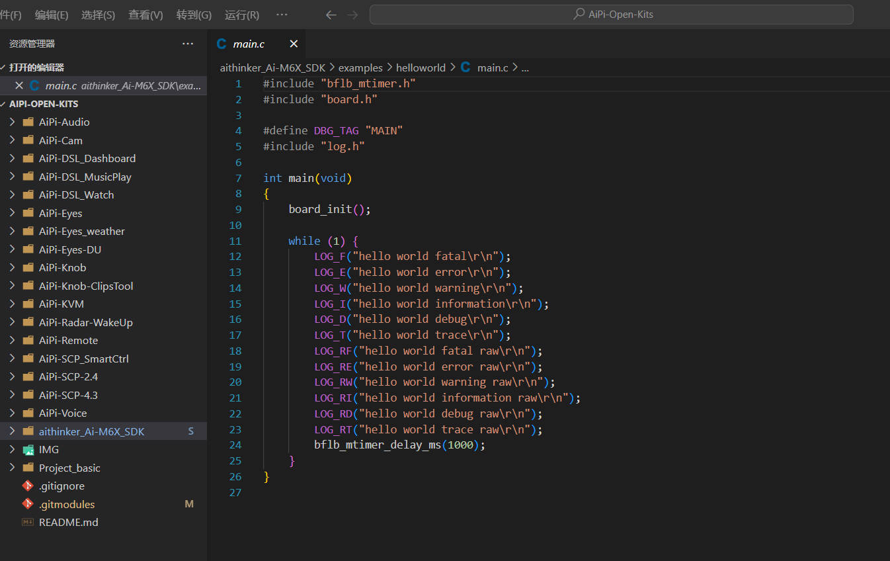

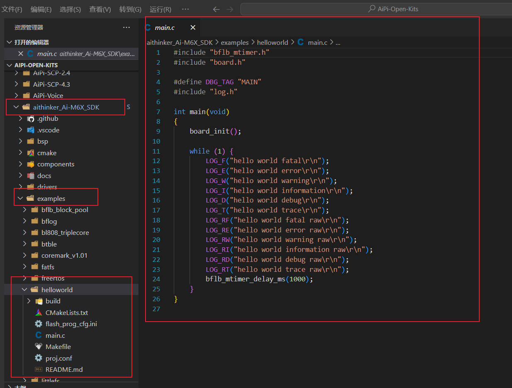

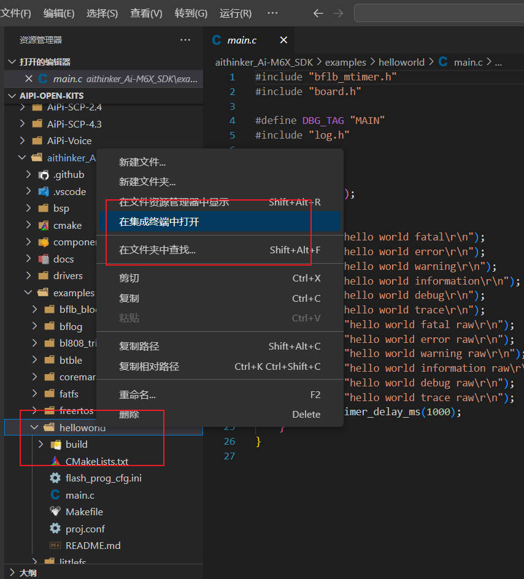

#### 选择了example/helloworld工程进行 make编译

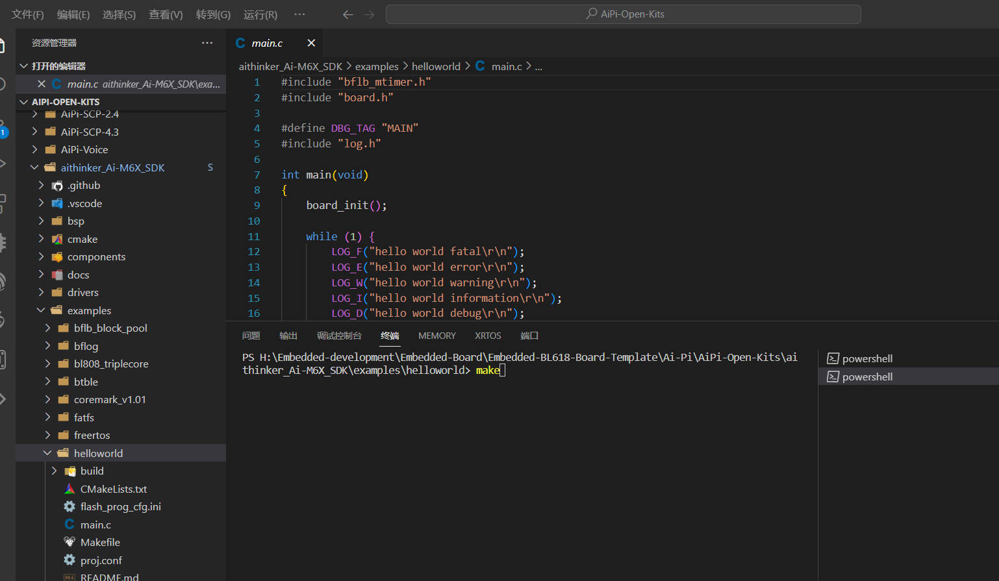

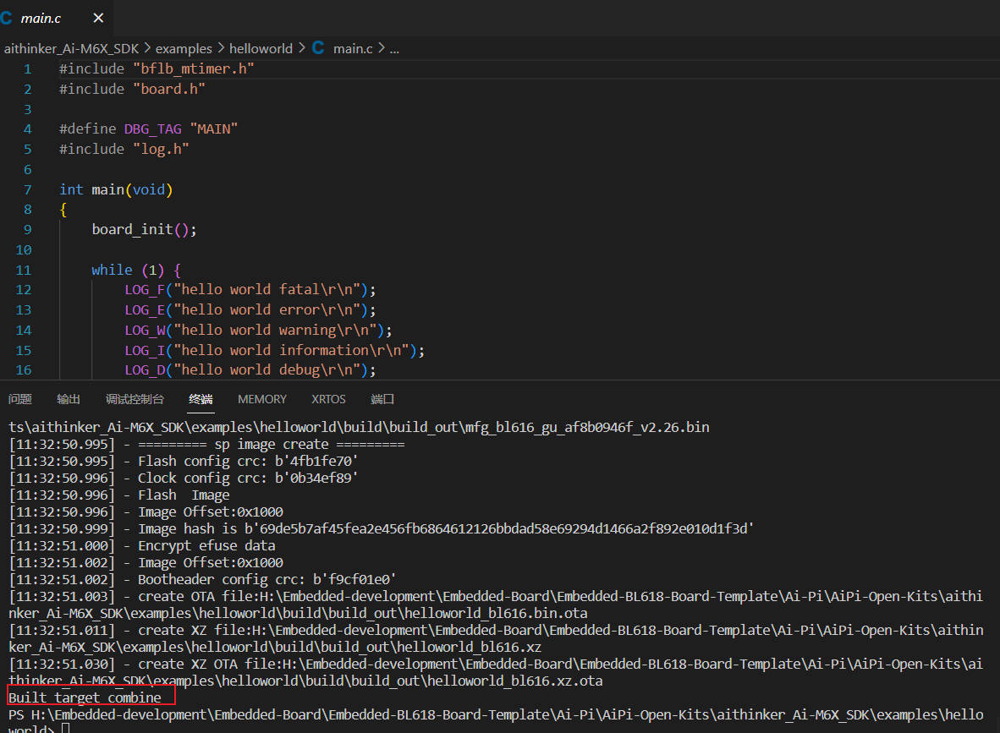

第一次编译可能实际要长一点，输出信息会多一点（我这个之前编译过）。

出现 Built target combine说明编译完成

换一个工程文件，测试编译（该工程没有编译过）

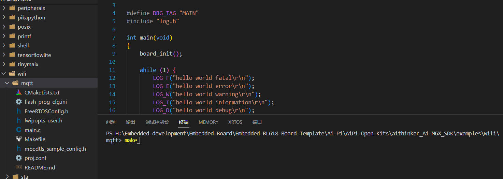

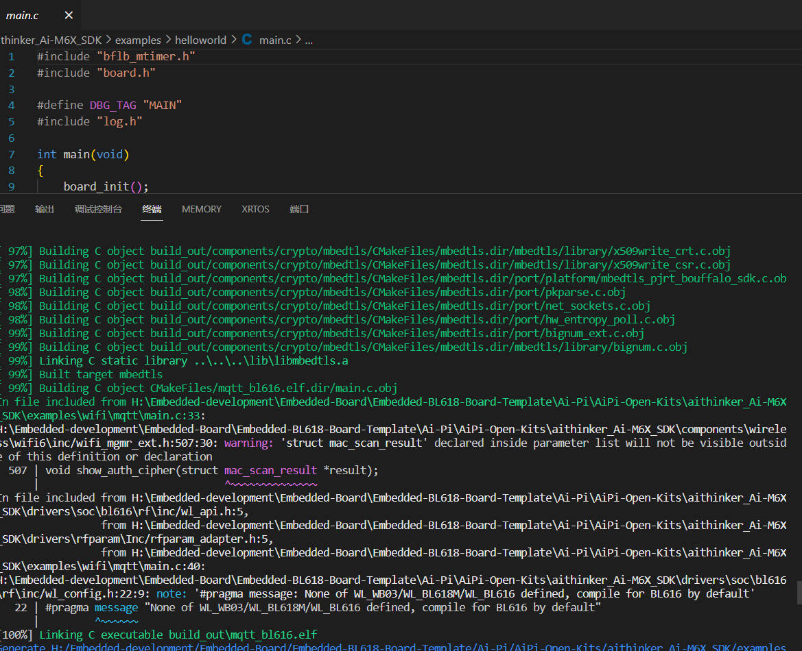

### 7. 烧录程序

等Ai-Pi-Eyes 开发板到手再进行测试

参考教程http://bbs.ai-thinker.com/forum.php?mod=viewthread&tid=282&extra=page%3D1&page=2