## 03-安信可小安派开发板学习 代码下载

AiPi 代码下载（直接使用命令行操作，仅需要Type-C接口线即可）

在完成环境搭建，和代码编写前提下，使用Type-C接口线下载代码，当然可以自己使用usb-ttl串口线下载程序，但是感觉麻烦，没有直接一根线舒服。

以大佬的**基于小安派AiPi-Eye-S1的小霸王**工程代码为例：

博客链接 http://bbs.ai-thinker.com/forum.php?mod=viewthread&tid=41966&_dsign=9087c82a

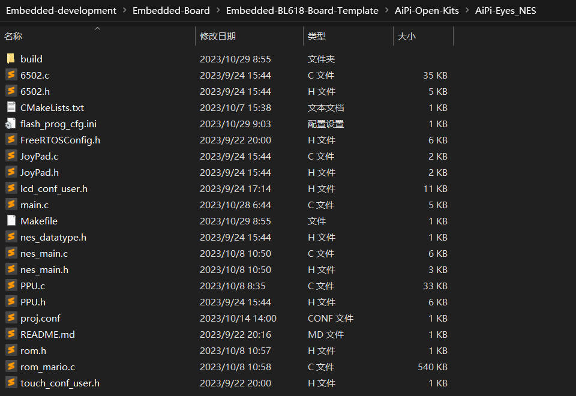

编译代码之前，先修改flash_prog_cfg.ini文件，在安信可其他的工程模板中，一般boot2_isp_mode = 1,但是在使用了命令行下载的工程中，需要改成0。

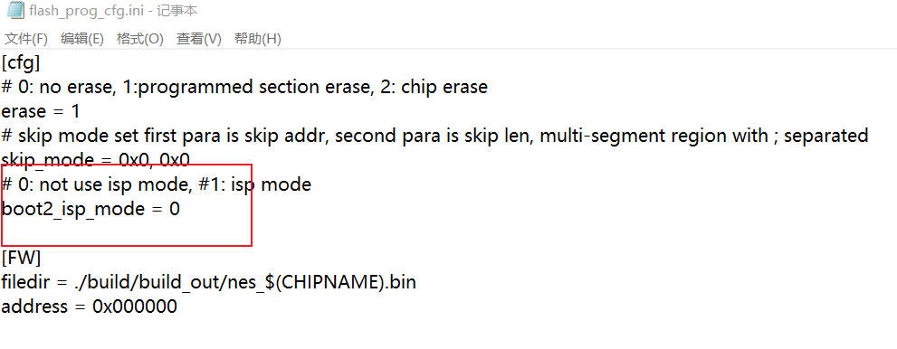

使用终端软件，打开该工程的文件夹，进行编译操作，如果之前工程有build，可以使用make clean清除。

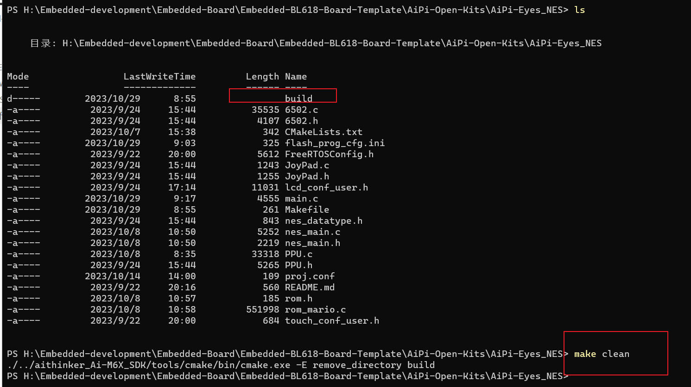

使用make命令进行编译。

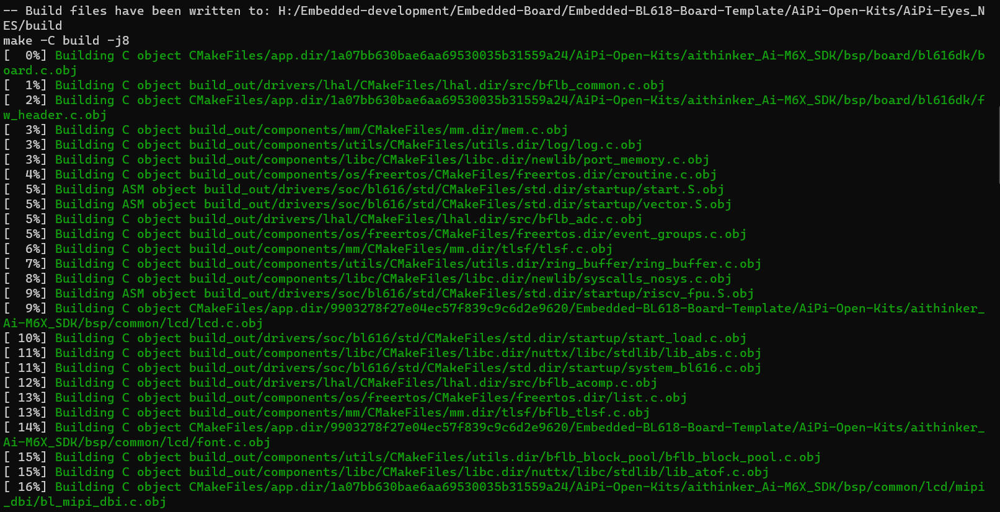

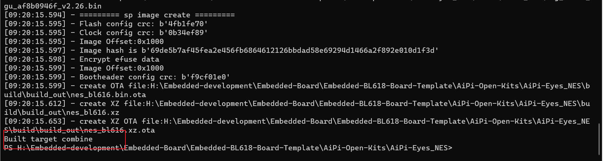

接下来就是重点，下载代码。将Type-C接口线接上开发板和电脑，但是发现设备管理器端口中并没有出现，因为我们需要下面的操作，这也是我写这个笔记的重点。（因为每次都记不住顺序，所以还是先记下来）

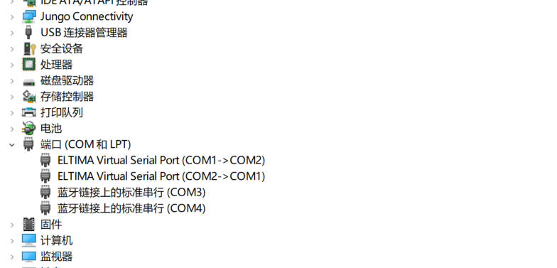

**在小安派S1通电的情况下,按住板子上的"BURN"按键别松开,再按一下"RST"按键,然后松开"RST",在松开"BURN"按键，此时板子屏幕会出现卡死现象,如果你的电脑右下角弹出"安装驱动成功"或者设备管理器端口中出现新的COM口。那么你很幸运,不用再做多余的操作。**

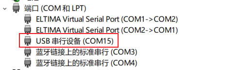

#### 输入 make flash COMX=COMXX

在windows环境下，一般是COMXX是端口好，我这里是COM15

在linux环境下,一般输入 make flash COMX=/dev/ttyUSB0

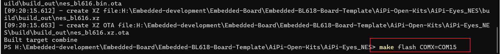

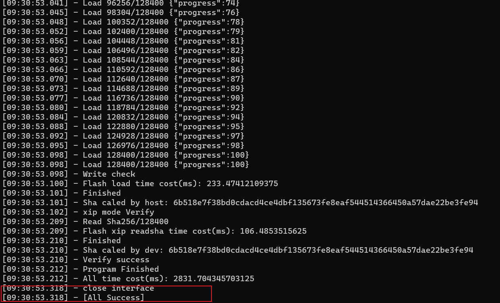

出现“[All Success]"后按下RST，就完成了整个操作.

实物效果，就可以玩游戏了

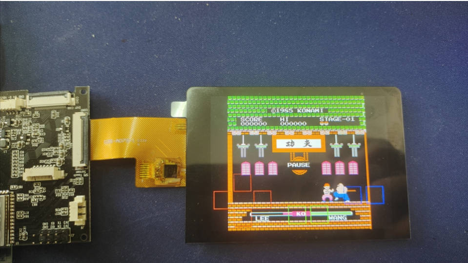

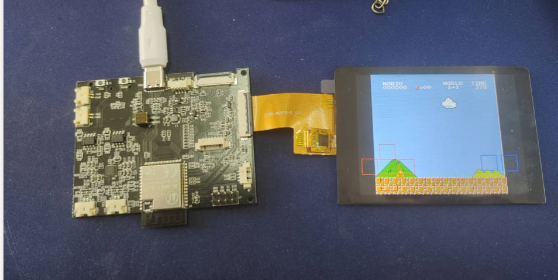
